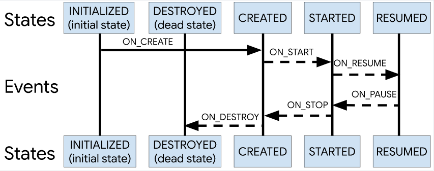

# Activity

- 新建的activity必须在AndroidManifest.xml中注册

## 生命周期




1. 创建：onCreate() -> onStart() -> onResume()
2. 按下主屏键：onPause() -> onStop()
3. 重新打开：onRestart() -> onStart() -> onResume()
4. 按下后退键到桌面：onPause() -> onStop() -> onDestroy()

## 启动模式

```xml
android:launchMode="singleInstance"
```

- **standard**:默认的启动模式。系统不会在乎这个活动是否已经在返回栈中存在，每次启动都会创建该活动的一个新的实例。
- **singleTop**:请求的Activity正好位于栈顶时，**不会构造新的实例**。
- **singleTask**:活动在整个应用程序的上下文中只存在一个实例，每次启动该活动时系统首先会在返回栈中检查是否存在该活动的实例，如果发现已经存在则直接使用该实例，并把在这个活动之上的所有活动统统出栈，如果没有发现就会创建一个新的活动实例。
- **singleInstance**:该模式具备singleTask模式的所有特性外，与它的区别就是，这种模式下的Activity会单独占用一个Task栈，具有全局唯一性。


## onSavedInstanceState()

> 场景：A活动上启动了B活动，此时A进入了停止状态，然后又碰巧被系统回收了。然后在活动B上点击返回键，A会依次调用onCreate()、onRestart()，而不是直接调用onRestart()方法。但是A活动上的临时数据和状态都没了。

- 在A中重写onSavedInstanceState()保存临时数据

```java
@Override
protected void onSaveInstanceState(@NonNull Bundle outState) {
    super.onSaveInstanceState(outState);
    String tempData = "临时数据";
    outState.putString("data_key", tempData);
}
```

- 在A中的onCreate()方法取出之前保存的数据

```java
@Override
protected void onCreate(Bundle savedInstanceState) {
    super.onCreate(savedInstanceState);
    setContentView(R.layout.activity_main);
    
    if (savedInstanceState != null){
        String tempData = savedInstanceState.getString("data_key");
        Log.d(TAG, tempData);
    }
}
```

-	调用时机

1. 当用户按下手机home键的时候。

2. 长按手机home键或者按下菜单键时。

3. 手机息屏时。

4. FirstActivity启动SecondActivity，FirstActivity就会调用，也就是说打开新Activity时，原Activity就会调用。

5. 默认情况下横竖屏切换时。当竖屏切换到横屏时，系统会销毁竖屏Activity然后创建横屏的Activity，所以竖屏被销毁时，该方法就会被调用。

