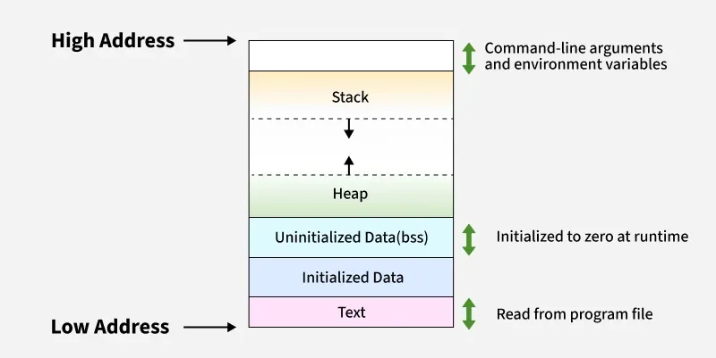

## C++ 程序内存布局

**进程地址空间**是指进程能够访问的虚拟地址范围。在大多数操作系统中（如 Linux、Windows 等），进程地址空间被划分为两个主要部分：

1. **用户态（用户区）**
2. **内核态（内核区）**

以 32 位 Linux 为例（3G/1G 分布）：

| 区域   | 地址范围                    | 所属空间 | 说明                       |
| ------ | --------------------------- | -------- | -------------------------- |
| 用户区 | `0x00000000` ~ `0xBFFFFFFF` | 用户态   | 下面图里的部分             |
| 内核区 | `0xC0000000` ~ `0xFFFFFFFF` | 内核态   | 所有进程共享，进程无法访问 |

> 内核区是操作系统在每个进程虚拟地址空间中保留的一块地址范围，用来存放内核代码、数据、驱动程序和关键内核结构（如进程控制块PCB）。这部分地址对所有进程共享映射，但普通用户态进程无法访问，只有进入内核态时才能操作，保证系统安全和资源管理统一。

以下只讨论用户区。

### 内存结构图示意图



这个结构描述的是 **一个 C/C++ 程序在进程中的典型虚拟内存布局**（即**进程地址空间结构**）。这是一种**逻辑视图**，不是物理内存，而是操作系统为每个进程划分的**虚拟地址空间**。

### Text Segment（代码段）

- 存储程序的编译后的机器代码（函数和方法）。
- 通常只读，以增强安全性。
- 大小随代码复杂度而变化。
- 多个相同程序的进程之间可以**共享**这块区域（节省内存）。

### Data Segment（数据段）

存储全局变量和静态变量。位于代码段之上，分为两部分：

#### Initialized Data Segment（已初始化数据段）

- 存储在声明时已赋值的全局和静态变量。

```cpp
int a = 50;      // 全局变量
static int b = 100;  // 静态变量

// a 和 b 存储在初始化数据段中
```

#### Uninitialized Data Segment (BSS)（未初始化数据段）

- 存储未显式初始化的全局和静态变量。
- 系统在运行时会自动初始化为 0。

```cpp
int c;           // 全局变量
static int d;    // 静态变量

// c 和 d 存储在 BSS 段中
```

### Heap Segment（堆）

- 用于程序运行时的动态内存分配。
- 由程序员手动管理：`new/delete` 或 `malloc/free`。

```cpp
int* arr = new int[10]; // 分配到堆
delete[] arr;           // 释放
```

### Stack Segment（栈）

- 用于存储：
  - 局部变量
  - 函数参数
  - 返回地址
- 每次函数调用创建一个栈帧，函数返回时栈帧被弹出。
- 栈向下增长（地址递减），与堆相反。

```cpp
void foo() {
    int local = 42; // 存在栈中
    cout << local << endl;
}

int main() {
    foo();
    return 0;
}
```

### Literal or Constant Segment（常量区）

程序中的常量，比如字符串常量、`const` 修饰的全局变量（有时实现上会被放入代码段）。

```cpp
const int c = 100;    // 有些实现中在常量区
char* str = "hello";  // 字符串常量位于常量区
```

### 示例

```cpp
#include <iostream>
using namespace std;

int global_a = 10;      // 已初始化全局变量 → Initialized Data Segment
int global_b;           // 未初始化全局变量 → BSS

const int global_c = 30; // 常量 → 可能在常量区

int main() {
    int local_var = 5;    // 局部变量 → 栈区
    static int static_var = 20; // 静态变量 → Initialized Data Segment
    int* heap_var = new int(100); // 动态分配 → 堆区

    cout << *heap_var << endl;

    delete heap_var; // 手动释放堆内存
    return 0;
}
```

各分区的实现细节依赖操作系统和编译器，例如：

- Windows 和 Linux 的地址布局可能不同；
- `const` 局部变量通常还是在栈上；
- `const char*` 指向的字符串常量位于常量区，但变量本身在栈上。
