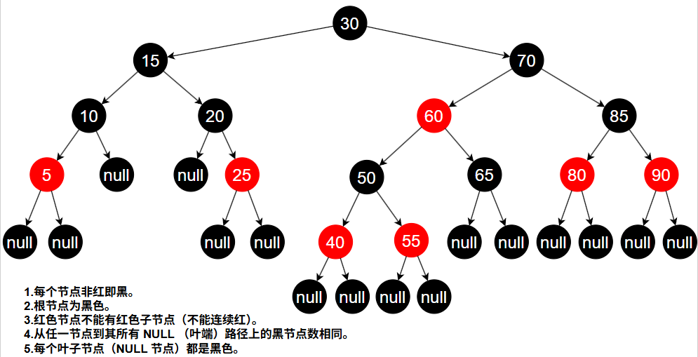
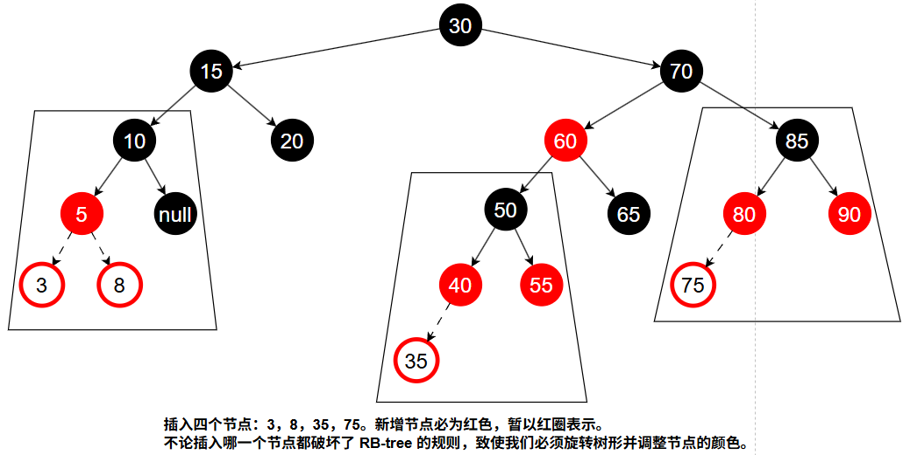
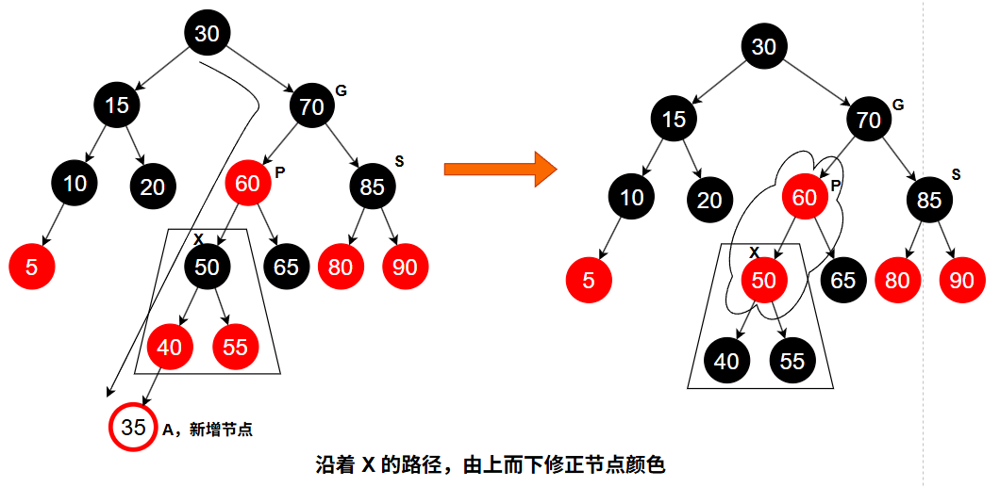
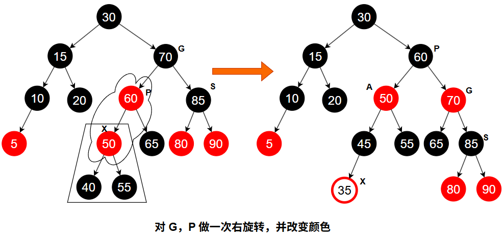
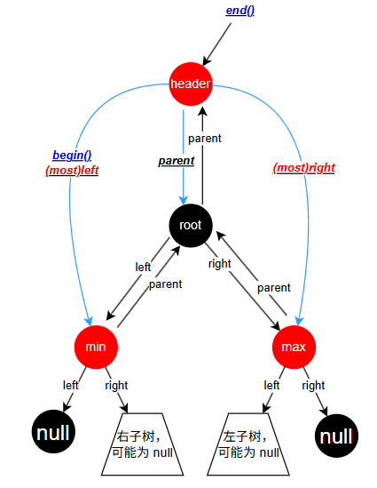

## RB-Tree（上）

RB-tree（红黑树）是加了平衡条件的二叉搜索树，需满足以下规则：

1. 每个节点非红即黑。
2. 根节点是黑色。
3. 红节点不能有红色子节点（即不能连续红）。
4. 从任一节点到其所有 NULL（叶端）路径上的黑节点数相同。

   - 这些路径是指：从某个节点出发，往下走到“空指针”结束（即 NULL 节点）。
   - 这些“NULL 节点”并不是真正存在于树中的实际节点，但在理论分析中，会将每个叶子节点的左右子指针（即指向 NULL）视为“虚拟叶子节点”。
   - 这些“NULL”被视作**黑色节点**，这点在红黑树的定义中是默认的。
5. 每个叶子节点（即 NULL 节点）都是黑色的。

   - 在 **红黑树的语境下**：

     - **NULL 被视作叶子节点**，并且是黑色的。

     - 一般来说红黑树中的“叶子节点”就是指的 NULL 节点（并不是没有孩子的真实节点）。
     
     - 但有的时候是指实际节点，具体看情况。


新增节点设为红色，若违反规则需通过“变色”和“旋转”调整恢复平衡。



后续图示不再画出 NULL 节点。

### AVL vs 红黑树的对比

| 特性         | AVL 树                     | 红黑树                                       |
| ------------ | -------------------------- | -------------------------------------------- |
| 平衡条件     | 任一节点左右子树高度差 ≤ 1 | 任一路径黑节点数相同，不允许连续红           |
| 平衡“严格度” | 更严格（几乎是最平衡的）   | 较宽松（可容忍部分不平衡）                   |
| 插入调整     | 可能需要多次旋转           | 最多一次旋转 + 多次变色                      |
| 删除调整     | 较复杂，旋转多             | 简洁，最多三次旋转                           |
| 查找效率     | 更快（因树更矮）           | 略慢（树更高）                               |
| 应用场景     | 注重查找效率，如数据库索引 | 注重插入/删除效率，如操作系统、STL `map/set` |

### 插入节点

插入 3、8、35、75 后，都会违反红黑树的规则，因此需要调整结构。这些调整包括：**旋转**和**变色**，以恢复红黑树的五大规则（尤其是红红相连和黑高不一致的问题）。



为便于讨论，我们为特定节点设定代称：

- 新插入节点为 **X**
- 父节点为 **P**
- 爷爷节点为 **G**
- 叔叔节点（P 的兄弟）为 **S**
- 曾爷爷节点为 **GG**

#### 推论

- 由于按二叉搜索树规则，X 一定是叶节点；
- 根据红黑树规则 4，X 必须为红色；
- 若其父 **P 也是红色**，就违反了红黑树规则 3，必须进行调整（如果父节点是黑色，直接插入红色新节点，不需要任何旋转或染色操作；如果插入的就是根节点，那就把插入到红色节点变成黑色）。这时，**G 必为黑色**（因为原树满足红黑树规则）。

接下来根据插入节点 **X 的位置** 和**叔叔节点 S、曾爷爷节点GG 的颜色**，有三类典型处理情形。

#### 情形一：插入的节点是根节点

处理方法：直接变黑。

#### 情形二：插入节点的叔叔是黑色

##### 叔叔节点 S 是黑色，且 X 是“外侧插入”

处理方法：单旋转加变色。

- 对 P 和 G 进行 **一次单旋转**
- 然后交换转轴 P 和旋转点 G 的颜色

这样就能重新满足红黑树的规则，尤其是规则 3（红色不能相邻）。这是最简单、最直接的一种调整方式。


虽然此时可能出现子树高度差超过 1 的不平衡（如 A、B 为 null 而 D 或 E 非 null），但这无妨，因为红黑树的平衡要求本就比 AVL 树宽松。

经验表明，**红黑树的平均搜索效率和 AVL 树几乎相同**，实际效果很好。

##### 叔叔节点 S 是黑色，且 X 是“内侧插入”

处理方法：双旋转加变色。

- 对 P 和 X 进行 **一次单旋转**，并交换 G 和 X 的颜色
- 再对 G 进行 **一次单旋转**


#### 情形三：插入节点的叔叔是红色

##### 叔叔节点 S 是红色，且 X 是“外侧插入”

红黑树插入调整中，**“叔叔节点 S 是红色”时，不论 X 是内侧插入还是外侧插入**，这两种情况的处理方式是一样的——都是“重新染色并递归向上调整”。换句话说，叔叔是红色时，不旋转，**只变色，并往上继续递归修正**。

处理方法：

- 父节点和叔叔节点同时变为黑色
- 爷爷节点染成红色
- 将“当前节点指针”上移到爷爷节点，循环判断，直到满足红黑树性质（如根节点为黑，或没有连续红节点）

如果曾祖父 GG 是黑色，调整完成；若 GG 是红色，则把 G 当成新的插入节点，继续向上调整，直到没有连续红色父子节点为止。


#### 小结

| 插入信息             | 处理办法                                                     |
| -------------------- | ------------------------------------------------------------ |
| 插入的节点是根节点   | 直接变黑。                                                   |
| 插入节点的叔叔是黑色 | （LL，RR，LR，RL）旋转，然后变色。                           |
| 插入节点的叔叔是红色 | 不旋转，只变色，把父亲节点，叔叔节点，爷爷节点都变色，然后当前节点指针上移到爷爷节点，循环判断。 |

### Top-Down 插入优化策略

#### 普通插入（Bottom-Up）

- 先一路找到插入位置，插入节点（红色）。
- 如果“父子皆红”才开始从插入点往上回溯修正。
- 回溯过程中可能会遇到多个节点需要旋转或变色。
- **问题**：最坏情况下会一路递归到根，导致多次检查与栈操作。

#### Top-Down 插入

为了避免在插入过程中出现“父子节点同为红色”的情况，特别是当**叔叔节点为红色**时可能引发的向上颜色调整，可以采用一种 **自顶向下（Top-Down）** 的处理策略：

- 在向下走的过程中，**一旦遇到某个节点 X 两个孩子都是红色**，立刻：
  1. **X 变红**
  2. **两个孩子变黑**
- 这样在到达插入位置之前，就已经打破了可能形成的“父子红冲突”。
- 新节点插入后，冲突范围被局限在很小的局部，通常只需要一次旋转（或者甚至不用）。

#### 对比效果

##### 逻辑本质

- 是同一个修正过程，只是把回溯改成了下行时的“预修正”。
- 所以它不会改变红黑树最终结构，只是改变调整的时机。

##### 性能差别

- Bottom-Up：可能需要递归回溯 N 层（N 为树高度）。
- Top-Down：始终是 O(1) 栈空间（因为一路向下），没有显式回溯。
- 在需要频繁插入、且数据分布不平衡的情况下，Top-Down 的常数开销会小一些，尤其适合无递归的实现（例如在内核或嵌入式里）。

##### 缺点

- 写法更复杂，要考虑沿途变色可能引起的旋转（尤其当父节点是红色时）。
- 有些情况下会多做一次颜色翻转（虽然不影响最终树形）。

这种变换能预先消除将来可能出现的红冲突，从而**减少后续旋转和颜色调整的复杂度**，也能避免向上递归调整，提升插入效率。它并不是“额外优化红黑树的平衡性质”，只是**把调整从事后搬到事前**，节省了回溯的栈操作，让插入过程可以**一次从根到叶的线性遍历完成**，适合要求无递归的实现。



即使使用 Top-Down 插入法，在插入节点 A 的路径上先做了变色处理，但若插入 A 后，**A 的父节点 P 是红色**，仍会产生“父子皆红”的违规情况。此时：

- 若是“外侧插入”（A 和 P 同侧）→ 执行一次**单旋转**，并交换颜色。
- 若是“内侧插入”（A 和 P 异侧）→ 执行一次**双旋转**，并调整颜色。

完成这些操作后，**红黑树性质恢复**。接着，后续节点（如节点 35）插入就会很简单：

只需普通插入，或插入后配合一次简单的旋转即可。



### RB-tree 的节点设计

RB-tree 是具有红黑节点和左右子树的二叉搜索树。SGI STL 实现中采用双层节点结构，并设有 `parent` 指针，便于向上回溯。极值查找如 `minimum()`、`maximum()` 操作也非常简单高效。

```cpp
// 定义颜色类型为 bool
typedef bool __rb_tree_color_type;

// 红色为 false (0)，黑色为 true (1)
const __rb_tree_color_type __rb_tree_red = false;
const __rb_tree_color_type __rb_tree_black = true;

// 基础节点结构体，包含颜色、父子节点指针
struct __rb_tree_node_base {
    typedef __rb_tree_color_type color_type;   // 节点颜色类型（红或黑）
    typedef __rb_tree_node_base* base_ptr;     // 指向自身类型的指针别名

    color_type color;     // 节点颜色，非红即黑
    base_ptr parent;      // 指向父节点的指针（红黑树的操作常需要回溯父节点）
    base_ptr left;        // 指向左子节点的指针
    base_ptr right;       // 指向右子节点的指针

    // 查找以 x 为根的子树中的最小值节点（一直往左走）
    static base_ptr minimum(base_ptr x) {
        while (x->left != 0) x = x->left;
        // 一直向左走就能找到最小值
        return x;
    }

    // 查找以 x 为根的子树中的最大值节点（一直往右走）
    static base_ptr maximum(base_ptr x) {
        while (x->right != 0) x = x->right;
        // 一直向右走就能找到最大值
        return x;
    }
};

// 继承基础节点结构体，并添加 value 域（即模板值类型）
template <class Value>
struct __rb_tree_node : public __rb_tree_node_base {
    typedef __rb_tree_node<Value>* link_type;  // 指向自身类型的指针别名
    Value value_field;                        // 存储的数据内容（节点的值）
};
```

- 红黑树节点由 `__rb_tree_node_base` 提供通用结构，包括颜色和指针。
- `__rb_tree_node<Value>` 是模板化的节点，额外持有值字段 `value_field`。
- `minimum()` 和 `maximum()` 利用了二叉搜索树的特性，分别查找最小和最大值节点。


### RB-tree 的迭代器

为了将 RB-Tree 实现为泛型容器，**迭代器设计是关键**，需支持以下操作：

- **类型分类（category）**
- **前进（++）、后退（--）**
- **提领（\*）、成员访问（->）**

SGI STL 采用了 **双层结构** 的设计：

- 节点：`__rb_tree_node` 继承自 `__rb_tree_node_base`
- 迭代器：`__rb_tree_iterator` 继承自 `__rb_tree_base_iterator`

这种设计类似 `slist`，**利于统一操作与灵活转换**，也方便我们深入分析 RB-Tree 的行为和状态。


#### header 节点

##### `header` 的位置和作用

在 SGI STL 的 `rb_tree` 里，`header` 节点是**一棵红黑树之外的特殊节点**，它的结构是这样的：



- **`header` 是基类 `__rb_tree_node_base` 类型的节点**，它只包含最基础的指针和颜色信息，没有存储具体的值。
- **普通的红黑树节点是 `__rb_tree_node`，它继承自 `__rb_tree_node_base`，并额外存储了数据字段（Value）**。

**主要作用：**

- **保存根节点指针**（`header->parent`）：`header->parent` 指向树的真正根节点。
- **保存最小节点指针**（`header->left`）：`header->left` 指向树中的最小节点，方便 `begin()` 常数时间返回。
- **保存最大节点指针**（`header->right`）：`header->right` 指向树中的最大节点，方便 `end()` 前一个迭代器的查找。
- **充当 `end()` 迭代器的 node**：迭代器到达最后一个节点的下一个位置时，`node` 会指向 `header`。

#### **RB-Tree 迭代器特性与前后移动操作**

- **属于双向迭代器**，不支持随机访问。
- **提领（`*`）与成员访问（`->`）** 与 `list` 类似。
- **前进操作 `operator++()`** 会调用基类的 `increment()`
- **后退操作 `operator--()`** 会调用基类的 `decrement()`

前后移动都遵循 **二叉搜索树的中序遍历规则**，实现上对根节点处理有些特殊技巧。

RB-tree 基础迭代器结构：

```cpp
struct __rb_tree_base_iterator {
    typedef __rb_tree_node_base::base_ptr base_ptr;
    typedef bidirectional_iterator_tag iterator_category;
    typedef ptrdiff_t difference_type;

    base_ptr node; // 当前迭代器指向的节点指针

	// 中序遍历的后继节点（++ 操作）
	void increment() {
    	if (node->right != 0) {
        	// 情况 1：当前节点有右子树
        	// 后继是右子树中最左节点
        	node = node->right;
        	while (node->left != 0)
            	node = node->left;
    	} else {
        	// 情况 2：当前节点无右子树
        	// 向上回溯，寻找第一个祖先节点，使当前节点是该祖先的左子节点
        	base_ptr y = node->parent;
        	while (node == y->right) {
            	node = y;
            	y = y->parent;
        	}
        	// 退出循环时：
        	// 情况 2.1：y 是第一个使 node 成为其左子节点的祖先，
        	//           此时循环前的 node 的直接后继就是 y
        	// 情况 2.2：y 是 header（哨兵），循环后的 node 是根节点，
        	//           循环前的 node 实际是最大值节点，
        	//           经过下面的判断后，node 被设为 header，表示迭代器到达 end()
        	if (node->right != y)
            	node = y;
    	}
	}

    // 中序遍历的前驱节点（-- 操作）
    void decrement() {
        // 情况 1：当前迭代器指向 header（end()）
        // header 颜色为红色，且其父的父节点是 header 本身
        if (node->color == _rb_tree_red && node->parent->parent == node) {
            // 前驱是树中最大节点，位于 header->right
            node = node->right;
        } else if (node->left != 0) {
            // 情况 2：当前节点有左子树
            // 前驱是左子树中最右节点
            base_ptr y = node->left;
            while (y->right != 0)
                y = y->right;
            node = y;
        } else {
            // 情况 3：当前节点无左子树
            // 向上回溯，找到第一个祖先节点，使当前节点是该祖先的右子节点
            base_ptr y = node->parent;
            while (node == y->left) {
                node = y;
                y = y->parent;
            }
            // y 是中序遍历的前驱节点
            node = y;
        }
    }
};
```

RB-tree 正规迭代器结构（继承基层迭代器）:

```cpp
template <class Value, class Ref, class Ptr>
struct __rb_tree_iterator : public __rb_tree_base_iterator {
    // 迭代器中元素的类型
    typedef Value      value_type;
    // 解引用时返回的引用类型，可能是 Value& 或 const Value&
    typedef Ref        reference;
    // 迭代器指针类型，可能是 Value* 或 const Value*
    typedef Ptr        pointer;

    // iterator 和 const_iterator 类型定义，方便使用
    typedef __rb_tree_iterator<Value, Value&, Value*>             iterator;
    typedef __rb_tree_iterator<Value, const Value&, const Value*> const_iterator;
    typedef __rb_tree_iterator<Value, Ref, Ptr>                   self;       // 当前迭代器类型自身别名
    typedef __rb_tree_node<Value>*                                link_type;  // 节点指针类型

    // 构造函数
    __rb_tree_iterator() {}                  // 默认构造，节点为空
    __rb_tree_iterator(link_type x) {       // 通过节点指针构造迭代器
        node = x;
    }
    __rb_tree_iterator(const iterator& it) { // 通过非 const 迭代器构造 const 迭代器
        node = it.node;
    }

    // 解引用操作符：通过迭代器访问节点的值
    reference operator*() const {
        return link_type(node)->value_field; // 节点的值成员变量，一般叫 value 或 value_field
    }

#ifndef __SGI_STL_NO_ARROW_OPERATOR
    // 箭头操作符，返回指向节点值的指针，方便通过迭代器访问成员
    pointer operator->() const {
        return &(operator*());
    }
#endif

    // 前置 ++ 运算符：移动到中序遍历的下一个节点
    self& operator++() {
        increment();  // 调用基类或成员函数完成节点跳转
        return *this;
    }

    // 后置 ++ 运算符：移动到下一个节点，返回递增前的迭代器副本
    self operator++(int) {
        self tmp = *this;  // 复制当前迭代器
        increment();
        return tmp;        // 返回递增前的迭代器
    }

    // 前置 -- 运算符：移动到中序遍历的前一个节点
    self& operator--() {
        decrement();  // 调用基类或成员函数完成节点跳转
        return *this;
    }

    // 后置 -- 运算符：移动到前一个节点，返回递减前的迭代器副本
    self operator--(int) {
        self tmp = *this;  // 复制当前迭代器
        decrement();
        return tmp;        // 返回递减前的迭代器
    }
};
```


`increment()` 的状况 2.2：
当迭代器指向的是整棵树的最大节点，执行 `++` 时会指向 `header`，也就是 `end()`。

`decrement()` 的状况 1：
当迭代器是 `end()`（即指向 `header`）时，执行 `--`，实际返回的是最大节点（最右节点）。

### RB-tree 的数据结构

下面是红黑树（RB-tree）的定义简述：

- 使用专属的空间配置器，每次分配一个节点大小的内存。
- 定义了多种类型，用于管理整棵红黑树的数据结构。
- 包含一个仿函数（functor），用于比较节点的大小，保证树的有序性。
- 提供了若干成员函数，用于插入、删除、查找等操作。

这些设计保证了红黑树的灵活性和高效性。

```cpp
template <class Key, class Value, class KeyOfValue, class Compare, class Alloc = allocator>
class rb_tree {
protected:
    typedef void* void_pointer;
    typedef __rb_tree_node_base* base_ptr;      // 基础节点指针类型，指向红黑树节点基类
    typedef __rb_tree_node<Value> rb_tree_node; // 红黑树节点具体类型，存储Value数据
    typedef simple_alloc<rb_tree_node, Alloc> rb_tree_node_allocator; // 节点内存配置器，用于节点的分配和释放
    typedef __rb_tree_color_type color_type;    // 节点颜色类型，红或黑

public:
    // 公开类型定义，方便外部访问
    typedef Key key_type;                       // 键的类型
    typedef Value value_type;                   // 节点存储值的类型
    typedef value_type* pointer;                // 指向值的指针类型
    typedef const value_type* const_pointer;   // 指向常量值的指针类型
    typedef value_type& reference;              // 值的引用类型
    typedef const value_type& const_reference; // 常量值引用类型
    typedef rb_tree_node* link_type;            // 节点指针类型
    typedef size_t size_type;                    // 容器大小类型
    typedef ptrdiff_t difference_type;          // 差值类型

protected:
    // 内存管理相关函数

    // 分配一个新的节点内存
    link_type get_node() {
        return rb_tree_node_allocator::allocate();
    }

    // 释放一个节点内存
    void put_node(link_type p) {
        rb_tree_node_allocator::deallocate(p);
    }

    // 创建节点（分配+构造）
    link_type create_node(const value_type& x) {
        link_type tmp = get_node();  // 先分配内存
        __STLTRY {
            construct(&tmp->value_field, x); // 构造节点数据部分
        } __STL_UNWIND(put_node(tmp));      // 构造失败时释放内存
        return tmp;
    }

    // 复制节点，复制值和颜色，但左右子节点置空
    link_type clone_node(link_type x) {
        link_type tmp = create_node(x->value_field);  // 复制节点值
        tmp->color = x->color;                         // 复制颜色
        tmp->left = 0;
        tmp->right = 0;
        return tmp;
    }

    // 销毁节点（析构并释放内存）
    void destroy_node(link_type p) {
        destroy(&p->value_field);
        put_node(p);
    }

protected:
    // 树的核心数据成员

    size_type node_count;    // 当前树中节点总数
    link_type header;        // 特殊节点，作为树的“头”，方便操作树结构

    Compare key_compare;     // 用于比较键值的仿函数

    // 通过header节点访问红黑树中的重要节点：
    // root节点、最左（最小）节点、最右（最大）节点
    link_type& root() const { return (link_type&) header->parent; }
    link_type& leftmost() const { return (link_type&) header->left; }
    link_type& rightmost() const { return (link_type&) header->right; }

    // 静态辅助函数，方便访问节点的成员指针和值
    static link_type& left(link_type x) { return (link_type&)(x->left); }
    static link_type& right(link_type x) { return (link_type&)(x->right); }
    static link_type& parent(link_type x) { return (link_type&)(x->parent); }
    static reference value(link_type x) { return x->value_field; }
    static const Key& key(link_type x) { return KeyOfValue()(value(x)); }
    static color_type& color(link_type x) { return (color_type&)(x->color); }

    // 以上函数对 base_ptr 同样支持，方便类型转换和操作

    // 查找子树的最小和最大节点
    static link_type minimum(link_type x) { return (link_type)__rb_tree_node_base::minimum(x); }
    static link_type maximum(link_type x) { return (link_type)__rb_tree_node_base::maximum(x); }

public:
    // 迭代器类型定义，方便外部使用
    typedef __rb_tree_iterator<value_type, reference, pointer> iterator;

private:
    // 内部辅助函数声明
    iterator __insert(base_ptr x, base_ptr y, const value_type& v);
    link_type __copy(link_type x, link_type p);
    void __erase(link_type x);

    // 初始化树结构
    void init() {
        header = get_node();           // 分配header节点
        color(header) = _rb_tree_red;  // header颜色设为红，便于区分
        root() = 0;                    // 空树时root为空
        leftmost() = header;           // header的left指向自己，表示空树
        rightmost() = header;          // header的right指向自己，表示空树
    }

public:
    // 构造函数，初始化空树，传入比较函数对象
    rb_tree(const Compare& comp = Compare()) : node_count(0), key_compare(comp) {
        init();
    }

    // 析构函数，清空树并释放header节点
    ~rb_tree() {
        clear();         // 清空所有节点
        put_node(header); // 释放header
    }

    // 访问器

    // 返回比较函数对象
    Compare key_comp() const { return key_compare; }

    // 返回指向最小元素的迭代器
    iterator begin() { return leftmost(); }

    // 返回表示end()的迭代器（header节点）
    iterator end() { return iterator(header); }

    // 判断是否为空树
    bool empty() const { return node_count == 0; }

    // 返回节点数量
    size_type size() const { return node_count; }

    // 返回最大容量（通常是size_t最大值）
    size_type max_size() const { return size_type(-1); }

    // 插入接口（详细实现略）
    // 保持节点值独一无二
    pair<iterator, bool> insert_unique(const value_type& x);
    // 允许节点值重复
    iterator insert_equal(const value_type& x);
    // ...
};

```

- `header` 节点是红黑树中一个特殊哨兵节点，用来简化树操作，比如空树时的根节点为空的情况等。
- `KeyOfValue` 是一个仿函数，用来从 `Value` 中提取对应的 `Key`，方便做键比较。
- 内存管理使用 `simple_alloc` 封装，负责节点内存分配与释放。
- `insert_unique` 和 `insert_equal` 分别对应不允许重复键和允许重复键的插入操作。