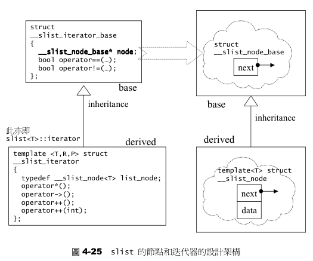
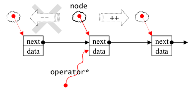
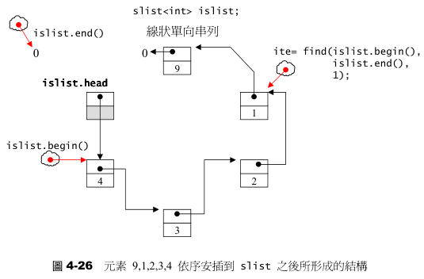
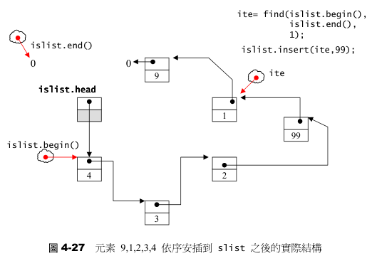
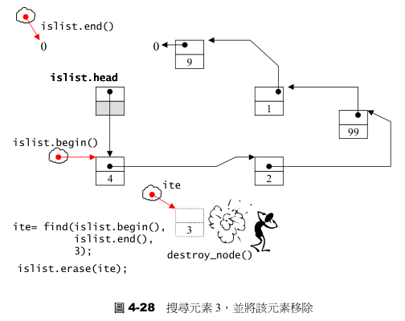
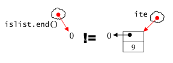

## forward_list

`std::forward_list` 是 C++11 引入的**单向链表容器**，相比 `std::list`（双向链表）更加轻量，仅维护一个方向的链接指针，适用于低内存开销、简单插删的场景。

### 底层结构与原理

底层是**单向链表（singly linked list）**，每个节点结构类似：

```cpp
struct Node {
    T data;
    Node* next;
};
```

容器只维护一个头指针 `head`，不能双向遍历，也没有 `tail`。

> 优点：比 `list` 更省内存（少一个指针）
> 缺点：不能反向遍历，也不支持 `size()` 常数时间获取大小（需手动统计）

### 常用接口

#### 创建与遍历

```cpp
#include <forward_list>
#include <iostream>
using namespace std;

int main() {
    forward_list<int> fl = {1, 2, 3};

    for (int x : fl)
        cout << x << " ";  // 输出：1 2 3
}
```

#### 插入与删除

```cpp
forward_list<int> fl = {1, 2, 3};
auto it = fl.before_begin();  // forward_list 没有 begin() 前的元素，所以用 before_begin()

fl.insert_after(it, 0);     // 插入到 1 之前 -> {0, 1, 2, 3}

++it;  // 指向 0
fl.erase_after(it);         // 删除 1 -> {0, 2, 3}

for (int x : fl) cout << x << " ";
// 0 2 3
```

注意：`insert_after` / `erase_after` 是 forward_list 的核心插入/删除方式，**操作的是指定节点“之后”的位置**。

#### 其他操作

```cpp
forward_list<int> fl = {5, 2, 1, 3, 2};

fl.sort();       // 排序
fl.unique();     // 相邻去重（如：1,1,2,3 -> 1,2,3）
fl.reverse();    // 反转

for (int x : fl) cout << x << " ";
// 1 2 3 5
```

### 常见操作时间复杂度对比

| 操作             | `forward_list` | `list`   | 说明                   |
| ---------------- | -------------- | -------- | ---------------------- |
| 顺序访问（遍历） | ✅ O(n)         | ✅ O(n)   | 单向 / 双向            |
| 任意位置插入删除 | ✅ O(1)         | ✅ O(1)   | 需迭代器定位前一个位置 |
| 反向遍历         | ❌ 不支持       | ✅ 支持   |                        |
| 获取 size()      | ❌ O(n)         | ✅ O(1)*  | 一些实现中是 O(1)      |
| 随机访问         | ❌ 不支持       | ❌ 不支持 |                        |

### 适用场景

| 场景                  | 推荐容器       | 原因                |
| --------------------- | -------------- | ------------------- |
| 只需要单向遍历        | `forward_list` | 更轻量省内存        |
| 需要频繁双向插入/删除 | `list`         | 双向更方便          |
| 有严格内存限制        | `forward_list` | 少一个指针          |
| 需要常数时间 `size()` | `list`         | forward_list 不支持 |

### slist 概述

STL 的 `list` 是双向链表，SGI STL 还有一个单向链表叫 `slist`，虽然不是标准，但学习它有助于理解实现技巧。

`slist` 的迭代器是单向的（Forward Iterator），功能比双向链表 `list` 少，但空间更省，某些操作更快。两者都支持插入、删除、拼接，且这些操作不会使已有迭代器失效（指向被删除元素的迭代器除外）。插入操作会把新元素放在指定位置前面，但 `slist` 无法方便地找到前一个节点，除非从头遍历，因此在非开头位置用 `insert` 或 `erase` 不方便。为此，`slist` 提供了 `insert_after()` 和 `erase_after()`，更灵活。

`slist` 只支持 `push_front()`，没有 `push_back()`，因此元素顺序与插入顺序相反。

### slist 的节点

slist 的节点和迭代器设计比 list 更复杂，采用了继承关系，因此类型转换较复杂。



```cpp
// 单向链表的节点基本结构，只包含指向下一个节点的指针
struct __slist_node_base {
    __slist_node_base* next; // 指向下一个节点
};

// 单向链表的节点结构，继承自 __slist_node_base，存储数据部分
template <class T>
struct __slist_node : public __slist_node_base {
    T data; // 节点存储的数据
};

// 全局函数：在已知节点 prev_node 后插入一个新节点 new_node
inline __slist_node_base* __slist_make_link(
    __slist_node_base* prev_node,
    __slist_node_base* new_node)
{
    // 新节点的 next 指向 prev_node 的下一个节点，实现链表连接
    new_node->next = prev_node->next;
    // prev_node 的 next 指向新节点，完成插入
    prev_node->next = new_node;
    return new_node; // 返回插入的新节点指针
}

// 全局函数：计算单向链表的大小（元素个数）
// 传入链表起始节点指针，逐个遍历直到末尾（nullptr），累加计数
inline size_t __slist_size(__slist_node_base* node) {
    size_t result = 0;
    for ( ; node != nullptr; node = node->next)
        ++result;
    return result; // 返回链表元素总数
}
```

### slist 的迭代器



```cpp
// 单向链表的迭代器基础结构
struct __slist_iterator_base {
    typedef size_t size_type;
    typedef ptrdiff_t difference_type;
    typedef forward_iterator_tag iterator_category; // 单向迭代器类别

    __slist_node_base* node; // 指向链表节点的指针（基础节点类型）

    // 构造函数，初始化时指向某节点
    __slist_iterator_base(__slist_node_base* x) : node(x) {}

    // 前进操作，指向下一个节点
    void incr() { node = node->next; }

    // 判断两个迭代器是否相等，判断节点指针是否相等
    bool operator==(const __slist_iterator_base& x) const {
        return node == x.node;
    }

    // 判断两个迭代器是否不等
    bool operator!=(const __slist_iterator_base& x) const {
        return node != x.node;
    }
};

// 单向链表的具体迭代器模板结构，继承基础迭代器结构
template <class T, class Ref, class Ptr>
struct __slist_iterator : public __slist_iterator_base {
    typedef __slist_iterator<T, T&, T*> iterator;
    typedef __slist_iterator<T, const T&, const T*> const_iterator;
    typedef __slist_iterator<T, Ref, Ptr> self;
    typedef T value_type;
    typedef Ptr pointer;
    typedef Ref reference;
    typedef __slist_node<T> list_node;

    // 构造函数，接受具体节点指针，传给基础迭代器构造函数
    __slist_iterator(list_node* x) : __slist_iterator_base(x) {}

    // 默认构造函数，迭代器为空时 node 指针为 0（nullptr）
    __slist_iterator() : __slist_iterator_base(0) {}

    // 允许从普通 iterator 转换构造
    __slist_iterator(const iterator& x) : __slist_iterator_base(x.node) {}

    // 解引用，返回节点中的数据引用
    reference operator*() const { return ((list_node*) node)->data; }

    // -> 操作符，返回数据指针
    pointer operator->() const { return &(operator*()); }

    // 前置递增，移动到下一个节点并返回自身引用
    self& operator++() {
        incr(); // 调用基类的 incr()
        return *this;
    }

    // 后置递增，移动到下一个节点，但返回递增前的迭代器副本
    self operator++(int) {
        self tmp = *this;
        incr();
        return tmp;
    }

    // 注意：没有实现 operator--，因为单向链表迭代器只能单向遍历（Forward Iterator）
};
```

比较两个 slist 迭代器是否相等时（如循环中判断是否等于 slist.end()），因为 __slist_iterator 没有重载 operator==，会调用基类 __slist_iterator_base 的 operator==。这个操作是比较它们内部的指针 __slist_node_base* node 是否相同，指针相同即认为迭代器相等。

### slist 的数据结构

```cpp
template <class T, class Alloc = alloc>
class slist {
public:
    typedef T value_type;
    typedef value_type* pointer;
    typedef const value_type* const_pointer;
    typedef value_type& reference;
    typedef const value_type& const_reference;
    typedef size_t size_type;
    typedef ptrdiff_t difference_type;
    typedef __slist_iterator<T, T&, T*> iterator;
    typedef __slist_iterator<T, const T&, const T*> const_iterator;

private:
    typedef __slist_node<T> list_node;           // 单向链表节点结构，包含数据和指向下一节点指针
    typedef __slist_node_base list_node_base;    // 节点基类，仅含 next 指针
    typedef __slist_iterator_base iterator_base; // 迭代器基类
    typedef simple_alloc<list_node, Alloc> list_node_allocator; // 内存分配器，用于节点空间管理

    // 创建一个新节点，包含元素 x
    static list_node* create_node(const value_type& x) {
        list_node* node = list_node_allocator::allocate(); // 分配内存
        __STL_TRY {
            construct(&node->data, x);  // 构造节点内的数据
            node->next = 0;             // 初始化 next 指针为空
        }
        __STL_UNWIND(list_node_allocator::deallocate(node)); // 异常时释放内存
        return node;  // 返回新节点指针
    }

    // 销毁节点，释放内存
    static void destroy_node(list_node* node) {
        destroy(&node->data);                   // 销毁数据元素
        list_node_allocator::deallocate(node); // 释放节点内存
    }

private:
    list_node_base head;  // 链表头节点（非指针，实际节点对象），其 next 指向链表第一个节点

public:
    slist() { head.next = 0; }   // 构造函数，初始化为空链表（head.next 为空）
    ~slist() { clear(); }        // 析构函数，清空链表释放所有节点

public:
    iterator begin() { return iterator((list_node*)head.next); } // 返回第一个元素的迭代器
    iterator end() { return iterator(0); }                      // 返回尾迭代器（空指针表示末尾）

    size_type size() const { return __slist_size(head.next); }  // 计算链表长度，从第一个节点开始遍历

    bool empty() const { return head.next == 0; }               // 判断链表是否为空

    // 交换两个 slist 的内容，只交换头节点的 next 指针，操作效率高
    void swap(slist& L) {
        list_node_base* tmp = head.next;
        head.next = L.head.next;
        L.head.next = tmp;
    }

public:
    // 返回头节点数据的引用（链表第一个元素）
    reference front() { return ((list_node*) head.next)->data; }

    // 从头部插入元素 x，新节点成为链表第一个节点
    void push_front(const value_type& x) {
        __slist_make_link(&head, create_node(x)); // 创建新节点并链入 head 后
    }

    // 从头部删除元素，释放第一个节点
    void pop_front() {
        list_node* node = (list_node*) head.next;  // 取出第一个节点指针
        head.next = node->next;                     // 头节点指向下一个节点
        destroy_node(node);                          // 销毁并释放原第一个节点
    }
    ...
};
```

- `slist` 实际用一个“空的头节点对象”`head`作为链表起点，不是指针，方便统一处理空链表情况。
- 节点内存用自定义分配器管理，`create_node`和`destroy_node`封装内存分配和构造析构细节。
- 只提供从头插入和删除操作，没有尾插（节省复杂度和空间）。
- 迭代器类型封装了节点指针，支持前向遍历。
- 通过交换头节点的 `next` 指针即可快速交换两个链表内容。

### slist 的元素操作

```cpp
#include <slist>      // 单向链表头文件（注意：标准库中无此头文件，可能是SGI STL扩展）
#include <iostream>
#include <algorithm>  // 提供 find 等算法
using namespace std;

{int main()
{
    int i;
    slist<int> islist;               // 创建一个空的单向链表
    cout << "size=" << islist.size() << endl; // 输出链表大小，初始应为0

    // 头插入元素，顺序插入：9, 1, 2, 3, 4
    // 由于是 push_front，新元素都插入到前面，最终链表顺序为 4 3 2 1 9
    islist.push_front(9);
    islist.push_front(1);
    islist.push_front(2);
    islist.push_front(3);
    islist.push_front(4);

    cout << "size=" << islist.size() << endl; // 输出链表大小，现为5

    slist<int>::iterator ite = islist.begin();  // 迭代器指向链表头
    slist<int>::iterator ite2 = islist.end();   // 迭代器指向链表尾（空节点）

    // 遍历链表输出所有元素
    for (; ite != ite2; ++ite)
        cout << *ite << ' ';   // 输出: 4 3 2 1 9
    cout << endl;

    // 查找值为1的节点
    ite = find(islist.begin(), islist.end(), 1);
    if (ite != 0)  // 找到后，在该节点之前插入99（slist支持insert）
        islist.insert(ite, 99);

    cout << "size=" << islist.size() << endl; // 插入后大小为6
    cout << *ite << endl;                     // 输出找到的节点的值，仍是1

    // 再次遍历链表输出所有元素
    ite = islist.begin();
    ite2 = islist.end();
    for (; ite != ite2; ++ite)
        cout << *ite << ' ';  // 输出: 4 3 2 99 1 9
    cout << endl;

    // 查找值为3的节点
    ite = find(islist.begin(), islist.end(), 3);
    if (ite != 0)
        cout << *(islist.erase(ite)) << endl; // 删除节点3，并输出删除节点之后的节点值，输出2

    // 遍历链表输出剩余元素
    ite = islist.begin();
    ite2 = islist.end();
    for (; ite != ite2; ++ite)
        cout << *ite << ' ';  // 输出: 4 2 99 1 9
    cout << endl;
}
}
```

- `slist<int> islist;` 创建一个空的单向链表。
- `push_front` 总是在链表头部插入元素，因此元素顺序和插入顺序相反。
- 使用标准算法 `find` 查找元素。
- `insert(ite, 99)` 在迭代器 `ite` 指向节点之前插入元素99。
- `erase(ite)` 删除迭代器指向的节点，返回下一个节点的迭代器。
- `begin()` 和 `end()` 分别返回链表头和尾迭代器，用于遍历。
- 注意：slist 不支持随机访问迭代器，只支持单向前进。







当调用 `slist.end()` 时，代码如下：

```cpp
iterator end() { return iterator(0); }
```

这个返回值会调用 `slist` 的迭代器构造函数：

```cpp
template <class T, class Ref, class Ptr>
struct __slist_iterator : public __slist_iterator_base {
    // ...

    // 构造函数
    __slist_iterator(list_node* x) : __slist_iterator_base(x) {}
    // ...
};
```

其中基类是：

```cpp
struct __slist_iterator_base {
    __slist_node_base* node;  // 指向节点的指针

    __slist_iterator_base(__slist_node_base* x) : node(x) {}

    // 判断两个迭代器是否相等，就是比较它们的 node 指针是否相同
    bool operator==(const __slist_iterator_base& x) const {
        return node == x.node;
    }
    bool operator!=(const __slist_iterator_base& x) const {
        return node != x.node;
    }
};
```

由于传入的是 `0`（空指针），`end()` 返回的迭代器内部的 `node` 就是 `nullptr`。

这代表：

- `end()` 并不指向链表中任何实际节点
- 它是一个特殊的标记，表示“链表遍历结束”
- 因此，用迭代器比较判断是否到达末尾，是通过比较 `node` 是否为 `nullptr` 来实现的



### slist 和 forward_list 的关系

1. **slist** 是 **SGI STL**（旧版 STL 实现）中提供的单向链表容器，功能和接口设计比较早，属于非标准库组件。它支持单向遍历，空间开销小，但功能相对有限。
2. **forward_list** 是 C++11 标准库引入的单向链表容器，基于 `slist` 的设计改进而来，是标准容器，支持单向遍历，接口更现代且符合标准库规范。
3. **forward_list** 可以看作是标准化、规范化的 `slist`，它们都实现单向链表的基本特性，区别主要在于：
   - **接口**：`forward_list` 采用了标准库的命名和接口，支持标准迭代器、算法的无缝配合。
   - **功能**：`forward_list` 进一步完善了异常安全、效率和接口一致性。
   - **命名**：`slist` 这个名称容易和 STL 中双向链表的 `list` 混淆，C++11 标准库采用 `forward_list` 作为更明确且语义清晰的名字。
