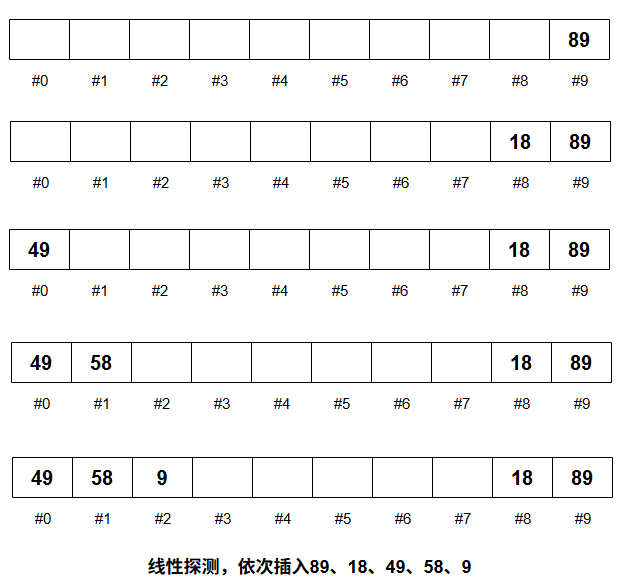
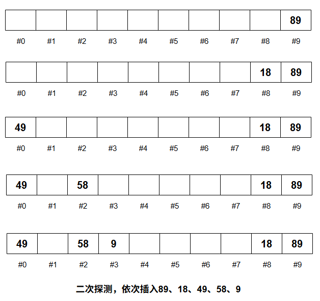

## hashtable 前置知识

- **二叉搜索树（BST）**：平均时间复杂度是对数级 `O(log n)`，但前提是假设输入数据有足够随机性。
- **红黑树（RB-tree）**：一种高效的平衡二叉搜索树，STL `set` / `map` 底层采用。
- **hashtable（散列表）**：在插入、删除、查找等操作上，可以实现**常数平均时间 `O(1)`** 的性能，并且不依赖数据随机性，而是基于统计特性。

### hashtable 的本质

- **结构定义**：可视作一种字典（dictionary），支持快速的“键-值”映射。
- **目标**：在 **常数时间** 完成插入、删除、查找操作，类似于 `stack` 或 `queue` 的操作效率。

### 理想化的直接寻址法

假设元素是 16 位无符号整数（范围 0~65535）：

1. 直接用一个长度为 `65536` 的数组 `A`，索引就是元素值。
2. 操作方式：
   - **插入元素 i**：`A[i]++`
   - **删除元素 i**：`A[i]--`
   - **查找元素 i**：检查 `A[i]` 是否为 0
3. **特点**：所有操作 `O(1)`，简单直接。
4. **缺点**：
   - 如果是 32 位整数，需要 `2^32` 个数组槽位（约 4GB 空间），不现实。
   - 如果元素类型是字符串等非整数类型，无法直接作为数组索引。

### 直接寻址法的字符串改造（不实用）

- 将字符串映射为整数：
   例 `"jihou"` → `j*128^4 + i*128^3 + h*128^2 + o*128^1 + u*128^0`
- 问题：映射值会非常大（例：`"jihou"` 对应 `28678174709`），需要的数组规模依然过大。

### 引入 **hash function（散列函数）**

- **目的**：将大范围的键映射为较小的整数索引（可接受的数组大小）。

- **例**：

  ```cpp
  index = x % TableSize; // 结果范围在 [0, TableSize - 1]
  ```

- **好处**：显著减少数组规模。

### 碰撞（collision）问题

- 不可避免：元素总数可能大于数组容量，不同元素会映射到同一索引。
- **解决方法**：
  1. **线性探测（linear probing）**：依次向后查找空槽。
  2. **二次探测（quadratic probing）**：按平方距离跳跃查找。
  3. **开链法（separate chaining）**：每个槽位用链表存放多个元素。
- 不同方法效率不同，且与 **装填因子（load factor）** 密切相关。

### 线性探测（Linear Probing）

#### 负载系数（Loading Factor）

- 定义：
  $$
  \text{负载系数} = \frac{\text{元素个数}}{\text{表格大小}}
  $$

- 范围：`0 ~ 1`（**除非**采用开链法，可以大于 1）。

- 意义：衡量哈希表的“填满程度”，对性能有重要影响。

#### 基本思想

- 当哈希函数计算出的插入位置**已被占用**：
  1. 顺序向后查找下一个位置（到表尾则回绕到表头）。
  2. 直到找到一个空槽（插入）或匹配元素（查找）。
- 删除策略：
  - 采用 **惰性删除（lazy deletion）**：标记已删除，但不立即清空元素。
  - 原因：直接清空可能破坏其它元素的探测路径。真正删除在 **rehashing** 时进行。

#### 时间复杂度分析

**假设**：

1. 表格足够大。
2. 元素的哈希值相互独立。

- **最坏情况**：可能巡访整个表格，时间复杂度 `O(n)`。
- **平均情况**：约巡访一半表格，仍然远大于理想的 `O(1)`。
- 实际情况往往**更差**，因为假设 2 不成立——这会导致元素聚集。

#### 主集团（Primary Clustering）现象

- 线性探测的最大问题：会形成**连续的一大段已占用的格子**。
- 一旦形成主集团：
  - 新元素容易落在集团的开头位置，被迫沿着集团探测。
  - 插入过程会加大集团规模，使冲突进一步恶化。
- 结果：**平均插入成本的增长速度远高于负载系数的增长速度**。

#### 示意图



- 已经连续占用了 **0,1,2,8,9**，它们连成一个大块（主集团）
- 只要新元素的哈希值落在 8、9、0、1、2 这一片范围，都会从它自己的哈希位置开始往后线性探测，最终依次占用 3、4、5、6、7 前的空位。
- 但**如果哈希值落在 3、4、5、6、7**，它会直接放到自己位置上，不用进入主集团往后线性探测。

#### 小结

| 特性         | 说明                           |
| ------------ | ------------------------------ |
| 冲突处理方式 | 顺序探测下一个空槽             |
| 优点         | 实现简单，无额外指针开销       |
| 缺点         | 主集团效应严重，性能下降明显   |
| 删除方式     | 惰性删除，避免破坏探测链       |
| 适用场景     | 装填因子较低，数据分布较均匀时 |

### 二次探测（quadratic probing）

二次探测（quadratic probing）是一种解决线性探测主集团（primary clustering）问题的方法。

具体做法是：

- 如果哈希位置 H 被占用，不是简单地往后一个一个找，而是按二次方增量探测，探测序列为：
  $$
  H, H + 1^2, H + 2^2, H + 3^2, \ldots, H + i^2
  $$
  其中 $H$ 是初始哈希位置，$i$ 是探测次数。

- 这样探测的位置间隔会越来越大，避免了线性探测中连续聚集形成的主集团。



#### 二次探测中的加减交替变体

- **纯二次探测**：只用 $H + i^2$
- **加减交替探测**：用 $H \pm i^2$，交替尝试两边位置

二次探测（quadratic probing）中，有一种常见的变体，会在探测序列里对平方步长**加减交替使用**，即探测序列类似于：
$$
H, H + 1^2, H - 1^2, H + 2^2, H - 2^2, H + 3^2, H - 3^2, \ldots
$$
这样设计的目的是让探测更均匀地分布在哈希表的两侧，避免所有探测都往一个方向“挤”，进一步降低碰撞和主集团的风险。

具体使用哪种，取决于实现细节和哈希表大小，但加减交替版本确实更常见于实际应用中。

#### 疑问与解答

1. **二次探测是否能保证每次探测位置都不同？**
    以及**如果表中没有元素X，是否一定能成功插入X？**
   - 如果哈希表大小是质数（prime），且负载因子保持在 0.5 以下（超过则扩容），则保证二次探测不会重复探测同一位置，且一定能找到空位插入新元素。
   - 此条件下，插入新元素时的最大探测次数不超过 2 次，效率较高。
2. **二次探测相比线性探测，计算复杂度是否太高，影响效率？**
   - 线性探测计算简单：只需加1及少量判断。
   - 二次探测表面复杂，涉及平方和模运算，但可以通过递推优化避免乘法（例如通过前后探测位置差值递推计算），且乘法可以用位移优化。
   - 这种优化使得二次探测的开销大幅降低，权衡来看，避免主集团带来的性能损失更值得。
3. **负载因子过高时，是否支持动态扩容？**
   - 支持动态扩容，通常扩容时选择下一个较大的质数表大小（大约是当前的两倍），重新哈希所有元素到新表。
   - 重建成本较高，但整体提升查询与插入效率。

#### 其他说明

- **主集团（Primary Clustering）**：线性探测容易产生。
- **次集团（Secondary Clustering）**：二次探测减少主集团，但仍可能产生次集团——哈希值相同的元素探测序列相同，仍会浪费空间。
- 解决次集团的方法之一是**复式散列（Double Hashing）**。

### 复式散列（Double Hashing）

复式散列是一种解决哈希冲突的方法，属于开放地址法的一种。它通过使用**两个不同的哈希函数**来计算探测序列，从而减少主集团和次集团现象，提升哈希表的性能。

具体做法是：

- 初始哈希位置由第一个哈希函数计算得出：
  $$
  H_1(x) = h_1(x)
  $$

- 当发生冲突时，使用第二个哈希函数计算步长：
  $$
  H_2(x) = h_2(x)
  $$

- 探测序列为：
  $$
  H_i(x) = (H_1(x) + i \times H_2(x)) \bmod M
  $$
  其中 $i = 0, 1, 2, \ldots$，$M$ 是哈希表大小。

这样，每次冲突探测的位置间隔由 $H_2(x)$ 决定，不是固定的步长，能更均匀地分布探测序列，避免线性或二次探测中产生的连续聚集问题。

### 开链法（Separate Chaining）

开链法（拉链法）是解决哈希冲突的另一种常用方法，与二次探测等开放地址法不同。其核心思想是：

- 哈希表的每个槽（桶）不仅存储单个元素，而是维护一个链表（list）或者其他结构。
- 元素经过哈希函数计算后，分配到对应的链表中。
- 插入、搜索、删除操作都在该链表中进行，链表的查找是线性的。
- 虽然链表查找是线性时间，但只要链表长度足够短，整体操作依然高效。
- 采用开链法时，负载因子可以大于1，因为多个元素可以存储在同一个槽的链表中。

SGI STL 的哈希表就是采用开链法实现。