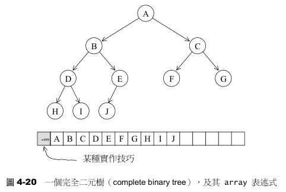
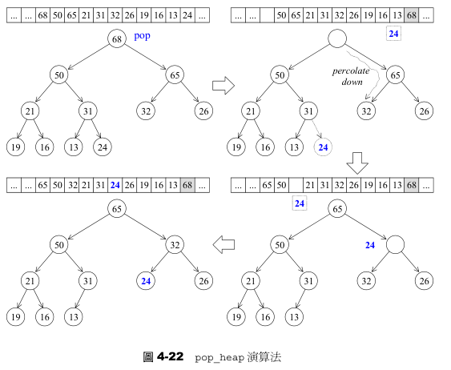
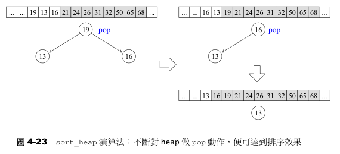

## heap

### Heap 概述

Heap 并不属于 STL 的容器组件，它更像是一个“幕后英雄”，是 `priority_queue`（优先队列）的底层支撑。

#### 什么是 Priority Queue？

- 优先队列允许用户以任意顺序插入元素，但**取出元素时总是优先级最高的先出**（通常数值最大）。
- 这非常符合 **Binary Max Heap（二叉最大堆）** 的特性，因此它被选作 `priority_queue` 的底层结构。

#### 其他结构作为底层的比较

| 数据结构                         | 插入效率 | 查找/删除极值效率 | 是否合适 |
| -------------------------------- | -------- | ----------------- | -------- |
| `list`                           | O(1)     | O(n)              | 不合适   |
| 排序后的 `list`                  | O(n)     | O(1)              | 不合适   |
| `binary search tree`（如红黑树） | O(logN)  | O(logN)           | 太复杂   |

**Binary Heap** 既拥有较快的插入和删除效率，又不如红黑树那样复杂，适合做优先队列的底层结构。

#### 什么是 Binary Heap？



- **Binary Heap** 是一种 **完全二叉树（Complete Binary Tree）**。
- 特点：
  - 除最底层外，每一层节点都填满。
  - 最底层节点从左往右紧密排列，中间不能有空位。

##### 隐式表述（Implicit Representation）

由于 Binary Heap 是完全二叉树，**可以用数组来表示整棵树**，而无需使用指针结构。

节点关系如下（假设下标从 1 开始）：

- 父节点在 `i`，左子节点在 `2*i`，右子节点在 `2*i + 1`。
- 父节点的索引是 `i / 2`（向下取整）。

> 这种用数组模拟树结构的方式，称为 **隐式表述（implicit representation）**。

##### 数组 VS Vector

- Heap 的操作需要动态扩容，数组（array）大小固定不适用。
- 使用 **vector** 是更好的选择，因为它支持自动扩展容量。

#### Max-Heap 与 Min-Heap

- **Max-Heap**：每个节点的键值 ≥ 子节点，根节点是最大值，存储在数组起始位置。
- **Min-Heap**：每个节点的键值 ≤ 子节点，根节点是最小值，也在数组起始位置。
- STL 默认提供的是 **Max-Heap**。

### Heap 算法

#### push_heap


为了满足 **完全二叉树（complete binary tree）** 的结构，新加入的元素必须：

- 放在**最底层**作为叶子节点；
- 填补**从左到右**的第一个空位；
- 也就是插入到底层 `vector` 的 **末尾（`end()`）**。

插入后再通过上滤（sift-up）调整，使整个结构继续保持堆性质。

新加入的元素是否能保留在当前位置？这要看是否符合 **max-heap** 的规则（每个节点的值 ≥ 子节点）。

为此，我们执行一个称为 **“上溯（percolate up）”** 的过程：

- 将新元素与其父节点比较；
- 如果新元素比父节点大，就交换两者位置；
- 重复此过程，直到：
  - 不再需要交换，或
  - 到达根节点。

`push_heap` 的作用就是执行这个“上溯”操作，保持堆的性质。

- `push_heap` 接收的是一个已经是 max-heap 的序列；
- 新元素必须已插入到末尾；
- 否则，结果是未定义的。

```cpp
// push_heap 接口函数：将 [first, last) 区间的最后一个元素（即新插入的元素）上浮到正确位置，使整个区间重新满足堆性质（max-heap）
// 要求：调用该函数前，新元素已插入到底部容器的最后一个位置（即 last - 1）
template <class RandomAccessIterator>
inline void push_heap(RandomAccessIterator first, RandomAccessIterator last) {
    // 提取距离类型和元素类型，并调用辅助函数启动上浮逻辑
    __push_heap_aux(first, last, distance_type(first), value_type(first));
}

// __push_heap_aux：从 first、last 推导类型后，调用核心的上浮调整函数
template <class RandomAccessIterator, class Distance, class T>
inline void __push_heap_aux(RandomAccessIterator first,
                             RandomAccessIterator last,
                             Distance*, T*) {
    // 计算刚插入的元素在容器中的位置，即“洞号” = last - first - 1
    // 堆顶位置固定为 0
    // value = 新插入的值（即最后一个元素）
    __push_heap(first, Distance((last - first) - 1), Distance(0), T(*(last - 1)));
}

// __push_heap：执行上浮调整（percolate up），将 value 插入堆中正确位置，维持 max-heap 性质
template <class RandomAccessIterator, class Distance, class T>
void __push_heap(RandomAccessIterator first,
                 Distance holeIndex,  // 当前“洞”的位置（即新元素的位置）
                 Distance topIndex,   // 堆顶索引（通常为 0）
                 T value) {           // 新插入的值

    // 计算当前洞的父节点位置（父 = (i - 1) / 2）
    Distance parent = (holeIndex - 1) / 2;

    // 向上查找插入位置，只要还没到堆顶，并且 value 比父节点大（max-heap）
    while (holeIndex > topIndex && *(first + parent) < value) {
        // 将父节点值下移，填补当前洞
        *(first + holeIndex) = *(first + parent);

        // 洞往上移至父节点位置
        holeIndex = parent;

        // 重新计算新的父节点
        parent = (holeIndex - 1) / 2;
    }

    // 最终将 value 放入合适位置，完成上浮调整
    *(first + holeIndex) = value;
}
```

- `distance_type(first)` 的作用是：**取得迭代器 `first` 对应的“距离类型”**，用于后续计算两个迭代器之间的距离（如索引、偏移量）。
- **push_heap 的前提**：新元素必须已放在容器末尾（`last - 1`）。
- **核心操作**：将新值与父节点不断比较，如果大于父节点则上移（percolate up）。
- **结束条件**：到达根节点或找到合适位置（父节点大于等于新值）。
- **使用的比较方式**：默认使用 `operator<`，说明实现的是 **max-heap**。

#### pop_heap



作为 **max-heap**，最大值总是在**根节点**。当我们执行 `pop_heap`：

1. 并不会直接删除根节点，而是**将根节点与末尾元素交换**，最大值被移到最后；
2. 然后从堆中“移除”末尾元素（即取出最大值）；
3. 为了维持 **完全二叉树** 的结构，这就相当于**移除了最底层最右边的叶子节点**；
4. 根节点现在是一个“洞”，我们需要为这个洞填一个合适的值。

为保持 max-heap，我们执行 **下溯（percolate down）** 操作：

- 把被移除的末尾元素（刚才交换上来的值）填入根节点；
- 然后不断与左右子节点比较；
- 如果比其中的**较大子节点还小**，就交换位置；
- 持续向下移动，直到：
  - 该值比子节点都大，或
  - 到达叶子节点为止。

这样就完成了 `pop_heap` 的调整过程，同时维持了 heap 的结构和顺序性质。

```cpp
// pop_heap 主接口函数：将最大元素（堆顶）移至末尾，并调整剩余元素仍为合法堆。
// 这是对外公开的接口，用户只需传入表示堆范围的两个迭代器。
// 前提条件：传入的 [first, last) 必须已经是一个有效的 max-heap。
template <class RandomAccessIterator>
inline void pop_heap(RandomAccessIterator first, RandomAccessIterator last) {
    // 通过 value_type 推导出元素类型，调用辅助函数完成具体操作。
    __pop_heap_aux(first, last, value_type(first));
}

// pop_heap 辅助函数：准备数据，调用实际的弹出实现逻辑。
// 参数说明：
// - first、last：堆的起止迭代器
// - T*：元素类型指针，用于类型推导
// 前提条件同上：传入的区间必须是 max-heap。
template <class RandomAccessIterator, class T>
inline void __pop_heap_aux(RandomAccessIterator first,
                           RandomAccessIterator last, T*) {
    // 1. 将堆尾元素的值保存到 value 中（准备填补堆顶“空洞”）。
    // 2. 调用 __pop_heap 完成核心弹出操作：
    //    - last-1 作为存放堆顶元素的“结果”位置。
    //    - distance_type(first) 用于推导索引类型。
    __pop_heap(first, last - 1, last - 1, T(*(last - 1)),
               distance_type(first));
}

// pop_heap 实际实现函数：
// 把堆顶元素（最大值）放到最后一个位置（result 指向的位置），
// 并用原末尾元素 value 填补堆顶，再执行向下调整维持堆性质。
// 参数说明：
// - first: 堆起始迭代器
// - last: 堆尾（不含）迭代器，调整的堆区间为 [first, last)
// - result: 用来放置原堆顶元素（最大值）的迭代器，通常为 last-1
// - value: 原堆尾元素的值，待放入堆顶“空洞”进行调整
// - Distance*: 用于类型推导（索引类型）
template <class RandomAccessIterator, class T, class Distance>
inline void __pop_heap(RandomAccessIterator first,
                       RandomAccessIterator last,
                       RandomAccessIterator result,
                       T value, Distance*) {
    // 将堆顶元素赋值到 result 指向的位置（末尾），完成“弹出”最大元素的效果
    *result = *first;

    // 用原末尾元素的值 value 填补堆顶的空洞（索引0），
    // 并执行向下调整（percolate down）保证剩余元素仍为 max-heap。
    // 调整范围是 [first, last)，长度为 last - first。
    __adjust_heap(first, Distance(0), Distance(last - first), value);
}

// 核心调整函数 __adjust_heap：
// 从 holeIndex（通常为堆顶0）开始，向下调整元素 value 位置，
// 以恢复 max-heap 性质。过程为“挖洞法”下滤（percolate down）。
// 参数说明：
// - first: 堆起始迭代器
// - holeIndex: 当前空洞位置索引（开始时为堆顶0）
// - len: 堆长度（元素个数）
// - value: 待放入空洞的值，通常是原堆尾元素
template <class RandomAccessIterator, class Distance, class T>
void __adjust_heap(RandomAccessIterator first,
                   Distance holeIndex,
                   Distance len,
                   T value) {
    Distance topIndex = holeIndex;              // 堆顶索引，固定为0
    Distance secondChild = 2 * holeIndex + 2;   // 洞的右子节点索引（2*i+2）

    // 当右子节点存在时循环
    while (secondChild < len) {
        // 比较左右子节点大小，secondChild 设为较大子节点索引
        if (*(first + secondChild) < *(first + (secondChild - 1)))
            secondChild--;  // 左子较大，改为左子索引

        // 将较大子节点的值上移，填补当前洞位置
        *(first + holeIndex) = *(first + secondChild);

        // 洞位置向下移至被提上来的子节点位置
        holeIndex = secondChild;

        // 计算新洞位置的右子节点索引，准备下一轮循环
        secondChild = 2 * (holeIndex + 1);
    }

    // 如果只有左子节点存在（无右子节点）
    if (secondChild == len) {
        // 将左子节点值移上来，填补洞位置
        *(first + holeIndex) = *(first + (secondChild - 1));
        holeIndex = secondChild - 1;
    }

    // 将 value 放入最后洞位置。此时可能需要上溯调整以确保堆序，
    // 调用 __push_heap 进行“微调”上浮。
    __push_heap(first, holeIndex, topIndex, value);
}
```

- **交换**堆顶与末尾元素（最大值被移动到末尾）。
- **保存最大值**到 `result`（`last - 1`）。
- 用原末尾值暂时填到堆顶形成“洞”。
- 执行 `__adjust_heap`：
  - 不断与左右子节点比较，把较大子节点向上提；
  - 最后插入原末尾值；
  - 用一次 `__push_heap` 微调位置（理论上有时可省略）。
- 用户可在外部调用 `pop_back()` 删除最大值。
- `pop_heap` 执行后，**最大元素只是被移到了容器的最后**，**并未被移除**。

  - 若要**访问**它，可使用 `vector.back()`；
  - 若要**删除**它，可使用 `vector.pop_back()`。

  也就是说，`pop_heap` 只调整位置，不负责真正删除元素。

##### **先下沉后上浮**（Down then Up）

- 它在下移时 **不进行多次 value 比较**，只用更大的子节点不断覆盖“洞”，相当于快速找到了一个“合适区域”；
- 最后一次性调用 `__push_heap` 微调，使得只进行 **一条路径上限量的比较**，比每次都带着 `value` 比较效率更高。

#### sort_heap

只要不断执行 `pop_heap`，每次将最大值移动到容器末尾，并逐步缩小操作范围，就可以把整个 heap 排成一个**递增序列**。这就是 `sort_heap` 的原理。

- 每次 `pop_heap` 把最大值放到最后；
- 缩小 heap 的范围（从后往前）继续 pop；
- 最终形成一个 **有序序列（升序）**；
- `sort_heap` 实现的就是这个过程。

> 注意：执行完 `sort_heap` 后，原本的 heap 结构就被破坏了，不再是合法的 heap。

此外，`sort_heap` 接收一对迭代器，范围必须是一个有效的 heap，否则结果不可预测。




```cpp
// 该 sort_heap() 版本使用默认的比较方式（operator<），实现 max-heap 排序
template <class RandomAccessIterator>
void sort_heap(RandomAccessIterator first, RandomAccessIterator last) {
    // 每次执行 pop_heap()，都会把最大值移动到末尾
    // 然后将操作范围缩小一位，继续 pop_heap()
    // 最终从前到后形成一个升序序列
    while (last - first > 1)
        pop_heap(first, last--); // 缩小范围，重复 pop_heap
}
```

- `sort_heap` 会不断将最大值放到末尾，形成递增序列；
- 每次 `last--` 是为了缩小堆范围，避免干扰已排好的尾部；
- 排序结束后，原 heap 结构被破坏，容器变为有序序列；
- 要求初始区间必须是一个合法的 **max-heap**。

#### make_heap

这个算法用于将一段已有的数据转换成一个 heap。它的核心思想基于完全二叉树的 **隐式表述（implicit representation）**。

```cpp
// 将区间 [first, last) 重新构造成一个最大堆（max-heap）
// 默认使用 operator< 进行比较（即较大的元素具有更高优先级）
template <class RandomAccessIterator>
inline void make_heap(RandomAccessIterator first,
                      RandomAccessIterator last) {
    // 调用辅助函数，传入元素类型与距离类型（通过类型萃取）
    __make_heap(first, last, value_type(first), distance_type(first));
}

// 辅助函数：对区间 [first, last) 元素构建最大堆
// 不允许传入自定义比较函数，内部使用 operator<
template <class RandomAccessIterator, class T, class Distance>
void __make_heap(RandomAccessIterator first,
                 RandomAccessIterator last, T*, Distance*) {
    if (last - first < 2) return;  // 长度小于2，无需建堆，直接返回

    Distance len = last - first;           // 计算总元素个数
    Distance parent = (len - 2) / 2;       // 找到最后一个非叶子节点的位置
                                           // 即从该节点开始，需依次进行下滤操作

    // 从最后一个非叶子节点开始，向前逐个对子树执行 __adjust_heap 调整
    while (true) {
        // 对当前 parent 节点的子树进行“下滤”，使其满足 max-heap 性质
        // value 是当前 parent 节点的值，将其作为“洞”值传入
        __adjust_heap(first, parent, len, T(*(first + parent)));

        if (parent == 0) return;   // 已处理到堆顶节点，构建完成，返回
        parent--;                  // 向前移动，继续处理前一个非叶子节点
    }
}
```

- 完全二叉树的叶节点无需调整，故从最后一个非叶子节点开始向前调整。
- `parent = (len - 2) / 2` 计算出最后一个非叶子节点的位置。
- 通过循环，从后向前对所有非叶子节点调用 `__adjust_heap`，保证整个区间满足 max-heap 条件。
- 调整结束后，整个区间成为一个合法的 max-heap。

#### heap 沒有迭代器

heap 的元素必须满足完全二叉树的排列规则，因此 **heap 不支持遍历，也没有迭代器**。

#### heap 测试用例

```cpp
#include <vector>
#include <iostream>
#include <algorithm> // 包含 heap 相关算法，如 make_heap、push_heap、pop_heap、sort_heap
using namespace std;

int main() {
	{
		// 测试 heap（底层使用 vector 实现）
		int ia[9] = { 0,1,2,3,4,8,9,3,5 };
		vector<int> ivec(ia, ia + 9); // 以数组初始化 vector

		make_heap(ivec.begin(), ivec.end()); // 将 vector 变成 max-heap
		// 输出堆内容（顺序不是排序，是 heap 排列）
		for (int i = 0; i < ivec.size(); ++i)
			cout << ivec[i] << ' '; // 输出可能是：9 5 8 3 4 0 2 3 1
		cout << endl;

		ivec.push_back(7);               // 在堆末尾添加新元素 7
		push_heap(ivec.begin(), ivec.end()); // 调整堆，保持 max-heap 结构
		for (int i = 0; i < ivec.size(); ++i)
			cout << ivec[i] << ' '; // 输出调整后的堆，例如：9 7 8 3 5 0 2 3 1 4
		cout << endl;

		pop_heap(ivec.begin(), ivec.end());  // 把最大值（堆顶）移到末尾，但不删除
		cout << ivec.back() << endl;          // 输出最大值 9
		ivec.pop_back();                      // 删除末尾最大值

		for (int i = 0; i < ivec.size(); ++i)
			cout << ivec[i] << ' '; // 删除后堆结构仍保持，例如：8 7 4 3 5 0 2 3 1
		cout << endl;

		sort_heap(ivec.begin(), ivec.end()); // 对堆排序，结果升序排列
		for (int i = 0; i < ivec.size(); ++i)
			cout << ivec[i] << ' '; // 输出排序结果：0 1 2 3 3 4 5 7 8
		cout << endl;
	}

	{
		// 测试 heap（底层使用数组实现）
		int ia[9] = { 0,1,2,3,4,8,9,3,5 };
		make_heap(ia, ia + 9); // 使数组构成 max-heap

		// 注意：数组大小固定，不能 push_heap（无法动态扩容）
		// 因此不能直接对满载数组使用 push_heap

		sort_heap(ia, ia + 9); // 对堆排序，数组升序排列
		for (int i = 0; i < 9; ++i)
			cout << ia[i] << ' '; // 输出排序结果：0 1 2 3 3 4 5 8 9
		cout << endl;

		// 排序后数组不再是合法的 heap，需重新建立
		make_heap(ia, ia + 9);  // 重新建堆
		pop_heap(ia, ia + 9);   // 将最大值放到末尾
		cout << ia[8] << endl; // 输出最大值 9
	}

	{
		// 另一个数组 heap 测试
		int ia[6] = { 4,1,7,6,2,5 };
		make_heap(ia, ia + 6); // 建立 max-heap
		for (int i = 0; i < 6; ++i)
			cout << ia[i] << ' '; // 输出堆结构，例如：7 6 5 1 2 4
		cout << endl;
	}
}
```

- `make_heap`：将已有序列构造成 max-heap。
- `push_heap`：向堆中插入新元素（必须插入到末尾后调用）。
- `pop_heap`：将最大元素（根节点）移到末尾，但不删除。
- `pop_back`：从底层容器删除最后一个元素。
- `sort_heap`：对整个 heap 排序（升序），排序后不再是 heap。
- 使用 `vector` 时支持动态扩容，适合执行 `push_heap`。
- 使用数组时大小固定，不支持 `push_heap`，只能 `make_heap`、`pop_heap` 和 `sort_heap`。
