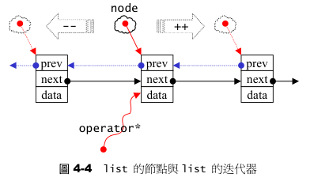
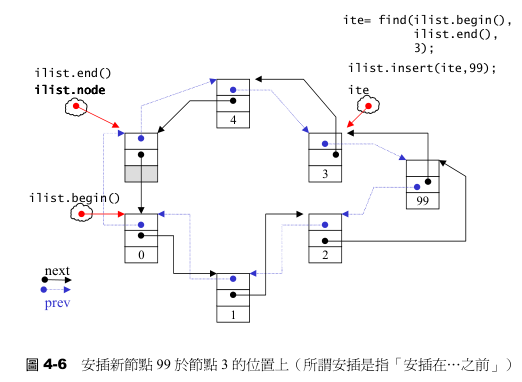
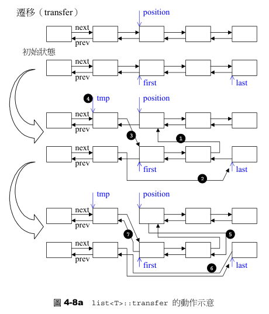

## list

`std::list` 是 STL 中的一个容器，底层实现为 **双向链表**，每个元素是一个节点，拥有前后指针，可以快速在任意位置插入或删除元素。

### 底层原理

每个节点：

```cpp
struct Node {
    T data;
    Node* prev;
    Node* next;
};
```

容器维护两个指针：

- `head` 指向首节点
- `tail` 指向尾节点（或一个哨兵节点）

特性：

- 内存不连续，节点动态分配
- 插入删除某个位置元素时间复杂度是 O(1)
- 不支持随机访问（`list[i]` 会报错）

### 常用接口

#### 构造与遍历

```cpp
#include <iostream>
#include <list>
using namespace std;

int main() {
    list<int> lst = {1, 2, 3};

    lst.push_back(4);    // 尾部插入
    lst.push_front(0);   // 头部插入

    for (int x : lst)    // 范围for遍历
        cout << x << " ";
    // 0 1 2 3 4
}
```

#### 插入 / 删除元素

```cpp
list<int> lst = {0, 1, 2, 3};
auto it = lst.begin(); // it -> 0
++it;                  // it -> 1
++it;                  // it -> 2

lst.insert(it, 99);    // 在 2 前插入 99 -> {0, 1, 99, 2, 3}
lst.erase(it);         // 删除 2 -> {0, 1, 99, 3}
```

#### `splice`：O(1) 把一个 list 的内容移动到另一个位置

```cpp
list<int> a = {1, 2, 3};
list<int> b = {4, 5};

auto it = a.begin();
++it;  // 指向 2
a.splice(it, b);  // 把 b 的所有元素移到 a 的 2 之前

for (int x : a) cout << x << " ";
// 1 4 5 2 3
```

#### `reverse()` / `sort()` / `unique()`

```cpp
list<int> l = {3, 1, 2, 2, 4};

l.sort();      // 升序排序
l.unique();    // 去重（相邻）
l.reverse();   // 反转

for (int x : l) cout << x << " ";
// 4 3 2 1
```

### 性能特点

| 操作          | 时间复杂度 | 备注                           |
| ------------- | ---------- | ------------------------------ |
| 访问元素      | O(1)       | 只能访问 `front()` 和 `back()` |
| 随机访问      | O(n)       | 迭代器需要遍历                 |
| 插入/删除     | O(1)       | 已知迭代器位置，操作快速       |
| 插入/删除尾部 | O(1)       |                                |
| 搜索元素      | O(n)       | 遍历                           |

### 使用建议

- 适合频繁 **中间插入删除**，且不需要随机访问的场景。
- 不适合频繁随机访问元素或按索引访问。 
- 迭代器在插入删除时保持有效（除了被删除节点）。
- 使用 `splice` 实现链表间的高效节点移动。

### list 的迭代器



```cpp
// 双向链表迭代器的定义，用于SGI STL中的list结构
template<class T, class Ref, class Ptr>
struct __list_iterator {
    // 定义普通iterator类型（Ref = T&，Ptr = T*）
    typedef __list_iterator<T, T&, T*> iterator;
    // 当前iterator类型（Ref/Ptr可能是const的）
    typedef __list_iterator<T, Ref, Ptr> self;

    // 迭代器的类型标签：双向迭代器
    typedef bidirectional_iterator_tag iterator_category;
    typedef T value_type;       // 元素类型
    typedef Ptr pointer;        // 指针类型（如T*或const T*）
    typedef Ref reference;      // 引用类型（如T&或const T&）
    typedef __list_node<T>* link_type; // 节点指针类型（链表节点指针）
    typedef size_t size_type;         // 通常用于记录容器大小
    typedef ptrdiff_t difference_type;// 迭代器间距离类型

    link_type node; // 实际指向链表节点的指针

    // 构造函数
    __list_iterator(link_type x) : node(x) {}  // 指定节点构造
    __list_iterator() {}                       // 默认构造
    __list_iterator(const iterator& x) : node(x.node) {} // 拷贝构造（从普通iterator构造）

    // 相等与不等比较
    bool operator==(const self& x) const { return node == x.node; }
    bool operator!=(const self& x) const { return node != x.node; }

    // 解引用操作，返回引用类型（Ref）
    reference operator*() const { return (*node).data; }

    // 成员访问操作（->）
    pointer operator->() const { return &(operator*()); }

    // 前置++（迭代器前移）
    self& operator++() {
        node = (link_type)((*node).next); // 移动到下一个节点
        return *this;
    }

    // 后置++（迭代器前移，返回原副本）
    self operator++(int) {
        self tmp = *this;
        ++*this; // 先对 *this 解引用得到对象，再对结果执行前置++运算符
        return tmp;
    }

    // 前置--（迭代器后退）
    self& operator--() {
        node = (link_type)((*node).prev); // 移动到上一个节点
        return *this;
    }

    // 后置--（迭代器后退，返回原副本）
    self operator--(int) {
        self tmp = *this;
        --*this;
        return tmp;
    }
};
```

#### 为什么要三个模板参数？

| 模板参数 | 作用                              | 说明                     |
| -------- | --------------------------------- | ------------------------ |
| `T`      | 元素的真实类型（如 `int`）        | 节点内存放的数据类型     |
| `Ref`    | 引用类型（如 `T&` 或 `const T&`） | 控制 `*iter` 的返回类型  |
| `Ptr`    | 指针类型（如 `T*` 或 `const T*`） | 控制 `iter->` 的返回类型 |

简单示例对比：

```cpp
// 方案1：只有T，写死了引用和指针类型
template<class T>
struct iterator {
    typedef T& reference;  // 固定是T&
    typedef T* pointer;    // 固定是T*
    reference operator*();
    pointer operator->();
};

// 方案2：三个模板参数，灵活支持普通和const迭代器
template<class T, class Ref, class Ptr>
struct iterator {
    typedef Ref reference;
    typedef Ptr pointer;
    reference operator*();
    pointer operator->();
};
```

用方案2，声明：

```cpp
using iterator = iterator<T, T&, T*>;            // 普通迭代器
using const_iterator = iterator<T, const T&, const T*>; // 常量迭代器
```

这样设计可以让一个模板类生成 **普通迭代器和 const 迭代器** 两种版本，只需传不同的 `Ref` 和 `Ptr`：

| 版本        | 模板参数                                 | 表示                      |
| ----------- | ---------------------------------------- | ------------------------- |
| 普通迭代器  | `__list_iterator<T, T&, T*>`             | 可读可写元素引用/指针     |
| const迭代器 | `__list_iterator<T, const T&, const T*>` | 只读引用/指针（不可修改） |

#### typedef 的作用

```cpp
typedef __list_iterator<T, T&, T*> iterator;
typedef __list_iterator<T, Ref, Ptr> self;
```

##### iterator

- 是“普通版本”的迭代器，传入 `T&, T*`

- 用于在 const 迭代器中调用拷贝构造：

  ```cpp
  __list_iterator(const iterator& x) : node(x.node) {}
  ```

  意味着：**允许从普通迭代器构造一个 const 迭代器**

##### self

- 当前这个类自己的名字（用于简化代码书写）

- 比如：

  ```cpp
  bool operator==(const self& x) const;
  self operator++(int);
  ```

### list 的数据结构

SGI 的 list 是一个环状双向链表，只用一个指针就能完整表示整个链表结构。

```cpp
// 模板参数说明：
// T 是存储元素的类型
// Alloc 是内存配置器类型，默认使用 alloc（内存分配器）
template <class T, class Alloc = alloc> 
class list {
protected:
    // 链表节点类型，通常定义为 __list_node<T>
    typedef __list_node<T> list_node;

public:
    // 节点指针类型，指向 list_node 结构
    typedef list_node* link_type;

protected:
    // 链表中只需一个指针即可表示整个环状双向链表
    // 这个指针通常指向“头节点”或哨兵节点
    link_type node;

    // ... 其他成员变量和函数
};
```

如果让指针 `node` 指向专门放在链表尾部的一个空节点， 那么这个 `node` 就能当作 STL 里“前闭后开”区间的 `last` 迭代器。这样设计后，许多操作都能简单实现。

```cpp
// 返回指向第一个元素的迭代器（头节点的下一个节点）
iterator begin() { 
    return iterator((link_type)(node->next)); 
}

// 返回指向尾后空节点的迭代器（哨兵节点）
iterator end() { 
    return iterator(node); 
}

// 判断链表是否为空：头节点的 next 指向自己表示空链表
bool empty() const { 
    return node->next == node; 
}

// 计算链表元素个数，调用全局 distance 函数（第3章内容）
size_type size() const {
    size_type result = 0;
    distance(begin(), end(), result);
    return result;
}

// 返回头节点元素的引用（链表第一个元素）
reference front() { 
    return *begin(); 
}

// 返回尾节点元素的引用（链表最后一个元素）
reference back() { 
    return *(--end()); 
}
```


### list 的构造与内存管理

```cpp
// list 默认使用 alloc 作为空间配置器（参考2.2.4节）
template <class T, class Alloc = alloc>
class list {
protected:
    typedef __list_node<T> list_node;

    // 专属空间配置器，每次按节点大小分配内存
    typedef simple_alloc<list_node, Alloc> list_node_allocator;

    // 配置一个节点并返回指针
    link_type get_node() { 
        return list_node_allocator::allocate(); 
    }

    // 释放一个节点内存
    void put_node(link_type p) { 
        list_node_allocator::deallocate(p); 
    }

    // 创建（分配并构造）一个节点，带有元素值 x
    link_type create_node(const T& x) {
        link_type p = get_node();
        construct(&p->data, x); // 全局函数，负责对象构造
        return p;
    }

    // 销毁（析构并释放）一个节点
    void destroy_node(link_type p) {
        destroy(&p->data);     // 全局函数，负责对象析构
        put_node(p);
    }

public:
    // 默认构造函数，产生一个空链表
    list() { empty_initialize(); }

protected:
    // 初始化空链表
    void empty_initialize() {
        node = get_node();   // 分配一个节点空间，令 node 指向它（哨兵节点）
        node->next = node;   // 头尾都指向自己，表示空链表
        node->prev = node;
    }

    link_type node; // 指向环状双向链表的哨兵节点
    // 其他成员...
};
```

- `list_node_allocator` 按节点大小分配内存，方便管理。
- 通过 `get_node` 和 `put_node` 实现节点的分配和释放。
- `create_node` 和 `destroy_node` 负责节点元素的构造与析构。
- 默认构造函数调用 `empty_initialize` 创建一个空的环状双向链表，用哨兵节点 `node` 表示空表。

#### `push_back()` 插入元素到链表尾部

```cpp
// 将元素 x 插入到链表末尾，内部调用 insert() 在 end() 位置插入
void push_back(const T& x) { 
    insert(end(), x); 
}
```

#### `insert()` 函数核心功能

- 目的：在迭代器 `position` 指向的位置之前插入一个新节点，节点内容为 `x`。
- 过程：
  1. 创建一个新节点并构造元素 `x`。
  2. 调整相邻节点的指针，将新节点插入链表中。

```cpp
iterator insert(iterator position, const T& x) {
    link_type tmp = create_node(x);          // 创建新节点，内容为 x
    tmp->next = position.node;                // 新节点的 next 指向 position 节点
    tmp->prev = position.node->prev;          // 新节点的 prev 指向 position 前一个节点
    (link_type(position.node->prev))->next = tmp;  // 前一个节点的 next 指向新节点
    position.node->prev = tmp;                 // position 节点的 prev 指向新节点
    return tmp;                                // 返回新节点迭代器
}
```

#### 插入示例说明

- 连续插入 0、1、2、3、4 五个节点后，链表状态如图所示。

  

- 如果想在值为 3 的节点前插入值为 99 的节点：

```cpp
auto ilite = find(il.begin(), il.end(), 3); // 查找值为3的节点迭代器
if (ilite != il.end())                       // 找到后插入
    il.insert(ilite, 99);
```

- 插入后，新节点位于原节点 3 的前面，符合 STL “插入操作”规范。

#### 重要特点

- `list` 的插入操作不会像 `vector` 那样发生内存重新分配和数据搬移。
- 因此，插入操作前的所有迭代器在插入后仍然有效，不会失效。

### list 的元素操作

#### 头部插入元素

```cpp
void push_front(const T& x) {
    insert(begin(), x);  // 在头节点前插入新节点
}
```

#### 尾部插入元素

```cpp
void push_back(const T& x) {
    insert(end(), x);    // 在尾后哨兵节点前插入新节点
}
```

#### 删除迭代器指向节点

```cpp
iterator erase(iterator position) {
    link_type next_node = link_type(position.node->next);
    link_type prev_node = link_type(position.node->prev);
    prev_node->next = next_node;
    next_node->prev = prev_node;
    destroy_node(position.node); // 销毁节点
    return iterator(next_node);  // 返回删除节点的下一个节点迭代器
}
```

#### 删除头节点

```cpp
void pop_front() {
    erase(begin());
}
```

#### 删除尾节点

```cpp
void pop_back() {
    iterator tmp = end();
    erase(--tmp);
}
```

#### 清空链表

```cpp
template <class T, class Alloc>
void list<T, Alloc>::clear() {
    link_type cur = (link_type)node->next;  // 从第一个节点开始
    while (cur != node) {
        link_type tmp = cur;
        cur = (link_type)cur->next;
        destroy_node(tmp);                   // 析构并释放节点
    }
    // 恢复哨兵节点状态
    node->next = node;
    node->prev = node;
}
```

#### 删除所有等于指定值的节点

```cpp
template <class T, class Alloc>
void list<T, Alloc>::remove(const T& value) {
    iterator first = begin();
    iterator last = end();
    while (first != last) {
        iterator next = first;
        ++next;
        if (*first == value)
            erase(first);  // 找到就删除
        first = next;
    }
}
```

#### 删除连续重复元素，只保留一个

```cpp
template <class T, class Alloc>
void list<T, Alloc>::unique() {
    iterator first = begin();
    iterator last = end();
    if (first == last) return;  // 空链表不用处理
    iterator next = first;
    while (++next != last) {
        if (*first == *next)
            erase(next);  // 删除连续重复节点
        else
            first = next;  // 移动比较指针
        next = first;
    }
}
```

#### transfer 函数（SGI list 内部使用）

隐含假设主要包括：

- [first, last) 是同一个链表上的连续区间
- position 不能位于 [first, last) 区间内部
- 链表是双向循环链表，带哨兵节点
- 调用者负责保证合法性

```cpp
protected:
    // 将 [first, last) 区间的节点搬移到 position 节点之前
    void transfer(iterator position, iterator first, iterator last) {
        if (position != last) {
            // 1. last 前一个节点的 next 指向 position
            last.node->prev->next = position.node;

            // 2. first 前一个节点的 next 指向 last
            first.node->prev->next = last.node;

            // 3. position 前一个节点的 next 指向 first
            position.node->prev->next = first.node;

            // 4. 暂存 position 的前一个节点
            link_type tmp = position.node->prev;

            // 5~7. 调整各节点的 prev 指针，完成“接入”
            position.node->prev = last.node->prev;
            last.node->prev = first.node->prev;
            first.node->prev = tmp;
        }
    }
```



- `transfer` 支持将 **同一个 list 内的某个子区间** `[first, last)` 搬移到另一个位置 `position` 前。
- 可以将同一个 list 看成是两段子区间的拼接，这在操作上与两个不同 list 没有区别。

简化版：

```cpp
#include <iostream>
using namespace std;

struct Node {
    Node* prev;
    Node* next;
    int val;

    Node(int v) : prev(nullptr), next(nullptr), val(v) {}
};

void transfer(Node* pos, Node* first, Node* last) {
    if (pos != last) {
        last->prev->next = pos;
        first->prev->next = last;
        pos->prev->next = first;

        Node* tmp = pos->prev;
        pos->prev = last->prev;
        last->prev = first->prev;
        first->prev = tmp;
    }
}
```

#### `splice`：元素接合（转移）操作

`splice` 是 list 提供的高效元素“剪切+粘贴”功能，底层由 `transfer()` 完成。其优点是 **不进行元素拷贝或构造，只做指针操作**，速度极快。

```cpp
// 将整个 x 接合到 position 之前。
// 注意：x 必须与当前 list（*this）不同，不是统一个链表。
void splice(iterator position, list& x) {
    if (!x.empty()) {
        // transfer 的参数含义：将 [x.begin(), x.end()) 接到 position 前
        transfer(position, x.begin(), x.end());
    }
}

// 将 i 所指元素接合到 position 之前。
// 可来自同一 list，但 position != i 且 position != ++i 才有效
void splice(iterator position, list&, iterator i) {
    iterator j = i;
    ++j;

    // 若 position == i 或 position == i+1，不移动，避免无效操作
    if (position == i || position == j) return;

    // 将 [i, i+1) 插到 position 前，即移动单个节点
    transfer(position, i, j);
}

// 将 [first, last) 区间的元素接合到 position 之前。
// 若来自同一 list，要求 position 不在 [first, last) 内
void splice(iterator position, list&, iterator first, iterator last) {
    if (first != last) {
        // 直接把区间搬过去，不构造/析构任何节点
        transfer(position, first, last);
    }
}
```

`splice(position, x)`

- **没有检查**：`&x != this`（x 是否为当前 list）
- 但是文档/注释中有**明确前提**：“x 必须不同于 *this”

`splice(position, x, first, last)`

- **没有检查**：`position` 是否位于 `[first, last)` 区间内
- 同样，注释中写明：“position 不能位于 [first, last) 之内”

SGI STL 的设计风格是**"高效优先 + 使用者自律"**，将正确性检查交由程序员负责，换取最大化的执行效率。

#### `merge()`：合并两个已排序的 list

```cpp
void merge(list& x) {
    iterator first1 = begin();
    iterator last1 = end();
    iterator first2 = x.begin();
    iterator last2 = x.end();

    // 合并过程：从 x 中取出比当前 *first1 小的元素插入
    while (first1 != last1 && first2 != last2) {
        if (*first2 < *first1) {
            iterator next = first2;
            ++next;
            transfer(first1, first2, next); // 插入前移动元素
            first2 = next;
        } else {
            ++first1;
        }
    }
    if (first2 != last2)
        transfer(last1, first2, last2); // 把剩余全部插入末尾
}
```

- 两个 list 必须 **事先经过升序排序**。

#### `reverse()`：链表反转

```cpp
void reverse() {
    if (node->next == node || link_type(node->next)->next == node)
        return;  // 空链表或仅1个元素，无需反转

    iterator first = begin();
    ++first;
    while (first != end()) {
        iterator old = first;
        ++first;
        transfer(begin(), old, first); // 插入到头部
    }
}
```

- 将每个元素依序移至表头。

- 传统链表反转的经典方式，伪代码大致如下：

  ```cpp
  link_type cur = node; // dummy node 本身
  do {
      std::swap(cur->next, cur->prev);
      cur = cur->prev;  // 注意，这里走 prev 是因为 swap 后反了
  } while (cur != node);
  ```

  - 每个节点 `prev` 和 `next` 指针交换一次。
  - 最后链表方向就反了。
  - 设链表有 5 个节点（含哨兵），指针反转法只做 5 次 swap，结束。而 transfer 法：第一次搬第2个节点，第二次搬第3个……共需要 `(n - 1)` 次转移，每次修改多个节点指针，整体指令多于 swap 法。

- SGI STL `list::reverse()` 没有选择直接反转 `prev` / `next` 指针，而是采用了更稳妥、可复用的 `transfer()` 机制来反转节点顺序，这在 STL 的整体架构中更加一致、安全且优雅。

#### `sort()`：快速排序实现

```cpp
void sort() {
    // 如果链表为空，或者只有一个元素，则不需要排序，直接返回
    if (node->next == node || link_type(node->next)->next == node)
        return;

    list carry;             // 一个临时链表，用于暂存当前切下来的单个节点
    list counter[64];       // 模拟归并排序的“桶”，最多支持 2^64 个元素（非常大）
    int fill = 0;           // 当前 counter 中被占用的最大桶编号 + 1（即桶的“位数”）

    // 主循环：依次从原链表中切出元素，并进行“二进制合并”
    while (!empty()) {
        // 1. 把 this 的第一个元素（begin()）剪下来放入 carry（cut/splice）
        // carry 现在只包含一个元素，相当于一个 size 为 1 的有序子链表
        carry.splice(carry.begin(), *this, begin());

        int i = 0;
        // 2. 查找 counter[i] 是否为空，如果不为空，则执行合并操作
        // 直到找到一个空桶为止。这个过程类似二进制加法中的“进位合并”。
        while (i < fill && !counter[i].empty()) {
            // merge 是就地归并排序（两个有序链表合并）
            counter[i].merge(carry);   // merge 到 counter[i]
            carry.swap(counter[i++]);  // 交换 carry 和 counter[i]：carry 保存合并结果，counter[i] 清空
        }

        // 3. 找到空桶（或开辟新桶）后，把合并好的 carry 放入其中
        carry.swap(counter[i]);

        // 4. 如果当前使用到了新桶（超过原先 fill），就更新 fill
        if (i == fill) ++fill;
    }

    // 所有元素已经切分并归并到 counter[] 中，现在将这些桶中的结果最终合并
    // counter[i] 表示 2^i 大小的有序链表，将它们两两归并成一个最终结果
    for (int i = 1; i < fill; ++i)
        counter[i].merge(counter[i - 1]);  // 每次把更小的桶归并进更大的桶

    // 将最终合并好的结果（在 counter[fill - 1]）与 this 交换
    // 完成排序：this 持有有序链表
    swap(counter[fill - 1]);
}
```

- 利用 **归并排序思想**，对链表进行排序。

- 通过 `counter` 数组模拟二进制加法的“桶”：

  - 每次拿一个元素（一个单节点链表）归并到对应桶。

  - 遇到满桶就合并，类似二进制进位。

  - 每个桶的含义

    - `counter[0]`：可以放 2⁰ = 1 个元素的有序链表
    - `counter[1]`：可以放 2¹ = 2 个元素的有序链表
    - `counter[2]`：可以放 2² = 4 个元素的有序链表
       ...
    - `counter[i]`：存储一个大小为 2ⁱ 的有序链表段

    这个结构类似于二进制加法中每一位的进位机制。

- 使用 `splice` 和 `merge` 完成链表间的元素移动和有序合并。

- 时间复杂度稳定为 O(n log n)，且不额外分配内存。

##### 举例

###### 初始

原链表为：

```txt
List: 7 → 2 → 6 → 5 → 1
```

counter 全部为空，fill = 0

###### 第一步：切下 7

- carry: `7`
- counter[0] 是空的，carry 放入 counter[0]

```txt
counter[0]: 7
fill = 1
```

###### 第二步：切下 2

- carry: `2`
- counter[0] 不为空（是 `7`），所以进行归并：

```txt
merge(carry=2, counter[0]=7) → 合并得到 carry: 2 → 7（升序）
```

- counter[0] 清空
- 把 carry 放入 counter[1]

```txt
counter[1]: 2 → 7
fill = 2
```

###### 第三步：切下 6

- carry: `6`
- counter[0] 是空的，carry 放入 counter[0]

```txt
counter[0]: 6
fill = 2
```

###### 第四步：切下 5

- carry: `5`
- counter[0] 是 `6`，merge：

```txt
carry: 5 + 6 → carry = 5 → 6
```

- counter[1] 是 `2 → 7`，merge：

```txt
carry = 5 → 6 + counter[1] = 2 → 7
merge 后 carry = 2 → 5 → 6 → 7
```

- 放入 counter[2]

```txt
counter[2]: 2 → 5 → 6 → 7
fill = 3
```

###### 第五步：切下 1

- carry: `1`
- counter[0] 是空的 → 放进去

```txt
counter[0]: 1
```

###### 合并所有 counter

现在 counter 状态如下：

```txt
counter[0]: 1
counter[1]: 空
counter[2]: 2 → 5 → 6 → 7
fill = 3
```

合并 counter[0] 到 counter[2]：

- merge(1, 空) → 1
- merge(1, 2→5→6→7) → 1→2→5→6→7

###### 最终链表

```txt
List: 1 → 2 → 5 → 6 → 7
```

这个算法的精妙之处在于：

- 每次切一个元素，用 `carry` 装起来；
- 使用 `counter[]` 模拟“二进制加法”归并，效率为 O(N log N)；
- 无需递归，且链表操作都是 splice/merge，**无需额外空间分配**，效率高。