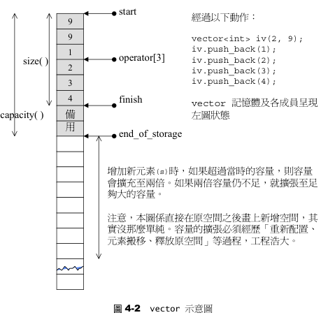
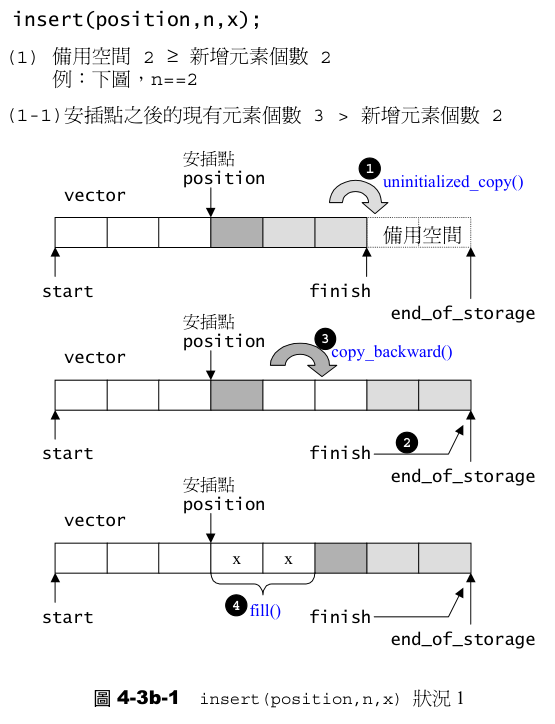
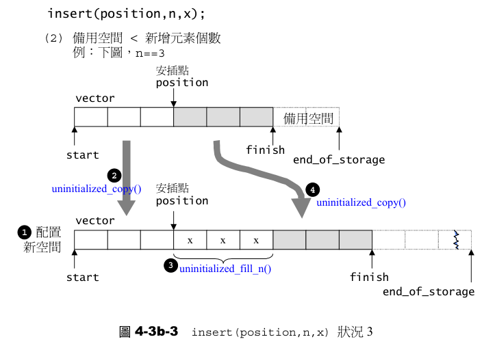

## vector

`std::vector` 是 C++ 标准库中提供的**动态数组容器**，支持快速随机访问，能够自动管理内存，使用灵活，是实际开发中最常用的 STL 容器之一。

### 底层原理

#### 内存结构

```css
data   --> [x][x][x][ ][ ][ ][ ]...
             ↑        ↑        ↑
           begin()   end()   capacity
```

底层通过三个指针管理状态：

- `begin()`：起始位置
- `end()`：最后一个元素之后（逻辑长度）
- `capacity()`：已分配空间的结尾（物理容量）

所有元素是**连续存储的**。



####  扩容机制（增长策略）

当元素数量 > capacity 时：

1. **分配更大的内存**（一般为原容量的约 2 倍）。
2. **拷贝旧数据到新内存**（调用元素的拷贝构造/移动构造）。
3. **释放旧内存**。

这个过程是**代价较高**的，因此建议预先 `reserve()` 以避免频繁扩容。

**注意**：扩容后原有的指针、引用、迭代器全部失效！

#### 内存管理

如果元素是自定义类型，插入或扩容时会调用：

- 构造函数
- 拷贝构造/移动构造
- 析构函数

所以定义 `struct`/`class` 时务必实现这几个方法！

### 常见接口

#### 构造与赋值

```cpp
vector<int> v1;                      // 默认构造
vector<int> v2(10);                  // 10 个默认值 0
vector<int> v3(5, 42);               // 5 个 42
vector<int> v4 = {1, 2, 3};          // 初始化列表
v1 = v4;                             // 拷贝赋值
v.assign(n, value);       // 重新赋值
```

#### 增删改查

```cpp
v.push_back(100);                   // 末尾添加
v.pop_back();                       // 删除最后一个元素
v.insert(v.begin() + 1, 200);       // 在指定位置插入
v.erase(v.begin() + 1);             // 删除指定位置元素
v.clear();                          // 清空所有元素
v[2] = 999;                         // 修改第3个元素
int x = v[2];                       // 访问元素（不检查越界）
```

#### 容量管理

```cpp
v.size();                           // 当前元素个数
v.capacity();                       // 分配的容量
v.empty();                          // 是否为空
v.reserve(100);                     // 提前分配容量
v.resize(20);                       // 调整大小，多余元素会析构，不足补默认值
```

#### 迭代器

```cpp
begin(), end()         // 普通迭代器
rbegin(), rend()       // 反向迭代器
cbegin(), cend()       // const 迭代器

for (auto it = v.begin(); it != v.end(); ++it) {}
for (int x : v) {}                  // 范围 for
auto r = std::find(v.begin(), v.end(), 42);
```

#### 其他常用操作

```cpp
std::sort(v.begin(), v.end());
std::reverse(v.begin(), v.end());
std::vector<int> v2(v.rbegin(), v.rend()); // 反转拷贝
```

### 使用建议

| 需求           | 建议                                  |
| -------------- | ------------------------------------- |
| 大量插入       | 使用 `reserve()` 预分配               |
| 不需要连续内存 | 考虑用 `list` 或 `deque`              |
| 插入删除频繁   | 尽量避免中间插入/删除，性能差         |
| 指针/引用      | vector 扩容时地址会变，存放指针需谨慎 |

### 底层源码简析（以 libstdc++ 为例）

```cpp
template<typename _Tp, typename _Alloc = std::allocator<_Tp>>
class vector {
    _Tp* _M_start;			// 指向元素的起始地址
    _Tp* _M_finish;			// 指向最后一个元素的“后一个地址”（即 size 末尾）
    _Tp* _M_end_of_storage;	// 指向分配内存块的“末尾地址”（即 capacity 尾部）
    // ...
};
```

`begin()`、`end()`、`capacity()` 是 **对用户暴露的接口**，它们的返回值是基于上面三个指针的：

| 接口         | 实际含义                       |
| ------------ | ------------------------------ |
| `begin()`    | 返回 `_M_start`                |
| `end()`      | 返回 `_M_finish`               |
| `size()`     | `_M_finish - _M_start`         |
| `capacity()` | `_M_end_of_storage - _M_start` |

扩容逻辑：

```cpp
void push_back(const T& val) {
    if (_M_finish == _M_end_of_storage)
        _M_reallocate();
    *_M_finish = val;
    ++_M_finish;
}
```

### 常见问题

#### `emplace_back()` vs `push_back()` 性能差异

| 操作      | `push_back()`          | `emplace_back()`            |
| --------- | ---------------------- | --------------------------- |
| 需求      | 需要现成对象           | 就地构造对象                |
| 拷贝/移动 | 可能触发拷贝或移动构造 | **直接构造，省略拷贝/移动** |
| 性能      | 较慢（多一步构造）     | 较快（就地构造）            |
| 使用场景  | 已有对象               | 直接传构造参数              |

#### vector 的内存释放为什么不一定及时？

因为 `capacity()` 大于 `size()`，即使 `clear()` 也不会释放已分配内存，除非用 `shrink_to_fit()`。

`shrink_to_fit()` 的行为与实际效果：

尝试将 `vector` 的容量缩小到等于其大小，**释放多余的内存**。

```cpp
std::vector<int> v = {1, 2, 3, 4, 5};
v.reserve(1000);          // 容量变大
v.resize(5);              // 元素变少，但内存仍大
v.shrink_to_fit();        // 请求回收未用内存
```

注意：它是 **non-binding request**

- **标准并不保证一定释放内存**。
- 实际是否释放取决于实现（libc++、libstdc++）和系统内存管理。
- 一般通过新分配内存再拷贝元素实现（可能引发移动构造或拷贝构造）。

#### 插入后使用原迭代器 / 指针

**vector 的扩容或中间插入，会导致内存重新分配**，原来的指针、引用、迭代器就不再指向合法位置，**变成了“悬空指针/迭代器”**，继续使用会导致未定义行为（可能崩溃、访问垃圾值等）。

```cpp
#include <iostream>
#include <vector>

int main() {
    std::vector<int> v;
    v.reserve(1);  // 先留一点空间，确保后续插入会触发扩容
    v.push_back(1);
    
    int* p = &v[0];          // 获取元素地址
    std::vector<int>::iterator it = v.begin();  // 获取迭代器

    v.push_back(2);          // 扩容发生，vector 内部地址可能变了！

    std::cout << *p << "\n"; // ❌ 悬空指针，未定义行为
    std::cout << *it << "\n";// ❌ 悬空迭代器，未定义行为
}
```

正确做法：

1. 插入或扩容后重新获取迭代器/指针

```cpp
auto it = v.begin();
v.push_back(42);       // 可能导致迭代器失效
it = v.begin();        // 重新获取！
```

2. 不在迭代过程中插入或删除

```cpp
for (auto it = v.begin(); it != v.end(); ++it) {
    if (*it == 3) {
        // v.push_back(100); // ❌ 迭代器失效
    }
}
```

3. 如果必须插入，先收集再操作

```cpp
std::vector<int> v = {1, 2, 3};
std::vector<int> to_add;

for (int x : v) {
    if (x % 2 == 1)
        to_add.push_back(x * 10);  // 不在原 vector 中操作
}

v.insert(v.end(), to_add.begin(), to_add.end());  // 统一处理
```

#### `vector<bool>` 奇葩在哪里？

##### bool 占 1 字节太浪费

在标准 `std::vector<T>` 中，每个元素是一个完整的 `T` 对象。

但对 `bool` 类型来说，每个布尔值其实只需要 1 位，而 `sizeof(bool)` 是 1 字节，也就是 **用了 8 倍空间**，太浪费了！

##### 设计目的：节省空间

为了节省空间，标准库特意对 `vector<bool>` 做了**模板特化**（不是偏特化，是完整特化）：

它不是 `vector<bool>` 的普通版本，而是这样的结构：

```cpp
template <>
class vector<bool> {
    // 使用位图压缩存储 bool（通常是 unsigned char 或 uint32_t）
    std::vector<uint8_t> data_;
    ...
};
```

它不是真的存储了 `bool` 类型，而是用一个**按位压缩的位容器**来模拟布尔数组。

比如：

```cpp
std::vector<bool> v = {true, false, true};
```

实际上在内部变成了一组位操作，比如：

```cpp
data_[0] = 0b00000101;
```

##### 带来的副作用

###### 无法返回 `bool&`

```cpp
std::vector<bool> v = {true};
bool* p = &v[0];  // 编译错误：不能取地址
```

因为它根本没有 `bool` 类型的内存，所以不能返回 `bool&`，也不能取地址。

为了解决这个问题，标准库搞了一个**代理对象** `vector<bool>::reference`，实现 `operator bool()`、`operator=` 等，但依然不是原生 bool。

###### 与泛型算法兼容性差

```cpp
template<typename T>
void test(std::vector<T>& v) {
    T* p = &v[0];  // vector<bool> 会报错
}
```

###### 不能安全和并发使用

由于多个 `bool` 被压缩进一个 `byte`，单个元素修改涉及位操作，因此并发修改两个 `bool` 也可能互相影响（**位竞争条件**），不像 `vector<int>` 是原子独立的。

##### 替代方案

| 场景         | 推荐替代                                      |
| ------------ | --------------------------------------------- |
| 简单用法     | `std::vector<char>` or `std::vector<uint8_t>` |
| 固定大小位集 | `std::bitset<N>`                              |
| 可变大小位集 | `boost::dynamic_bitset`                       |

### 源码摘录

```cpp
template <class T, class Alloc = alloc>
class vector {
public:
	typedef T value_type;
	typedef value_type* pointer;
	typedef value_type* iterator;
	typedef value_type& reference;
	typedef size_t size_type;
	typedef ptrdiff_t difference_type;

protected:
	// 内存配置器，封装了底层内存分配
	typedef simple_alloc<value_type, Alloc> data_allocator;

	iterator start;          // 指向当前使用空间的头部（第一个元素）
	iterator finish;         // 指向当前使用空间的尾部（最后一个元素的下一个位置）
	iterator end_of_storage; // 指向目前可用空间的尾部（容量的终点）

	// 插入元素的辅助函数，当备用空间不足时调用
	void insert_aux(iterator position, const T& x);
  
	// 释放所有已分配空间（但不调用析构函数）
	void deallocate() {
		if (start)
			data_allocator::deallocate(start, end_of_storage - start);
	}

	// 使用指定的值填充初始化空间
	void fill_initialize(size_type n, const T& value) {
		start = allocate_and_fill(n, value); // 分配并填充
		finish = start + n;                   // 更新 finish 指针
		end_of_storage = finish;              // 备用空间尾指针也同步
	}

public:
	// 迭代器相关接口
	iterator begin() { return start; }
	iterator end() { return finish; }
	
	// 当前元素数量
	size_type size() const {
		return size_type(end() - begin());
	}

	// 当前容量大小
	size_type capacity() const {
		return size_type(end_of_storage - begin());
	}

	// 是否为空
	bool empty() const {
		return begin() == end();
	}

	// 下标访问
	reference operator[](size_type n) {
		return *(begin() + n);
	}

	// 构造函数（默认构造，空容器）
	vector():start(0),finish(0),end_of_storage(0){}

	// 构造函数，构造 n 个 value 元素
	vector(size_type n, const T& value) { fill_initialize(n, value); }
	vector(int n, const T& value) { fill_initialize(n, value); }
	vector(long n, const T& value) { fill_initialize(n, value); }

	// 显式构造，构造 n 个默认值元素
	explicit vector(size_type n) { fill_initialize(n, T()); }

	// 析构函数，销毁所有元素并释放内存
	~vector() {
		destroy(start, finish); // 逐个调用元素析构函数
		deallocate();           // 释放分配的内存
	}

	// 访问第一个元素
	reference front() { return *begin(); }

	// 访问最后一个元素
	reference back() { return *(end() - 1); }

	// 尾部添加元素
	void push_back(const T& x) {
		if (finish != end_of_storage) {    // 备用空间足够
			construct(finish, x);           // 直接构造元素
			++finish;                      // 更新 finish
		} else {
			insert_aux(end(), x);           // 空间不足，调用辅助函数扩容并插入
		}
	}

	// 删除尾部元素
	void pop_back() {
		--finish;                         // 后移 finish 指针
		destroy(finish);                  // 调用元素析构函数
	}

	// 删除 position 位置的元素，返回下一个元素位置
	iterator erase(iterator position) {
		if (position + 1 != end())
            // 把 [position+1, finish) 这段范围内的元素，往左（前面）拷贝到从 position 开始的位置上
			copy(position + 1, finish, position); // 覆盖被删除元素后续元素
		--finish;
		destroy(finish);
		return position;
	}

    // 删除区间 [first, last) 内的所有元素，返回删除区间起始位置的迭代器
	iterator erase(iterator first, iterator last) {
    	// 把区间 [last, finish) 的元素移动到 [first, first + (finish - last))，覆盖 [first, last)
        // i 就是“拷贝后新有效元素的尾迭代器”
    	iterator i = copy(last, finish, first);

    	// 销毁移动后尾部多余的元素（原先在 [i, finish) 区间的对象）
    	destroy(i, finish);

    	// 调整 finish 指针，减少被删除的元素个数
    	finish = finish - (last - first);

    	// 返回删除元素后的起始位置迭代器
    	return first;
	}

	// 调整容器大小，有新元素则插入填充，有多余则删除
	void resize(size_type new_size, const T& x) {
		if (new_size < size()) {
			erase(begin() + new_size, end()); // 删除多余元素
		} else {
			insert(end(), new_size - size(), x); // 插入缺少元素
		}
	}

	// resize 版本，使用默认构造值填充
	void resize(size_type new_size) {
		resize(new_size, T());
	}

	// 清空所有元素
	void clear() {
		erase(begin(), end());
	}

protected:
	// 分配并用 x 填充 n 个元素，返回起始指针
	iterator allocate_and_fill(size_type n, const T& x) {
		iterator result = data_allocator::allocate(n);    // 分配空间
		uninitialized_fill_n(result, n, x);               // 构造填充
		return result;
	}
};
```

- 为兼容老编译器和避免整数类型匹配歧义，特意为 `int` 和 `long` 写的重载，确保传入不同整型参数时都能正确调用对应构造函数。现代 C++ 通常不需要这么写。

```cpp
template <class T, class Alloc>
void vector<T, Alloc>::insert_aux(iterator position, const T& x) {
	// 如果尚有备用空间（即不需要扩容）
	if (finish != end_of_storage) {
		// 在备用空间构造最后一个元素（值为原末元素），整体向后挪一格
        // 在末尾空位置构造一个对象，其值是最后一个已有元素的拷贝。
		construct(finish, *(finish - 1));
		++finish;

		// 因为 position 到 finish - 2 的元素可能覆盖 x，所以先拷贝一份
		T x_copy = x;

		// 将 position 到 finish - 2 的元素整体向后移动一格（用 copy_backward）
        // 把 [position, finish - 2) 的区间，从后往前复制到 [position + 1, finish - 1)。
		copy_backward(position, finish - 2, finish - 1);

		// 把 x_copy 插入 position 位置
		*position = x_copy;
	} else {  // 否则空间不足，需要扩容并重新分配
		const size_type old_size = size();

		// 新容量为旧容量的两倍（或为 1，若原本 size 为 0）
		const size_type len = old_size != 0 ? 2 * old_size : 1;

		// 分配新内存
		iterator new_start = data_allocator::allocate(len);
		iterator new_finish = new_start;

		try {
			// 先复制旧数据中 [start, position) 的部分到新空间
			new_finish = uninitialized_copy(start, position, new_start);

			// 在新空间的对应位置构造新元素 x
			construct(new_finish, x);
			++new_finish;

			// 再复制旧数据中 [position, finish) 到新空间后面
			new_finish = uninitialized_copy(position, finish, new_finish);
		} catch (...) {
			// 若中途抛出异常，清理新空间并重新抛出异常
			destroy(new_start, new_finish);
			data_allocator::deallocate(new_start, len);
			throw;
		}

		// 销毁旧空间中的对象
		destroy(start, finish);
		// 释放旧空间
		deallocate();

		// 更新指针
		start = new_start;
		finish = new_finish;
		end_of_storage = new_start + len;
	}
}
```

- 虽然 `x` 没写入 vector，但它可能是 vector 内已有元素的引用，为了防止 `copy_backward` 时不小心覆盖了 `x` 的源值，需要提前复制一份 `x_copy`。这是 SGI STL 中典型的 **写时拷贝以防悬挂引用或数据破坏**。
- 一旦 vector 空间重新配置，会重新分配内存、复制旧数据、销毁原数据并更新迭代器。**扩容后所有原有迭代器、指针、引用都会失效**，这是使用 vector 时必须注意的一点。

```cpp
template <class T, class Alloc>
void vector<T, Alloc>::insert(iterator position, size_type n, const T& x) {
    if (n != 0) {  // 插入数量不为0时才操作
        // 判断剩余空间是否足够插入n个元素
        if (size_type(end_of_storage - finish) >= n) {
            T x_copy = x;  // 拷贝一份x，防止后续覆盖
            const size_type elems_after = finish - position;  // position后元素个数
            iterator old_finish = finish;

            if (elems_after > n) {
                // 情况一：后面元素多于插入元素个数

                // 先在未构造空间拷贝后面最后n个元素（扩容）
                uninitialized_copy(finish - n, finish, finish);
                finish += n;  // 更新finish指针

                // 把 [position, old_finish - n) 区间元素往后移动 n 个位置
                copy_backward(position, old_finish - n, old_finish);

                // 用x_copy填充[position, position + n)
                fill(position, position + n, x_copy);
            } else {
                // 情况二：后面元素不足n个

                // 先在未构造空间填充剩余 (n - elems_after) 个x_copy
                uninitialized_fill_n(finish, n - elems_after, x_copy);
                finish += n - elems_after;  // 更新finish指针

                // 拷贝原区间 [position, old_finish) 到新空间
                uninitialized_copy(position, old_finish, finish);
                finish += elems_after;  // 更新finish指针

                // 用x_copy填充[position, old_finish)
                fill(position, old_finish, x_copy);
            }
        } else {
            // 情况三：空间不足，重新分配更大空间
            const size_type old_size = size();
            const size_type len = old_size + max(old_size, n);  // 新容量策略

            iterator new_start = data_allocator::allocate(len);
            iterator new_finish = new_start;

            __STL_TRY {
                // 拷贝旧空间 [start, position) 元素到新空间
                new_finish = uninitialized_copy(start, position, new_start);

                // 在新空间构造n个值为x的元素
                new_finish = uninitialized_fill_n(new_finish, n, x);

                // 拷贝旧空间 [position, finish) 元素到新空间
                new_finish = uninitialized_copy(position, finish, new_finish);
            }
#ifdef __STL_USE_EXCEPTIONS
            catch (...) {
                // 异常安全：销毁已构造元素并释放新空间
                destroy(new_start, new_finish);
                data_allocator::deallocate(new_start, len);
                throw;
            }
#endif
            // 销毁旧空间元素，释放旧空间
            destroy(start, finish);
            deallocate();

            // 更新指针指向新空间
            start = new_start;
            finish = new_finish;
            end_of_storage = new_start + len;
        }
    }
}
```

- 图示：

  - 情况一：

  

  - 情况二：

  

  - 情况三：

  

#### `construct` 和 `destroy`

是一对负责“对象构造与析构”的辅助函数，分别用于**已分配但未构造的内存区域的初始化和清理**。

`construct` 和 `destroy` 在 SGI STL 中都是**全局函数模板**，它们通常定义在专门的辅助头文件（如 `stl_construct.h`）里，**不是任何类的成员函数**。

- 它们以模板函数的形式存在，供 STL 容器调用，用来统一处理对象的构造和析构。
- 因为是模板函数，编译器会根据传入类型自动实例化对应版本。

##### `construct`：对象构造器

```cpp
template <class T1, class T2>
inline void construct(T1* p, const T2& value) {
    new (p) T1(value);  // 在p所指的内存位置调用构造函数
}
```

- `p` 是一个已经通过 `allocate()` 分配好但**尚未构造对象**的地址
- 用 **定位 new 表达式** 在该地址上构造一个类型为 `T1` 的对象
- 以 `value` 为初值，调用拷贝构造函数：`T1(value)`

示例：

```cpp
T* p = alloc.allocate(1);         // 分配了空间，但没有构造对象
construct(p, value);              // 构造对象，等同于 new(p) T(value)
```

##### `destroy`：对象析构器

定义一：销毁单个对象

```cpp
template <class T>
inline void destroy(T* pointer) {
    pointer->~T();   // 显式调用析构函数
}
```

定义二：销毁一段区间

```cpp
template <class ForwardIterator>
void destroy(ForwardIterator first, ForwardIterator last) {
    for (; first != last; ++first)
        destroy(&*first);  // 调用上面那个 destroy
}
```

- 这两个版本分别销毁单个对象或对象区间
- 常配合容器的 `_M_start`, `_M_finish` 使用

示例：

```cpp
destroy(p);           // 销毁单个对象
destroy(first, last); // 销毁一个区间
```

#### 为什么 `size()` 不直接写 `finish - start`，而是调用 `end() - begin()`？

##### 增强一致性和可维护性

```cpp
size_type size() const {
    return size_type(end() - begin());
}
```

- `begin()` 和 `end()` 是标准容器的统一接口，写成 `end() - begin()` 能和 STL 算法（比如 `std::distance(begin(), end())`）一致。
- 将 `start` 封装成 `begin()`、`finish` 封装成 `end()`，以后修改内部结构时，不影响调用逻辑。

##### 方便派生类重写（虚函数或特殊容器）

如果某个派生容器不再用 `start` / `finish` 这种指针表示，而是用别的方式（比如链表），它可以重写 `begin()` 和 `end()`，而不用改 `size()` 的实现。

##### 统一接口风格

`size()`、`empty()` 都依赖 `begin()` 和 `end()`，使得 STL 的代码结构高度一致、模块化：

```cpp
bool empty() const {
    return begin() == end();
}
```

#### 为什么 `typedef value_type& reference;` 不直接写成 `typedef T& reference;`？

这其实就是一种**语义转发**（semantic forwarding）——

`value_type` 已经被定义为 `T`，后续都统一用 `value_type` 来表示元素类型，而不是再写 `T`。

```cpp
typedef T value_type;
typedef value_type& reference; // 用 value_type 做为语义中转
```

- 如果以后换了 `value_type`，只改一行 `typedef T value_type`，其他地方不用动。
- 写 `reference` 时不需要再关心底层是不是 `T`，只关心这是“值类型的引用”。
- 换句话说：写 `value_type&` 是一种语义自洽的“再包装”，更清晰、统一，也方便将来替换、重用。

### vector 的迭代器

在 `vector<T>` 中，`iterator` 实际上就是 `T*`，也就是指向元素的普通原生指针。

#### 源码印证

在 `vector` 的定义中，迭代器是这么写的：

```cpp
typedef value_type* iterator;  // 即 T*
```

所以用 `vector<int>::iterator` 时，其实就是 `int*`。

#### 那这有什么意义？

##### 性能极高

- 原生指针 `T*` 具有随机访问能力，所有操作（`++`, `--`, `+n`, `-n`, 比较等）都是 CPU 支持的指令，效率极高。
- `vector` 本身就是一段连续内存，用 `T*` 正合适，零成本。

##### 兼容 STL 算法

因为原生指针符合迭代器的语义（指向、递增、解引用等），所以可以直接用 `vector` 参与通用算法：

```cpp
std::vector<int> v = {1, 2, 3};
std::sort(v.begin(), v.end());  // begin() 实际上是 int*
```

STL 的算法都支持指针做迭代器。

##### 迭代器类别是 RandomAccessIterator

`vector` 的迭代器满足最强的迭代器类型：**随机访问迭代器（RandomAccessIterator）**，因为指针就是天生的随机访问工具。

这意味着：

- 可以 `it + n`、`it - n`
- 可以 `it[n]`
- 可以用 `<`、`>` 比较两个迭代器

#### 那为什么 list 的迭代器不是指针？

因为 `list` 节点在内存中**不连续**，不能用指针走来走去。

它的迭代器是一个封装类，里面存了一个指向节点的指针，并定义了 `++`, `--`, `*` 等操作，伪装成迭代器。