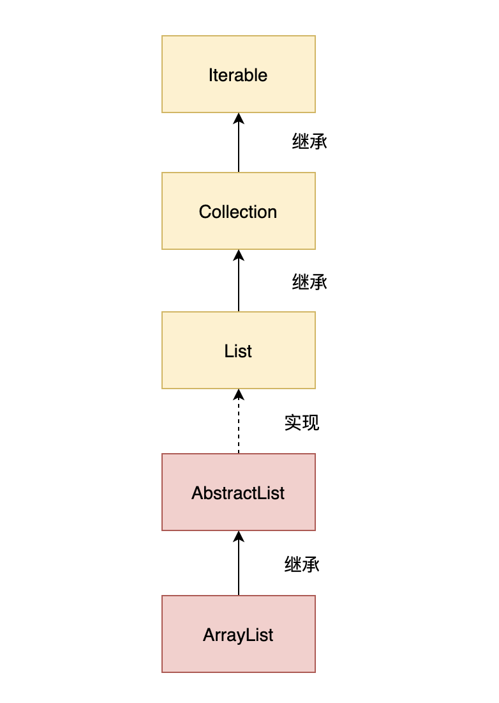

## 创建ArrayList

- 不指定初始大小

```java
List<String> list = new ArrayList<>();
```

调用无参构造方法，创建一个初始容量为10的空列表

```java
private static final int DEFAULT_CAPACITY = 10;

private static final Object[] DEFAULTCAPACITY_EMPTY_ELEMENTDATA = {};

public ArrayList() {
    this.elementData = DEFAULTCAPACITY_EMPTY_ELEMENTDATA;
}
```

- 指定初始大小，避免在添加新的元素时进行不必要的扩容

```java
List<String> list = new ArrayList<>(20);
```

## 添加元素

```java
list.add("hh");
```

- 源码

```java
public boolean add(E e) {
    // 确保容量够容纳新的元素
    ensureCapacityInternal(size + 1);  // Increments modCount!!
    // 在ArrayList末尾添加新的元素
    elementData[size++] = e;
    return true;
}
```

```java
// 列表中已有的元素个数，此时为0
private int size;
```

```java
// 此时minCapacity为1
private void ensureCapacityInternal(int minCapacity) {
    // elementData 为存放 ArrayList 元素的底层数组，此时为空
    ensureExplicitCapacity(calculateCapacity(elementData, minCapacity));
}
```

```java
// 默认初始容量是10
private static final int DEFAULT_CAPACITY = 10;

private static int calculateCapacity(Object[] elementData, int minCapacity) {
    if (elementData == DEFAULTCAPACITY_EMPTY_ELEMENTDATA) {
        // 从10和1中选最大的，返回10
        return Math.max(DEFAULT_CAPACITY, minCapacity);
    }
    return minCapacity;
}
```

```java
// 此时minCapacity为10
private void ensureExplicitCapacity(int minCapacity) {
    modCount++;

    // overflow-conscious code
    // 需要的容量为10，此时用于存储列表数据的实际大小为0，需要扩容
    if (minCapacity - elementData.length > 0)
        grow(minCapacity);
}
```

```java
private void grow(int minCapacity) {
    // overflow-conscious code
    // 当前实际大小
    int oldCapacity = elementData.length;
    // 扩容到原来的1.5倍
    int newCapacity = oldCapacity + (oldCapacity >> 1);
    // 扩容后还小于实际需要的最小容量，那就直接继续扩容到实际需要的最小容量
    if (newCapacity - minCapacity < 0)
        newCapacity = minCapacity;
    // 扩容后超出数组最大长度，那就缩小到最大长度
    if (newCapacity - MAX_ARRAY_SIZE > 0)
        newCapacity = hugeCapacity(minCapacity);
    // minCapacity is usually close to size, so this is a win:
    // 将数组复制到一个长度为newCapacity的新数组中
    elementData = Arrays.copyOf(elementData, newCapacity);
}

private static int hugeCapacity(int minCapacity) {
    if (minCapacity < 0) // overflow
        throw new OutOfMemoryError();
    return (minCapacity > MAX_ARRAY_SIZE) ?
        Integer.MAX_VALUE :
        MAX_ARRAY_SIZE;
}
```

- ArrayList在第一次执行add后会扩容为10，在添加第11个元素的时候会第二次扩容

## 向指定位置添加元素

```java
public void add(int index, E element) {
    // 越界判断
    rangeCheckForAdd(index);

    // 确保容量够，不够就扩容
    ensureCapacityInternal(size + 1);  // Increments modCount!!
    // 将index及其后面的元素后移一位，把index下标处留给新元素
    System.arraycopy(elementData, index, elementData, index + 1,
                     size - index);
    // 插入到index下标处
    elementData[index] = element;
    // 元素个数加一
    size++;
}

private void rangeCheckForAdd(int index) {
    if (index > size || index < 0)
        throw new IndexOutOfBoundsException(outOfBoundsMsg(index));
}
```

## 更新元素

```java
public E set(int index, E element) {
    // 越界检查
    rangeCheck(index);
    // 替换上新元素，返回旧元素
    E oldValue = elementData(index);
    elementData[index] = element;
    return oldValue;
}
```

## 删除元素

- 删除指定位置的元素

```java
public E remove(int index) {
    // 越界检查
    rangeCheck(index);

    modCount++;
    // 被删除的元素
    E oldValue = elementData(index);
    // 计算需要移动位置的元素总数
    int numMoved = size - index - 1;
    if (numMoved > 0)
        // 将删除位置后面的元素向前移动一位
        System.arraycopy(elementData, index+1, elementData, index,
                         numMoved);
    // 数组末尾元素置为null，让GC回收该元素占用的空间
    elementData[--size] = null; // clear to let GC do its work
    // 返回被删除的元素
    return oldValue;
}
```

- 删除指定元素

```java
public boolean remove(Object o) {
    if (o == null) {
        for (int index = 0; index < size; index++)
            // null 的时候使用 == 操作符判断
            if (elementData[index] == null) {
                fastRemove(index);
                return true;
            }
    } else {
        for (int index = 0; index < size; index++)
            // 非 null 的时候使用 equals() 方法
            if (o.equals(elementData[index])) {
                fastRemove(index);
                return true;
            }
    }
    return false;
}

private void fastRemove(int index) {
    modCount++;
    // 计算需要移动位置的元素总数
    int numMoved = size - index - 1;
    if (numMoved > 0)
        System.arraycopy(elementData, index+1, elementData, index,
                         numMoved);
    // 数组末尾置空，并让GC回收空间
    elementData[--size] = null; // clear to let GC do its work
}
```

## 查找元素

```java
list.indexOf("haha");
list.lastIndexOf("haha");
```

```java
public int indexOf(Object o) {
    if (o == null) {
        for (int i = 0; i < size; i++)
            if (elementData[i]==null)
                return i;
    } else {
        for (int i = 0; i < size; i++)
            if (o.equals(elementData[i]))
                return i;
    }
    return -1;
}
```

```java
public int lastIndexOf(Object o) {
    if (o == null) {
        for (int i = size-1; i >= 0; i--)
            if (elementData[i]==null)
                return i;
    } else {
        for (int i = size-1; i >= 0; i--)
            if (o.equals(elementData[i]))
                return i;
    }
    return -1;
}
```

```java
// contains()内部就是通过indexOf()实现的
public boolean contains(Object o) {
    return indexOf(o) >= 0;
}
```

## 二分查找

```java
public static void main(String[] args) {
    List<String> list = new ArrayList<>();
    list.add("c");
    list.add("e");
    list.add("d");
    // Collections 类的 sort() 方法可以对 ArrayList 进行排序
    // 如果是自定义类型的列表，还可以指定 Comparator 进行排序。
    Collections.sort(list);
    // [c, d, e]
    System.out.println(list);
    // 2
    System.out.println(Collections.binarySearch(list, "e"));
}
```

## 时间复杂度

- ArrayList内部使用数组来存储元素

| 操作 | 最好 | 最坏                                         |
| ---- | ---- | -------------------------------------------- |
| 查询 | O(1) | O(1)                                         |
| 插入 | O(1) | O(n)需要将插入位置之后的元素全部向后移动一位 |
| 删除 | O(1) | O(n)需要将删除位置之后的元素全部向前移动一位 |
| 修改 | O(1) | O(1)                                         |

## 拷贝

```java
// 返回该列表的浅表副本，元素本身不会被复制
// 浅表副本是创建一个新的对象，然后将当前对象的非静态字段复制到该新对象。
// 如果字段是值类型的，则对该字段执行逐位复制。
// 如果字段是引用类型，则复制引用但不复制引用的对象；因此，原始对象及其副本引用同一对象。
public Object clone() {
    try {
        // 调用 Object 类的 clone 方法，得到一个浅表副本
        ArrayList<?> v = (ArrayList<?>) super.clone();
        // 复制 elementData 数组，创建一个新数组作为副本
        v.elementData = Arrays.copyOf(elementData, size);
        v.modCount = 0;
        return v;
    } catch (CloneNotSupportedException e) {
        // this shouldn't happen, since we are Cloneable
        throw new InternalError(e);
    }
}
```

## 序列化

- 使用了 ArrayList 的实际大小 size 而不是数组的长度（`elementData.length`）来作为元素的上限进行序列化

```java
private void writeObject(java.io.ObjectOutputStream s)
    throws java.io.IOException{
    // Write out element count, and any hidden stuff
    int expectedModCount = modCount;
    // 写出对象的默认字段
    s.defaultWriteObject();

    // Write out size as capacity for behavioural compatibility with clone()
    // 写出 size
    s.writeInt(size);

    // Write out all elements in the proper order.
    for (int i=0; i<size; i++) {
        // 依次写出 elementData 数组中的元素
        s.writeObject(elementData[i]);
    }

    if (modCount != expectedModCount) {
        throw new ConcurrentModificationException();
    }
}
```

```java
private void readObject(java.io.ObjectInputStream s)
    throws java.io.IOException, ClassNotFoundException {
    elementData = EMPTY_ELEMENTDATA;

    // Read in size, and any hidden stuff
    // 读取默认字段
    s.defaultReadObject();

    // Read in capacity
    // 读取容量，这个值被忽略，因为在 ArrayList 中，容量和长度是两个不同的概念
    s.readInt(); // ignored

    if (size > 0) {
        // be like clone(), allocate array based upon size not capacity
        // 分配一个新的 elementData 数组，大小为 size
        int capacity = calculateCapacity(elementData, size);
        SharedSecrets.getJavaOISAccess().checkArray(s, Object[].class, capacity);
        ensureCapacityInternal(size);

        Object[] a = elementData;
        // Read in all elements in the proper order.
        // 依次从输入流中读取元素，并将其存储在数组中
        for (int i=0; i<size; i++) {
            // 读取对象并存储在 elementData 数组中
            a[i] = s.readObject();
        }
    }
}
```
