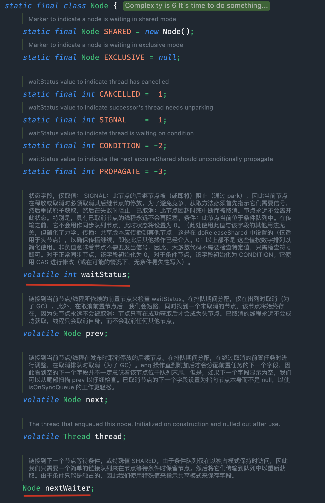
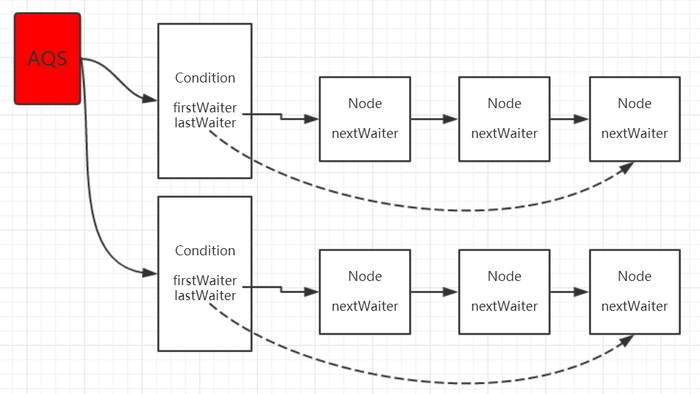
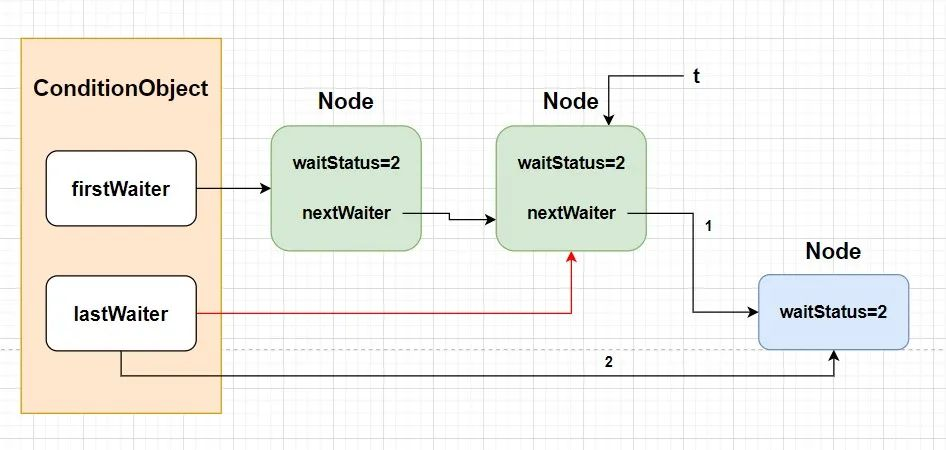
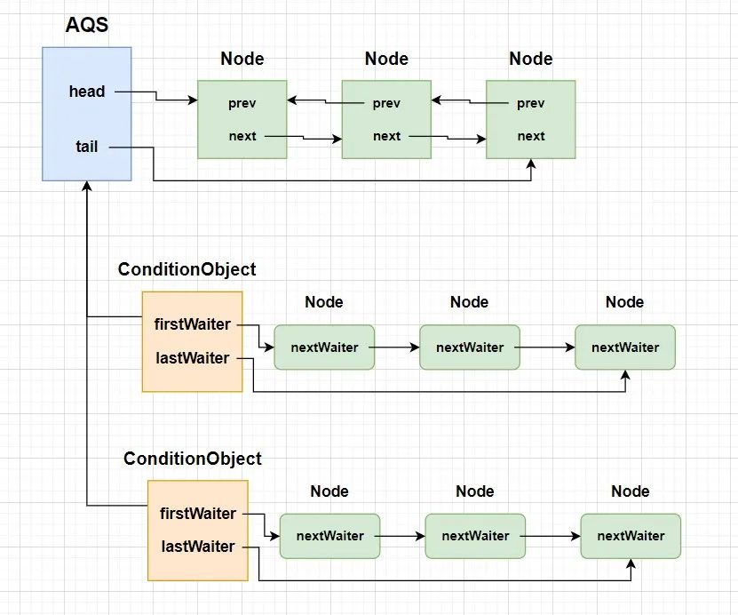
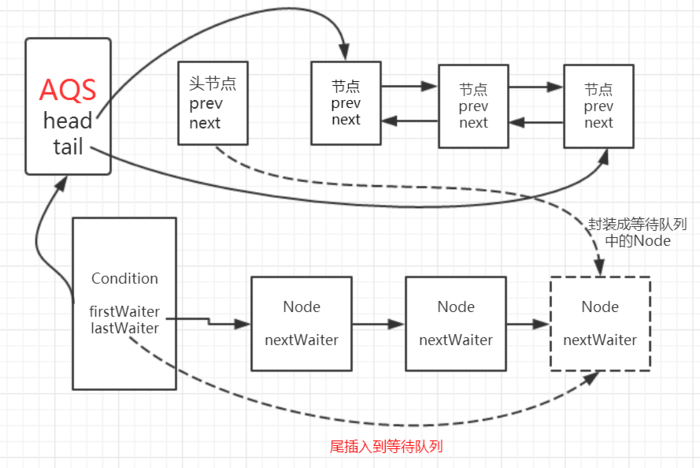
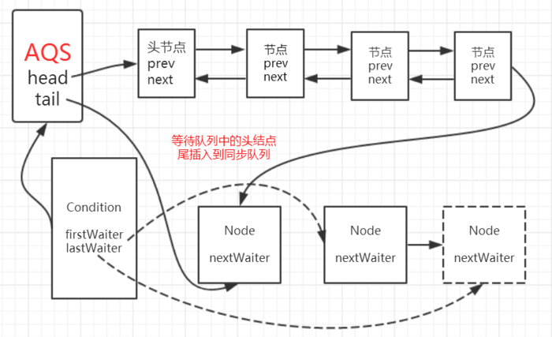
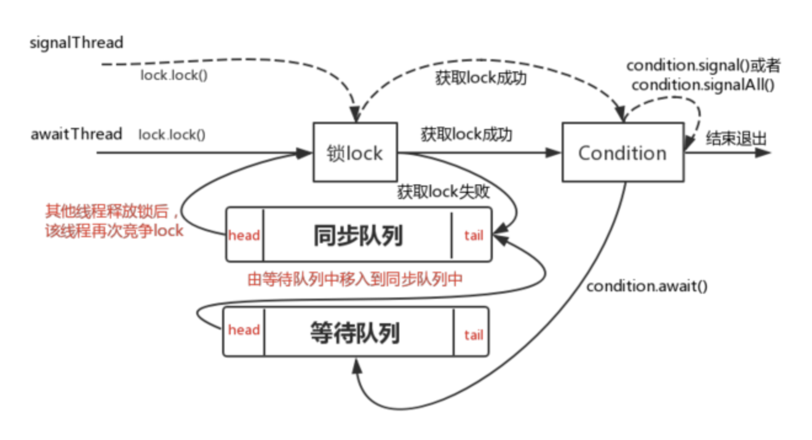

Condition 接口一共提供了以下 7 个方法：

- `await()`：线程等待直到被通知或者中断。类似于 `Object.wait()`。
- `awaitUninterruptibly()`：线程等待直到被通知，即使在等待时被中断也不会返回。没有与之对应的 Object 方法。
- `await(long time, TimeUnit unit)`：线程等待指定的时间，或被通知，或被中断。类似于 `Object.wait(long timeout)`，但提供了更灵活的时间单位。
- `awaitNanos(long nanosTimeout)`：线程等待指定的纳秒时间，或被通知，或被中断。没有与之对应的 Object 方法。
- `awaitUntil(Date deadline)`：线程等待直到指定的截止日期，或被通知，或被中断。没有与之对应的 Object 方法。
- `signal()`：唤醒一个等待的线程。类似于 `Object.notify()`。
- `signalAll()`：唤醒所有等待的线程。类似于 `Object.notifyAll()`。

 Object 类的主要方法：

- `wait()`：线程等待直到被通知或者中断。
- `wait(long timeout)`：线程等待指定的时间，或被通知，或被中断。
- `wait(long timeout, int nanos)`：线程等待指定的时间，或被通知，或被中断。
- `notify()`：唤醒一个等待的线程。
- `notifyAll()`：唤醒所有等待的线程。

## Condition 源码

创建一个 Condition 对象可以通过`lock.newCondition()` 来创建，这个方法实际上会 new 一个 **ConditionObject** 的对象，ConditionObject 是 AQS 的一个内部类。

```java
public class ReentrantLock implements Lock, java.io.Serializable {
    abstract static class Sync extends AbstractQueuedSynchronizer {
        final ConditionObject newCondition() {
            return new ConditionObject();
        }
    }
    public Condition newCondition() {
        return sync.newCondition();
    }
}
```

AQS 内部维护了一个先进先出（FIFO）的双端队列，并使用了两个引用 head 和 tail 用于标识队列的头部和尾部。


Condition 内部也使用了同样的方式，内部维护了一个先进先出（FIFO）的单向队列，我们把它称为等待队列。Condition 的**等待队列是一个单向队列**


所有调用 await 方法的线程都会加入到等待队列中，并且线程状态均为等待状态。firstWaiter 指向首节点，lastWaiter 指向尾节点，源码如下：

```java
public class ConditionObject implements Condition, java.io.Serializable {
    private static final long serialVersionUID = 1173984872572414699L;
    /** First node of condition queue. */
    private transient Node firstWaiter;
    /** Last node of condition queue. */
    private transient Node lastWaiter;
}
```

Node 中的 nextWaiter 指向队列中的下一个节点。并且进入到等待队列的 Node 节点状态都会被设置为 CONDITION。



可以多次调用`newCondition()`方法创建多个 Condition 对象，也就是一个 lock 可以持有多个等待队列。

而如果是 Object 方式的话，就只能有一个同步队列和一个等待队列。

因此，ReentrantLock 等 AQS 是可以持有一个同步队列和多个等待队列的，new 多个 Condition 就行了。示意图如下：



```java
public class BoundedBuffer<T> {
    private final LinkedList<T> buffer;  // 使用 LinkedList 作为缓冲区
    private final int capacity;          // 缓冲区最大容量
    private final ReentrantLock lock;    // 互斥锁
    private final Condition notEmpty;    // 缓冲区非空条件
    private final Condition notFull;     // 缓冲区非满条件

    public BoundedBuffer(int capacity) {
        this.capacity = capacity;
        this.buffer = new LinkedList<>();
        this.lock = new ReentrantLock();
        this.notEmpty = lock.newCondition();
        this.notFull = lock.newCondition();
    }

    // 放入一个元素
    public void put(T item) throws InterruptedException {
        lock.lock();
        try {
            // 如果缓冲区满，等待
            while (buffer.size() == capacity) {
                notFull.await();
            }
            buffer.add(item);
            // 通知可能正在等待的消费者
            notEmpty.signal();
        } finally {
            lock.unlock();
        }
    }

    // 取出一个元素
    public T take() throws InterruptedException {
        lock.lock();
        try {
            // 如果缓冲区空，等待
            while (buffer.isEmpty()) {
                notEmpty.await();
            }
            T item = buffer.removeFirst();
            // 通知可能正在等待的生产者
            notFull.signal();
            return item;
        } finally {
            lock.unlock();
        }
    }
}
```

### await 方法

当调用`condition.await()`方法后会使当前获取锁的线程进入到等待队列，如果该线程能够从 `await()` 方法返回的话，一定是该线程获取了与 Condition 相关联的锁。Condition 只是一个接口，它的实现类为 ConditionObject，是 AQS 的子类。

```java
// ConditionObject 的 await 方法
public final void await() throws InterruptedException {
    if (Thread.interrupted())
        throw new InterruptedException();
	// 1. 将当前线程包装成Node，尾插入到等待队列中
    Node node = addConditionWaiter();
	// 2. 释放当前线程所占用的lock，在释放的过程中会唤醒同步队列中的下一个节点
    int savedState = fullyRelease(node);
    int interruptMode = 0;
    while (!isOnSyncQueue(node)) {
		// 3. 当前线程进入到等待状态
        LockSupport.park(this);
        if ((interruptMode = checkInterruptWhileWaiting(node)) != 0)
            break;
    }
	// 4. 自旋等待获取到同步状态（即获取到lock）
    if (acquireQueued(node, savedState) && interruptMode != THROW_IE)
        interruptMode = REINTERRUPT;
    if (node.nextWaiter != null) // clean up if cancelled
        unlinkCancelledWaiters();
	// 5. 处理被中断的情况
    if (interruptMode != 0)
        reportInterruptAfterWait(interruptMode);
}

private Node addConditionWaiter() {
 	Node t = lastWaiter;
 	if (t != null && t.waitStatus != Node.CONDITION) {
  		//将不处于等待状态的节点从等待队列中移除
  		unlinkCancelledWaiters();
  		t = lastWaiter;
 	}
 	Node node = new Node(Thread.currentThread(), Node.CONDITION);
 	//尾节点为空
 	if (t == null)
    	//将首节点指向node
  		firstWaiter = node;
 	else
  		//将尾节点的nextWaiter指向node节点
  		t.nextWaiter = node;
	 //尾节点指向node
 	lastWaiter = node;
 	return node;
}


```

首先将 t 指向尾节点，如果尾节点不为空并且它的`waitStatus!=-2`（-2 为 CONDITION，表示正在等待 Condition 条件），则将不处于等待状态的节点从等待队列中移除，并且将 t 指向新的尾节点。

然后将当前线程封装成 waitStatus 为-2 的节点追加到等待队列尾部。

如果尾节点为空，则表明队列为空，将首尾节点都指向当前节点。


如果尾节点不为空，表明队列中有其他节点，则将当前尾节点的 nextWaiter 指向当前节点，将当前节点置为尾节点。



简单总结一下，这段代码的作用就是**通过尾插入的方式将当前线程封装的 Node 插入到等待队列中**，同时可以看出，Condtion 的等待队列是一个**不带头节点的链式队列**，之前我们学习 AQS 时知道同步队列**是一个带头节点的链式队列**，这是两者的一个区别。

关于头节点的作用，我们这里简单说明一下。

不带头节点是指在链表数据结构中，链表的第一个节点就是实际存储的第一个数据元素，而不是一个特定的"头"节点，该节点不包含实际的数据。

1）不带头节点的链表：

- 链表的第一个节点就是第一个实际的数据节点。
- 当链表为空时，头引用（通常称为 head）指向 null。

2）带头节点的链表：

- 链表有一个特殊的节点作为链表的开头，这个特殊的节点称为头节点。
- 头节点通常不存储任何实际数据，或者它的数据字段不被使用。
- 无论链表是否为空，头节点总是存在的。当链表为空时，头节点的下一个节点指向 null。
- 使用头节点可以简化某些链表操作，因为你不必特殊处理第一个元素的插入和删除。

为了更好地解释这两种链表结构，我将为每种结构提供一个简单的整数链表插入方法的示例。

1）不带头节点的链表

```java
public class Node {
    public int data;
    public Node next;

    public Node(int data) {
        this.data = data;
        this.next = null;
    }
}

public class LinkedListWithoutHead {
    public Node head;

    public void insert(int value) {
        Node newNode = new Node(value);
        if (head == null) {
            head = newNode;
        } else {
            Node temp = head;
            while (temp.next != null) {
                temp = temp.next;
            }
            temp.next = newNode;
        }
    }
}
```

2）带头节点的链表

```java
public class NodeWithHead {
    public int data;
    public NodeWithHead next;

    public NodeWithHead(int data) {
        this.data = data;
        this.next = null;
    }
}

public class LinkedListWithHead {
    private NodeWithHead head;

    public LinkedListWithHead() {
        head = new NodeWithHead(-1);  // 初始化头节点
    }

    public void insert(int value) {
        NodeWithHead newNode = new NodeWithHead(value);
        NodeWithHead temp = head;
        while (temp.next != null) {
            temp = temp.next;
        }
        temp.next = newNode;
    }
}
```

将当前节点插入到等待对列之后，会使当前线程释放 lock，由 fullyRelease 方法实现，源码如下：

```java
final int fullyRelease(Node node) {
 //释放锁失败为true，释放锁成功为false
 boolean failed = true;
 try {
     //获取当前锁的state
  int savedState = getState();
  //释放锁成功的话
  if (release(savedState)) {
   failed = false;
   return savedState;
  } else {
   throw new IllegalMonitorStateException();
  }
 } finally {
  if (failed)
   //释放锁失败的话将节点状态置为取消
   node.waitStatus = Node.CANCELLED;
 }
}
```

这段代码也很容易理解，**调用 AQS 的模板方法 release 释放 AQS 的同步状态并且唤醒在同步队列中头节点的后继节点引用的线程**，如果释放成功则正常返回，若失败的话就抛出异常。

怎样从 await 方法退出呢？现在回过头再来看 await 方法，其中有这样一段逻辑：

```java
while (!isOnSyncQueue(node)) {
	// 3. 当前线程进入到等待状态
    LockSupport.park(this);
    if ((interruptMode = checkInterruptWhileWaiting(node)) != 0)
        break;
}
```

isOnSyncQueue 方法用于判断当前线程所在的 Node 是否在同步队列中。


如果当前节点的 waitStatus=-2，说明它在等待队列中，返回 false；如果当前节点有前驱节点，则证明它在 AQS 队列中，但是前驱节点为空，说明它是头节点，而头节点是不参与锁竞争的，也返回 false。

如果当前节点既不在等待队列中，又不是 AQS 中的头节点且存在 next 节点，说明它存在于 AQS 中，直接返回 true。

这里有必要给大家看一下同步队列与等待队列的关系图了。



当线程第一次调用 condition.await 方法时，会进入到这个 while 循环，然后通过 `LockSupport.park(this)` 使当前线程进入等待状态，那么要想退出 await，第一个前提条件就是要先退出这个 while 循环，出口就只两个地方：

1. 走到 break 退出 while 循环；
2. while 循环中的逻辑判断为 false。

出现第 1 种情况的条件是，当前等待的线程被中断后代码会走到 break 退出，第 2 种情况是当前节点被移动到了同步队列中（即另外一个线程调用了  condition 的 signal 或者 signalAll 方法），while 中逻辑判断为 false 后结束 while 循环。

总结一下，退出 await 方法的前提条件是**当前线程被中断或者调用 condition.signal 或者 condition.signalAll 使当前节点移动到同步队列后**。

当退出 while 循环后会调用`acquireQueued(node, savedState)`，该方法的作用是在**自旋过程中线程不断尝试获取同步状态，直到成功（线程获取到 lock）**。这样也说明了**退出 await 方法必须是已经获得了 condition 引用（关联）的 lock**。

await 方法示意图如下：



调用 condition.await 方法的线程必须是已经获得了 lock 的线程，也就是当前线程是同步队列中的头节点。调用该方法后会使得当前线程所封装的 Node 尾插入到等待队列中。

condition 还额外支持超时机制，使用者可调用 awaitNanos、awaitUtil 这两个方法，实现原理基本上与 AQS 中的 tryAcquire 方法如出一辙。

要想不响应中断可以调用 `condition.awaitUninterruptibly()` 方法，该方法的源码如下：

```java
public final void awaitUninterruptibly() {
    Node node = addConditionWaiter();
    int savedState = fullyRelease(node);
    boolean interrupted = false;
    while (!isOnSyncQueue(node)) {
        LockSupport.park(this);
        if (Thread.interrupted())
            interrupted = true;
    }
    if (acquireQueued(node, savedState) || interrupted)
        selfInterrupt();
}
```

这段方法与上面的 await 方法基本一致，只不过减少了对中断的处理。

### signal/signalAll 实现原理

**调用 condition 的 signal 或者 signalAll 方法可以将等待队列中等待时间最长的节点移动到同步队列中**，使得该节点能够有机会获得 lock。等待队列是先进先出（FIFO）的，所以等待队列的头节点必然会是等待时间最长的节点，也就是每次调用 condition 的 signal 方法都会将头节点移动到同步队列中。

我们来通过看源码的方式验证这个猜想是不是正确的，signal 方法源码如下：

```java
public final void signal() {
    //1. 先检测当前线程是否已经获取lock
    if (!isHeldExclusively())
        throw new IllegalMonitorStateException();
    //2. 获取等待队列中第一个节点，之后的操作都是针对这个节点
	Node first = firstWaiter;
    if (first != null)
        doSignal(first);
}
```

signal 方法首先会检测当前线程是否已经获取了 lock，如果没有获取 lock 会直接抛出异常，如果获取的话，再得到等待队列的头节点，之后的  doSignal 方法也是基于该节点。下面我们来看看 doSignal 方法做了些什么事情，doSignal 方法源码如下：

```java
private void doSignal(Node first) {
    do {
        if ( (firstWaiter = first.nextWaiter) == null)
            lastWaiter = null;
        //1. 将头节点从等待队列中移除
        first.nextWaiter = null;
        //2. while中transferForSignal方法对头节点做真正的处理
    } while (!transferForSignal(first) &&
                (first = firstWaiter) != null);
}
```

具体逻辑请看注释，真正对头节点做处理的逻辑在**transferForSignal**方法中，该方法源码为：

```java
final boolean transferForSignal(Node node) {
    /*
     * If cannot change waitStatus, the node has been cancelled.
     */
	//1. 更新状态为0
    if (!compareAndSetWaitStatus(node, Node.CONDITION, 0))
        return false;

    /*
     * Splice onto queue and try to set waitStatus of predecessor to
     * indicate that thread is (probably) waiting. If cancelled or
     * attempt to set waitStatus fails, wake up to resync (in which
     * case the waitStatus can be transiently and harmlessly wrong).
     */
	//2.将该节点移入到同步队列中去
    Node p = enq(node);
    int ws = p.waitStatus;
    if (ws > 0 || !compareAndSetWaitStatus(p, ws, Node.SIGNAL))
        LockSupport.unpark(node.thread);
    return true;
}
```

关键逻辑请看注释，这段代码主要做了两件事情：

- 1.将头节点的状态更改为 CONDITION；
- 2.调用 enq 方法，将该节点尾插入到同步队列中

现在我们可以得出如下结论：

**调用 condition.signal 方法的前提条件是当前线程已经获取了 lock，该方法会使等待队列中的头节点即等待时间最长的那个节点移入到同步队列，而移入到同步队列后才有机会被唤醒**，即从 await 方法中的 `LockSupport.park(this)` 方法中返回，才有机会让调用 await 方法的线程成功退出。

signal 执行示意图如下图：



sigllAll 与 sigal 方法的区别体现在 doSignalAll 方法上，前面我们已经知道 **doSignal 方法只会对等待队列的头节点进行操作**，doSignalAll 的源码如下：

```java
private void doSignalAll(Node first) {
    lastWaiter = firstWaiter = null;
    do {
        Node next = first.nextWaiter;
        first.nextWaiter = null;
        transferForSignal(first);
        first = next;
    } while (first != null);
}
```

该方法会将等待队列中的每一个节点都移入到同步队列中，即“通知”当前调用 `condition.await()` 方法的每一个线程。

### await 与 signal/signalAll

文章开篇提到的等待/通知机制，通过 condition 的 await 和 signal/signalAll 方法就可以实现，而这种机制能够解决最经典的问题就是“生产者与消费者问题”，“生产者消费者问题”也是面试的高频考点。

await、signal 和 signalAll 方法就像一个开关，控制着线程 A（等待方）和线程 B（通知方）。它们之间的关系可以用下面这幅图来说明，会更贴切：



线程 awaitThread 先通过 `lock.lock()` 方法获取锁，成功后调用 condition.await 方法进入等待队列，而另一个线程 signalThread 通过 `lock.lock()` 方法获取锁成功后调用了 condition.signal 或者 signalAll 方法，使得线程 awaitThread  能够有机会移入到同步队列中，当其他线程释放 lock 后使得线程 awaitThread 能够有机会获取 lock，从而使得线程  awaitThread 能够从 await 方法中退出并执行后续操作。如果 awaitThread 获取 lock 失败会直接进入到同步队列。

## Condition 使用

```java
public class AwaitSignal {
    private static ReentrantLock lock = new ReentrantLock();
    private static Condition condition = lock.newCondition();
    private static volatile boolean flag = false;

    public static void main(String[] args) {
        Thread waiter = new Thread(new waiter());
        waiter.start();
        Thread signaler = new Thread(new signaler());
        signaler.start();
    }

    static class waiter implements Runnable {

        @Override
        public void run() {
            lock.lock();
            try {
                while (!flag) {
                    System.out.println(Thread.currentThread().getName() + "当前条件不满足等待");
                    try {
                        condition.await();
                    } catch (InterruptedException e) {
                        e.printStackTrace();
                    }
                }
                System.out.println(Thread.currentThread().getName() + "接收到通知条件满足");
            } finally {
                lock.unlock();
            }
        }
    }

    static class signaler implements Runnable {

        @Override
        public void run() {
            lock.lock();
            try {
                flag = true;
                condition.signalAll();
            } finally {
                lock.unlock();
            }
        }
    }
}
```
