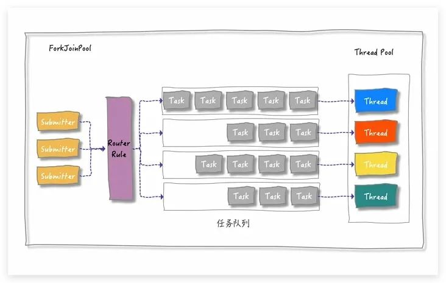
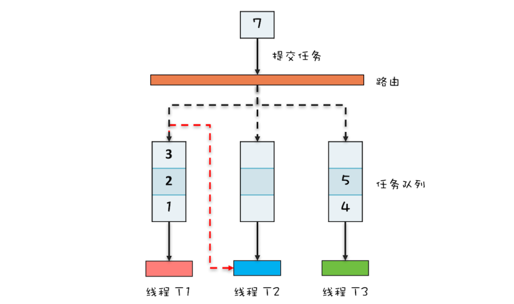

并发编程领域的任务可以分为三种：简单并行任务、聚合任务和批量并行任务，见下图。


这些模型之外，还有一种任务模型被称为“分治”。分治是一种解决复杂问题的思维方法和模式；具体而言，它将一个复杂的问题分解成多个相似的子问题，然后再将这些子问题进一步分解成更小的子问题，直到每个子问题变得足够简单从而可以直接求解。

从理论上讲，每个问题都对应着一个任务，因此分治实际上就是对任务的划分和组织。分治思想在许多领域都有广泛的应用。例如，在算法领域，我们经常使用分治算法来解决问题（如归并排序和快速排序都属于分治算法，二分查找也是一种分治算法）。在大数据领域，MapReduce 计算框架背后的思想也是基于分治。

由于分治这种任务模型的普遍性，Java 并发包提供了一种名为 Fork/Join 的并行计算框架，专门用于支持分治任务模型的应用。

## 什么是分治任务模型

------

分治任务模型可分为两个阶段：一个阶段是 **任务分解**，就是迭代地将任务分解为子任务，直到子任务可以直接计算出结果；另一个阶段是 **结果合并**，即逐层合并子任务的执行结果，直到获得最终结果。


在这个分治任务模型里，任务和分解后的子任务具有相似性，这种相似性往往体现在任务和子任务的算法是相同的，但是计算的数据规模是不同的。具备这种相似性的问题，往往都采用递归算法。

## Fork/Join 的使用

------

Fork/Join 是一个并行计算框架，主要用于支持分治任务模型。在这个计算框架中，Fork 代表任务的分解，而 Join 代表结果的合并。

Fork/Join 计算框架主要由两部分组成：分治任务的线程池 ForkJoinPool 和分治任务 ForkJoinTask。

这两部分的关系类似于 ThreadPoolExecutor 和 Runnable 之间的关系，都是用于提交任务到线程池的，只不过分治任务有自己独特的类型 ForkJoinTask。

ForkJoinTask 是一个抽象类，其中有许多方法，其中最核心的是 `fork()`方法和 `join()`方法。fork 方法用于异步执行一个子任务，而 join 方法通过阻塞当前线程来等待子任务的执行结果。

ForkJoinTask 有两个子类：RecursiveAction 和 RecursiveTask。


这两个子类都定义了一个抽象方法 `compute()`，不同之处在于 RecursiveAction 的 compute 方法没有返回值，而 RecursiveTask 的 compute 方法有返回值。这两个子类也都是抽象类，在使用时需要创建自定义的子类来扩展功能。

```java
public class Main {
    public static void main(String[] args) {
        int n = 20;

        // 为了追踪子线程名称，需要重写 ForkJoinWorkerThreadFactory 的方法
        final ForkJoinPool.ForkJoinWorkerThreadFactory factory = pool -> {
            final ForkJoinWorkerThread worker = ForkJoinPool.defaultForkJoinWorkerThreadFactory.newThread(pool);
            worker.setName("my-thread" + worker.getPoolIndex());
            return worker;
        };

        // 创建分治任务线程池，可以追踪到线程名称
        ForkJoinPool forkJoinPool = new ForkJoinPool(4, factory, null, false);

        // 快速创建 ForkJoinPool 方法
        // ForkJoinPool forkJoinPool = new ForkJoinPool(4);

        // 创建分治任务
        Fibonacci fibonacci = new Fibonacci(n);

        // 调用 invoke 方法启动分治任务
        Integer result = forkJoinPool.invoke(fibonacci);
        System.out.println("Fibonacci " + n + " 的结果是 " + result);
    }

}

class Fibonacci extends RecursiveTask<Integer> {
    final int n;

    Fibonacci(int n) {
        this.n = n;
    }

    @Override
    public Integer compute() {
        // 和递归类似，定义可计算的最小单元
        if (n <= 1) {
            return n;
        }
        System.out.println(Thread.currentThread().getName());

        Fibonacci f1 = new Fibonacci(n - 1);
        // 拆分成子任务
        f1.fork();
        Fibonacci f2 = new Fibonacci(n - 2);
        // f1.join 等待子任务执行结果
        return f2.compute() + f1.join();
    }
}
```

## ForkJoinPool

------

Fork/Join 并行计算的核心组件是 ForkJoinPool。下面简单介绍一下 ForkJoinPool 的工作原理。

当我们通过 ForkJoinPool 的 invoke 或 submit 方法提交任务时，ForkJoinPool 会根据一定的路由规则将任务分配到一个任务队列中。如果任务执行过程中创建了子任务，那么子任务会被提交到对应工作线程的任务队列中。

ForkJoinPool 中有一个数组形式的成员变量 `workQueue[]`，其对应一个队列数组，每个队列对应一个消费线程。丢入线程池的任务，根据特定规则进行转发。



ForkJoinPool 引入了一种称为"任务窃取"的机制。当工作线程空闲时，它可以从其他工作线程的任务队列中"窃取"任务。



ForkJoinPool 中的任务队列采用双端队列的形式。工作线程从任务队列的一个端获取任务，而"窃取任务"从另一端进行消费。这种设计能够避免许多不必要的数据竞争。

## 与ThreadPoolExecutor的比较

------

ForkJoinPool 与 ThreadPoolExecutor 有很多相似之处，例如都是线程池，都是用于执行任务的。但是，它们之间也有很多不同之处。

首先，ForkJoinPool 采用的是"工作窃取"的机制，而 ThreadPoolExecutor 采用的是"工作复用"的机制。这两种机制各有优劣，ForkJoinPool 的优势在于能够充分利用 CPU 的多核能力，而 ThreadPoolExecutor 的优势在于能够避免线程间的上下文切换。

其次，ForkJoinPool 采用的是分治任务模型，而 ThreadPoolExecutor 采用的是简单并行任务模型。这两种任务模型各有优劣，ForkJoinPool 的优势在于能够处理分治任务，而 ThreadPoolExecutor 的优势在于能够处理简单并行任务。

最后，ForkJoinPool 采用的是 LIFO 的任务队列，而 ThreadPoolExecutor 采用的是 FIFO 的任务队列。这两种任务队列各有优劣，ForkJoinPool 的优势在于能够避免数据竞争，而 ThreadPoolExecutor 的优势在于能够保证任务的顺序性。

假设：我们要计算 1 到 1 亿的和，为了加快计算的速度，我们自然想到算法中的分治原理，将 1 亿个数字分成 1 万个任务，每个任务计算 1 万个数值的综合，利用 CPU 的并发计算性能缩短计算时间。

由于 ThreadPoolExecutor 可以通过 Future 获取到执行结果，因此利用 ThreadPoolExecutor 也是可行的。

当然 ForkJoinPool 实现也是可以的。下面我们将这两种方式都实现一下，看看这两种实现方式有什么不同。

无论哪种实现方式，其大致思路都是：

1. 按照线程池里线程个数 N，将 1 亿个数划分成 N 等份，随后丢入线程池进行计算。
2. 每个计算任务使用 Future 接口获取计算结果，最后积加即可。

我们先使用 ThreadPoolExecutor 实现。

```java
interface Calculator {
    // 把传进来的所有 numbers 做求和处理
    long sumUp(long[] numbers);
}

class ExecutorServiceCalculator implements Calculator {
    private final int size;
    private final ExecutorService pool;

    public ExecutorServiceCalculator() {
        // CPU的核心数 默认就用cpu核心数了
        size = Runtime.getRuntime().availableProcessors();
        pool = Executors.newFixedThreadPool(size);
    }

    // 处理计算任务的线程
    private static class SumTask implements Callable<Long> {
        private final long[] numbers;
        private final int from;
        private final int to;

        public SumTask(long[] numbers, int from, int to) {
            this.numbers = numbers;
            this.from = from;
            this.to = to;
        }

        @Override
        public Long call() {
            long total = 0;
            for (int i = from; i <= to; i++) {
                total += numbers[i];
            }
            return total;
        }
    }

    // 核心业务逻辑实现
    @Override
    public long sumUp(long[] numbers) {
        List<Future<Long>> results = new ArrayList<>();

        // 把任务分解为 n 份，交给 n 个线程处理，然后把每一份都扔个一个 SumTask 线程进行处理
        int part = numbers.length / size;
        for (int i = 0; i < size; i++) {
            // 开始位置
            int from = i * part;
            // 结束位置
            int to = (i == size - 1) ? numbers.length - 1 : (i + 1) * part - 1;
            // 扔给线程池计算
            results.add(pool.submit(new SumTask(numbers, from, to)));
        }

        // 阻塞等待结果
        // 把每个线程的结果相加，得到最终结果 get()方法是阻塞的
        // 优化方案：可以采用CompletableFuture来优化  JDK1.8的新特性
        long total = 0L;
        for (Future<Long> f : results) {
            try {
                total += f.get();
            } catch (Exception ignore) {
            }
        }

        return total;
    }
}
```

接着我们使用 ForkJoinPool 来实现。

```java
interface Calculator {
    // 把传进来的所有 numbers 做求和处理
    long sumUp(long[] numbers);
}

class ForkJoinCalculator implements Calculator {
    private final ForkJoinPool pool;

    // 1. 定义计算逻辑
    private static class SumTask extends RecursiveTask<Long> {
        private final long[] numbers;
        private final int from;
        private final int to;

        public SumTask(long[] numbers, int from, int to) {
            this.numbers = numbers;
            this.from = from;
            this.to = to;
        }

        // 此方法为ForkJoin的核心方法：对任务进行拆分，拆分的好坏决定了效率的高低
        @Override
        protected Long compute() {
            // 当需要计算的数字个数小于6时，直接采用for loop方式计算结果
            if (to - from < 6) {
                long total = 0;
                for (int i = from; i <= to; i++) {
                    total += numbers[i];
                }
                return total;
            } else {
                // 否则，把任务一分为二，递归拆分(注意此处有递归)到底拆分成多少分 需要根据具体情况而定
                int middle = (from + to) / 2;
                SumTask taskLeft = new SumTask(numbers, from, middle);
                SumTask taskRight = new SumTask(numbers, middle + 1, to);
                taskLeft.fork();
                taskRight.fork();
                return taskLeft.join() + taskRight.join();
            }
        }
    }

    public ForkJoinCalculator() {
        // 也可以使用公用的线程池 ForkJoinPool.commonPool()：
        // pool = ForkJoinPool.commonPool()
        pool = new ForkJoinPool();
    }

    @Override
    public long sumUp(long[] numbers) {
        Long result = pool.invoke(new SumTask(numbers, 0, numbers.length - 1));
        pool.shutdown();
        return result;
    }
}
```

对比 ThreadPoolExecutor 和 ForkJoinPool 这两者的实现，可以发现它们都有任务拆分的逻辑，以及最终合并数值的逻辑。但 ForkJoinPool 相比 ThreadPoolExecutor 来说，做了一些实现上的封装，例如：

- 不用手动去获取子任务的结果，而是使用 join 方法直接获取结果。
- 将任务拆分的逻辑，封装到 RecursiveTask 实现类中，而不是裸露在外。

因此对于没有父子任务依赖，但是希望获取到子任务执行结果的并行计算任务，就可以使用 ForkJoinPool 来实现。**在这种情况下，使用 ForkJoinPool 实现更多是代码实现方便，封装做得更加好。**
