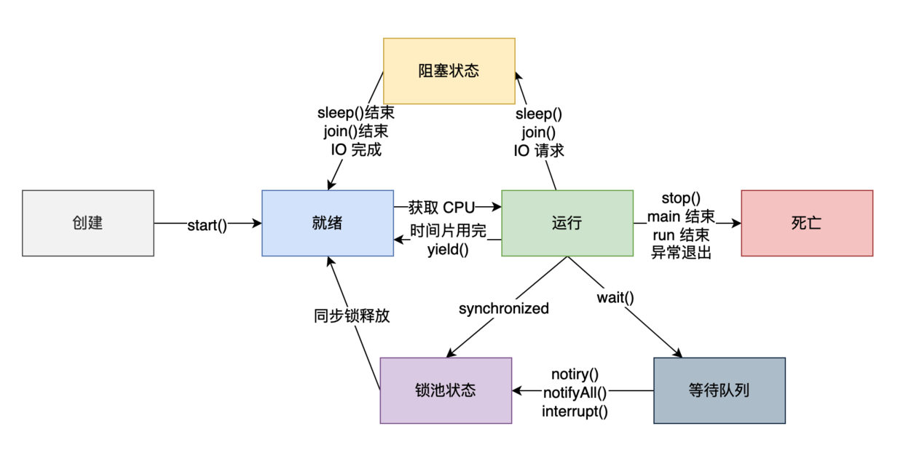

## 创建线程的三种方式

------

### 继承Thread类

```java
class MyThread extends Thread {
    @Override
    public void run() {
        for (int i = 0; i < 100; i++) {
            System.out.println(getName() + " " + i);
        }
    }

    public static void main(String[] args) {
        new MyThread().start();
        new MyThread().start();
        new MyThread().start();
    }
}
```

### 实现Runnable接口

```java
class MyRunnable implements Runnable {
    @Override
    public void run() {
        for (int i = 0; i < 10; i++) {
            try {
                Thread.sleep(10);
            } catch (InterruptedException e) {
                throw new RuntimeException(e);
            }
            System.out.println(Thread.currentThread().getName() + " " + i);
        }
    }

    public static void main(String[] args) {
        MyRunnable myRunnable = new MyRunnable();
        new Thread(myRunnable, "T1").start();
        new Thread(myRunnable, "T2").start();
        new Thread(myRunnable, "T3").start();
    }
}
```

### 实现Callable接口

```java
class CallerTask implements Callable<String> {

    @Override
    public String call() throws Exception {
        return "回调结果";
    }

    public static void main(String[] args) {
        // 创建异步任务
        FutureTask<String> task = new FutureTask<>(new CallerTask());
        // 启动线程
        new Thread(task).start();
        try {
            // 等待执行完成，并获取返回结果
            String result = task.get();
            System.out.println(result);
        } catch (InterruptedException | ExecutionException e) {
            e.printStackTrace();
        }
    }
}
```

- `run()`：封装线程执行的代码，直接调用相当于调用普通方法。
- `start()`：启动线程，然后由 JVM 调用此线程的 `run()` 方法。

- 实现 Runnable 接口避免了 Java 单继承的局限性，Java 不支持多重继承，因此如果我们的类已经继承了另一个类，就不能再继承 Thread 类了。并且适合多个相同的程序代码去处理同一资源的情况，把线程、代码和数据有效的分离，更符合面向对象的设计思想。Callable 接口与 Runnable 非常相似，但可以返回一个结果。

## 控制线程的其他方法

- sleep()：使当前正在执行的线程暂停指定的毫秒数，也就是进入休眠的状态。

- join()：等待这个线程执行完才会轮到后续线程得到 cpu 的执行权。

```java
public static void main(String[] args) {
    MyRunnable myRunnable = new MyRunnable();
    Thread t1 = new Thread(myRunnable, "T1");
    t1.start();

    try {
        // t1执行完才会轮到后面的线程执行
        t1.join();
    } catch (InterruptedException e) {
        throw new RuntimeException(e);
    }

    new Thread(myRunnable, "T2").start();
    new Thread(myRunnable, "T3").start();
}
```

- setDaemon()：将此线程标记为守护线程，准确来说，就是服务其他的线程，像 Java 中的垃圾回收线程，就是典型的守护线程。

- yield()：yield() 方法是一个静态方法，用于暗示当前线程愿意放弃其当前的时间片，允许其他线程执行。然而，它只是向线程调度器提出建议，调度器可能会忽略这个建议。具体行为取决于操作系统和 JVM 的线程调度策略。

```java
class YieldExample {
    public static void main(String[] args) {
        Thread thread1 = new Thread(YieldExample::printNumbers, "刘备");
        Thread thread2 = new Thread(YieldExample::printNumbers, "关羽");

        thread1.start();
        thread2.start();
        /*
            关羽 让出控制权...
            刘备 让出控制权...
            关羽: 3
            关羽: 4
            关羽 让出控制权...             // 即便有时候让出了控制权，其他线程也不一定会执行
            关羽: 5
            刘备: 3
            刘备: 4
            刘备 让出控制权...
            刘备: 5
         */
    }

    private static void printNumbers() {
        for (int i = 1; i <= 5; i++) {
            System.out.println(Thread.currentThread().getName() + ": " + i);

            // 当 i 是偶数时，当前线程暂停执行
            if (i % 2 == 0) {
                System.out.println(Thread.currentThread().getName() + " 让出控制权...");
                Thread.yield();
            }
        }
    }
}
```

## 线程的生命周期


