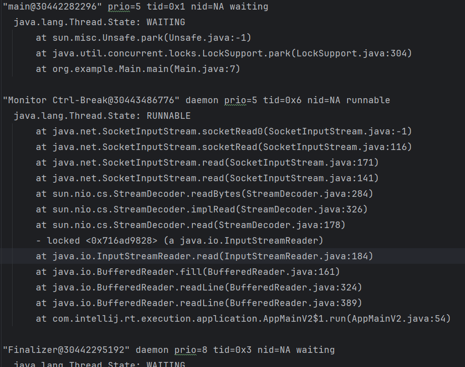
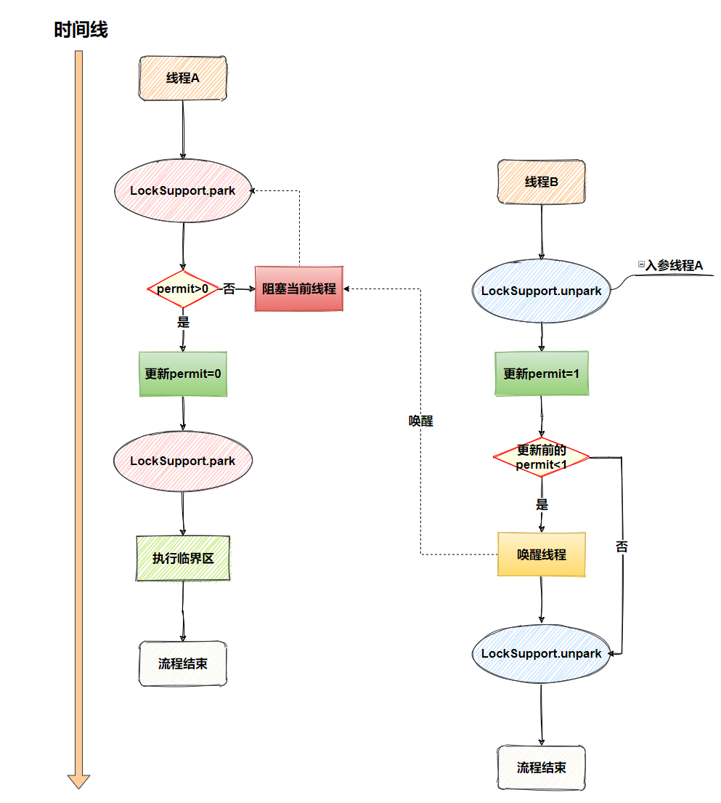
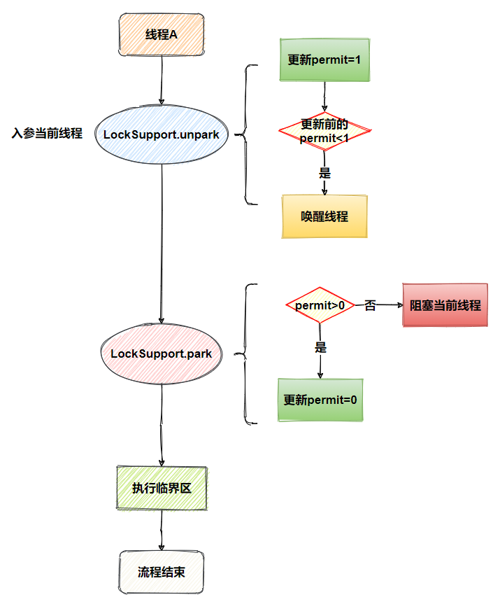

LockSupprot 用来阻塞和唤醒线程，底层实现依赖于 Unsafe 类（后面会细讲）。

该类包含一组用于阻塞和唤醒线程的静态方法，这些方法主要是围绕 park 和 unpark 展开。

```java
public class Main {
    public static void main(String[] args) {
        Thread mainThread = Thread.currentThread();

        // 当 counterThread 数到 10 时，它会唤醒 mainThread。而 mainThread 在调用 park 方法时会被阻塞，直到被 unpark。
        Thread counterThread = new Thread(() -> {
            for (int i = 1; i <= 20; i++) {
                System.out.println(i);
                if (i == 10) {
                    // 当数到10时，唤醒主线程
                    LockSupport.unpark(mainThread);
                }
            }
        });
        counterThread.start();

        // 主线程调用park
        LockSupport.park();
        System.out.println("Main thread was unparked.");
    }
}
```

## 阻塞线程

------

1. `void park()`：阻塞当前线程，如果调用 unpark 方法或线程被中断，则该线程将变得可运行。请注意，park 不会抛出 InterruptedException，因此线程必须单独检查其中断状态。
2. `void park(Object blocker)`：功能同方法 1，入参增加一个 Object 对象，用来记录导致线程阻塞的对象，方便问题排查。
3. `void parkNanos(long nanos)`：阻塞当前线程一定的纳秒时间，或直到被 unpark 调用，或线程被中断。
4. `void parkNanos(Object blocker, long nanos)`：功能同方法 3，入参增加一个 Object 对象，用来记录导致线程阻塞的对象，方便问题排查。
5. `void parkUntil(long deadline)`：阻塞当前线程直到某个指定的截止时间（以毫秒为单位），或直到被 unpark 调用，或线程被中断。
6. `void parkUntil(Object blocker, long deadline)`：功能同方法 5，入参增加一个 Object 对象，用来记录导致线程阻塞的对象，方便问题排查。

## 唤醒线程

------

`void unpark(Thread thread)`：唤醒一个由 park 方法阻塞的线程。如果该线程未被阻塞，那么下一次调用 park 时将立即返回。这允许“先发制人”式的唤醒机制。

实际上，LockSupport 阻塞和唤醒线程的功能依赖于 `sun.misc.Unsafe`，比如 LockSupport 的 park 方法是通过 `unsafe.park()` 方法实现的。

## Dump 线程

------

"Dump 线程"通常是指获取线程的当前状态和调用堆栈的详细快照。这可以提供关于线程正在执行什么操作以及线程在代码的哪个部分的重要信息。

下面是线程转储中可能包括的一些信息：

- 线程 ID 和名称：线程的唯一标识符和可读名称。
- 线程状态：线程的当前状态，例如运行（RUNNABLE）、等待（WAITING）、睡眠（TIMED_WAITING）或阻塞（BLOCKED）。
- 调用堆栈：线程的调用堆栈跟踪，显示线程从当前执行点回溯到初始调用的完整方法调用序列。
- 锁信息：如果线程正在等待或持有锁，线程转储通常还包括有关这些锁的信息。

线程转储可以通过各种方式获得，例如使用 Java 的 jstack 工具，或从 Java VisualVM、Java Mission Control 等工具获取。

下面是一个简单的例子，通过 LockSupport 阻塞线程，然后通过 Intellij IDEA 查看 dump 线程信息。

```java
public class LockSupportDemo {
    public static void main(String[] args) {
        LockSupport.park();
    }
}
```

先运行程序，再在 Run 面板中找到 attach to process，选择 attach 到主线程：


再到 debugger 面板中找到 export threads。


导出后就能看见线程信息了。



## 与 synchronized 的区别

------

synchronized 会使线程阻塞，线程会进入 BLOCKED 状态，而调用 LockSupprt 方法阻塞线程会使线程进入到 WAITING 状态。

```java
public class Main {
    public static void main(String[] args) {
        Thread thread = new Thread(() -> {
            System.out.println("Thread is parked now");
            LockSupport.park();
            System.out.println("Thread is unparked now");
        });
        thread.start();

        try {
            Thread.sleep(3000); // 主线程等待3秒
        } catch (InterruptedException e) {
            e.printStackTrace();
        }

        LockSupport.unpark(thread); // 主线程唤醒阻塞的线程
    }
}
```

## 设计思路

------

LockSupport 会为使用它的线程关联一个许可证（permit）状态，permit 的语义「是否拥有许可」，0 代表否，1 代表是，默认是 0。

- `LockSupport.unpark`：指定线程关联的 permit 直接更新为 1，如果更新前的`permit<1`，唤醒指定线程
- `LockSupport.park`：当前线程关联的 permit 如果>0，直接把 permit 更新为 0，否则阻塞当前线程



- 线程 A 执行`LockSupport.park`，发现 permit 为 0，未持有许可证，阻塞线程 A
- 线程 B 执行`LockSupport.unpark`（入参线程 A），为 A 线程设置许可证，permit 更新为 1，唤醒线程 A
- 线程 B 流程结束
- 线程 A 被唤醒，发现 permit 为 1，消费许可证，permit 更新为 0
- 线程 A 执行临界区
- 线程 A 流程结束

经过上面的分析得出结论 unpark 的语义明确为「使线程持有许可证」，park 的语义明确为「消费线程持有的许可」，所以 unpark 与 park 的执行顺序没有强制要求，只要控制好使用的线程即可，`unpark=>park`执行流程如下：



- permit 默认是 0，线程 A 执行 LockSupport.unpark，permit 更新为 1，线程 A 持有许可证
- 线程 A 执行 LockSupport.park，此时 permit 是 1，消费许可证，permit 更新为 0
- 执行临界区
- 流程结束

因 park 阻塞的线程不仅仅会被 unpark 唤醒，还可能会被线程中断（`Thread.interrupt`）唤醒，而且不会抛出 InterruptedException 异常，所以建议在 park 后自行判断线程中断状态，来做对应的业务处理。

为什么推荐使用 LockSupport 来做线程的阻塞与唤醒（线程间协同工作），因为它具备如下优点：

- 以线程为操作对象更符合阻塞线程的直观语义
- 操作更精准，可以准确地唤醒某一个线程（notify 随机唤醒一个线程，notifyAll 唤醒所有等待的线程）
- 无需竞争锁对象（以线程作为操作对象），不会因竞争锁对象产生死锁问题
- unpark 与 park 没有严格的执行顺序，不会因执行顺序引起死锁问题，比如「Thread.suspend 和 Thread.resume」没按照严格顺序执行，就会产生死锁

## 面试题

------

有 3 个独立的线程，一个只会输出 A，一个只会输出 B，一个只会输出 C，在三个线程启动的情况下，请用合理的方式让他们按顺序打印 ABCABC。

```java
public class Main {
    private static Thread t1, t2, t3;

    public static void main(String[] args) {
        t1 = new Thread(() -> {
            for (int i = 0; i < 2; i++) {
                LockSupport.park();
                System.out.print("A");
                LockSupport.unpark(t2);
            }
        });

        t2 = new Thread(() -> {
            for (int i = 0; i < 2; i++) {
                LockSupport.park();
                System.out.print("B");
                LockSupport.unpark(t3);
            }
        });

        t3 = new Thread(() -> {
            for (int i = 0; i < 2; i++) {
                LockSupport.park();
                System.out.print("C");
                LockSupport.unpark(t1);
            }
        });

        t1.start();
        t2.start();
        t3.start();

        // 主线程稍微等待一下，确保其他线程已经启动并且进入park状态。
        try {
            Thread.sleep(100);
        } catch (InterruptedException e) {
            e.printStackTrace();
        }

        // 启动整个流程
        LockSupport.unpark(t1);
    }
}
```

LockSupport 提供了一种更底层和灵活的线程调度方式。它不依赖于同步块或特定的锁对象。可以用于构建更复杂的同步结构，例如自定义锁或并发容器。LockSupport.park 与 LockSupport.unpark 的组合使得线程之间的精确控制变得更容易，而不需要复杂的同步逻辑和对象监视。
