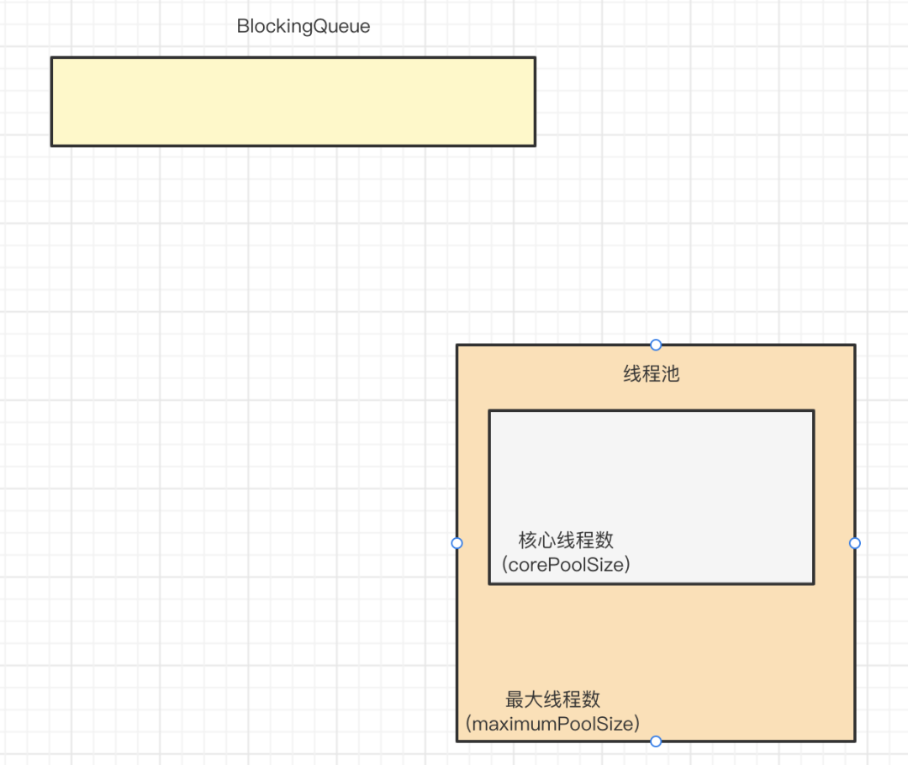
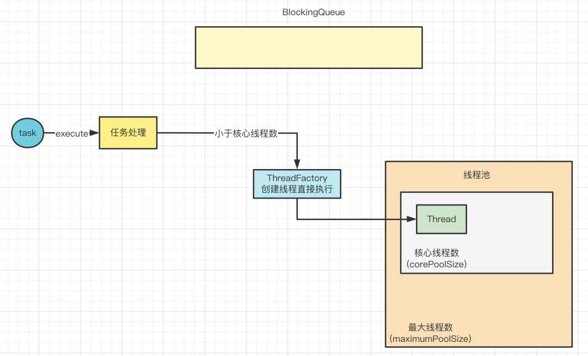
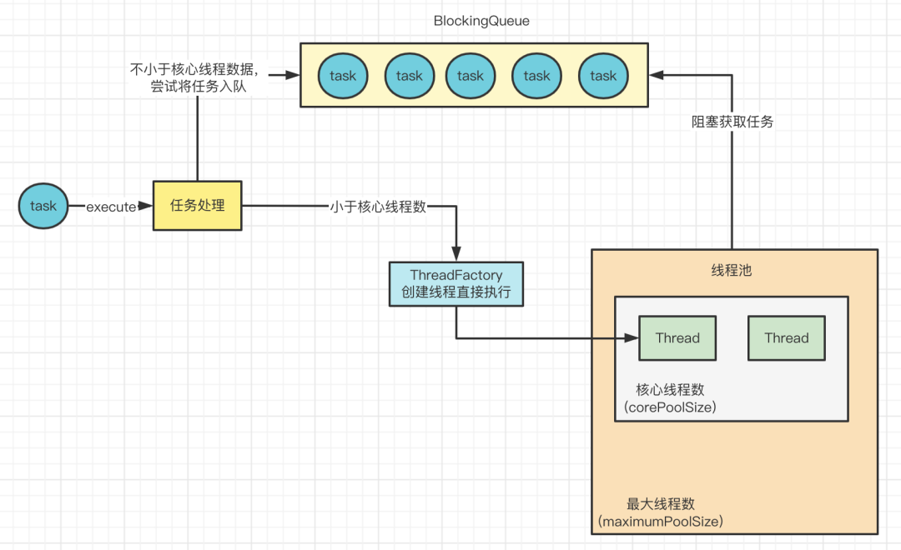
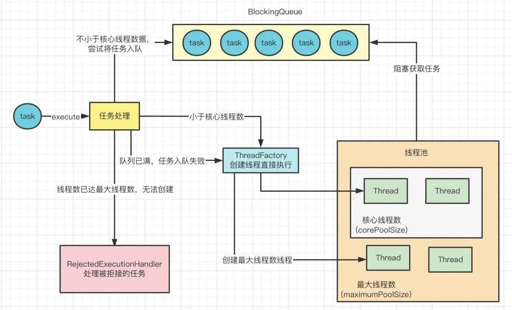

使用线程池的好处

- 降低资源消耗。通过重复利用已创建的线程降低线程创建和销毁造成的消耗。
- 提高响应速度。当任务到达时，任务可以不需要等到线程创建就能立即执行。
- 提高线程的可管理性。线程是稀缺资源，如果无限制的创建，不仅会消耗系统资源，还会降低系统的稳定性，使用线程池可以进行统一的分配，调优和监控。

## 线程池的构造方法

```java
public ThreadPoolExecutor(int corePoolSize,	// 线程池中用来工作的核心线程数量
                          int maximumPoolSize,// 最大线程数，线程池允许创建的最大线程数
                          long keepAliveTime, // 超出 corePoolSize 后创建的线程存活时间或者是所有线程最大存活时间，取决于配置
                          TimeUnit unit, // keepAliveTime 的时间单位
                          BlockingQueue<Runnable> workQueue, // 任务队列，是一个阻塞队列，当线程数达到核心线程数后，会将任务存储在阻塞队列中
                          ThreadFactory threadFactory, // 线程池内部创建线程所用的工厂
                          RejectedExecutionHandler handler) { // 拒绝策略；当队列已满并且线程数量达到最大线程数量时，会调用该方法处理任务
    if (corePoolSize < 0 ||
        maximumPoolSize <= 0 ||
        maximumPoolSize < corePoolSize ||
        keepAliveTime < 0)
        throw new IllegalArgumentException();
    if (workQueue == null || threadFactory == null || handler == null)
        throw new NullPointerException();
    this.acc = System.getSecurityManager() == null ?
            null :
            AccessController.getContext();
    this.corePoolSize = corePoolSize;
    this.maximumPoolSize = maximumPoolSize;
    this.workQueue = workQueue;
    this.keepAliveTime = unit.toNanos(keepAliveTime);
    this.threadFactory = threadFactory;
    this.handler = handler;
}
```

## 线程池运行原理



刚创建出来的线程池中只有一个构造时传入的阻塞队列，里面并没有线程，如果想要在执行之前创建好核心线程数，可以调用 prestartAllCoreThreads 方法来实现，默认是没有线程的。

```java
// 启动所有核心线程，使他们空闲等待任务。这会覆盖默认的策略，只有在执行新任务时才会启动核心线程。返回启动的线程数。
public int prestartAllCoreThreads() {
    int n = 0;
    while (addWorker(null, true))
        ++n;
    return n;
}
```

当有线程通过 execute 方法提交了一个任务，首先会去判断当前线程池的线程数是否小于核心线程数，也就是线程池构造时传入的参数 corePoolSize。如果小于，那么就直接通过 ThreadFactory 创建一个线程来执行这个任务，如图



当任务执行完之后，线程不会退出，而是会去阻塞队列中获取任务，如下图


接下来如果又提交了一个任务，也会按照上述的步骤去判断是否小于核心线程数，如果小于，还是会创建线程来执行任务，执行完之后也会从阻塞队列中获取任务。

这里有个细节，就是提交任务的时候，就算有线程池里的线程从阻塞队列中获取不到任务，如果线程池里的线程数还是小于核心线程数，那么依然会继续创建线程，而不是复用已有的线程。

如果线程池里的线程数不再小于核心线程数，那么此时就会尝试将任务放入阻塞队列中，入队成功之后，阻塞的线程就可以获取到任务。如图



随着任务越来越多，队列已经满了，任务放入失败，此时会判断当前线程池里的线程数是否小于最大线程数，也就是入参时的 maximumPoolSize 参数，如果小于最大线程数，那么也会创建非核心线程来执行提交的任务，如图


就算队列中有任务，新创建的线程还是会优先处理这个提交的任务，而不是从队列中获取已有的任务执行，**从这可以看出，先提交的任务不一定先执行**。

假如线程数已经达到最大线程数量，此时就会执行拒绝策略，也就是构造线程池的时候，传入的 RejectedExecutionHandler 对象，来处理这个任务。



JDK 自带的 RejectedExecutionHandler 实现有 4 种

- AbortPolicy：丢弃任务，抛出运行时异常
- CallerRunsPolicy：由提交任务的线程来执行任务
- DiscardPolicy：丢弃这个任务，但是不抛异常
- DiscardOldestPolicy：从队列中剔除最先进入队列的任务，然后再次提交任务

也可以自己实现 RejectedExecutionHandler 接口，比如将任务存在数据库或者缓存中，这样就可以从数据库或者缓存中获取被拒绝掉的任务了。

```java
public void execute(Runnable command) {
    // 首先检查提交的任务是否为null，是的话则抛出NullPointerException。
    if (command == null)
        throw new NullPointerException();

    // 获取线程池的当前状态（ctl是一个AtomicInteger，其中包含了线程池状态和工作线程数）
    int c = ctl.get();

    // 1. 检查当前运行的工作线程数是否少于核心线程数（corePoolSize）
    if (workerCountOf(c) < corePoolSize) {
        // 如果少于核心线程数，尝试添加一个新的工作线程来执行提交的任务
        // addWorker方法会检查线程池状态和工作线程数，并决定是否真的添加新线程
        if (addWorker(command, true))
            return;
        // 重新获取线程池的状态，因为在尝试添加线程的过程中线程池的状态可能已经发生变化
        c = ctl.get();
    }

    // 2. 尝试将任务添加到任务队列中
    if (isRunning(c) && workQueue.offer(command)) {
        int recheck = ctl.get();
        // 双重检查线程池的状态
        if (! isRunning(recheck) && remove(command))  // 如果线程池已经停止，从队列中移除任务
            reject(command);
        // 如果线程池正在运行，但是工作线程数为0，尝试添加一个新的工作线程
        else if (workerCountOf(recheck) == 0)
            addWorker(null, false);
    }
    // 3. 如果任务队列满了，尝试添加一个新的非核心工作线程来执行任务
    else if (!addWorker(command, false))
        // 如果无法添加新的工作线程（可能因为线程池已经停止或者达到最大线程数限制），则拒绝任务
        reject(command);
}
```

```java
}
```

- `workerCountOf(c)<corePoolSize`：判断是否小于核心线程数，是的话就通过 addWorker 方法，addWorker 用来添加线程并执行任务。
- `workQueue.offer(command)`：尝试往阻塞队列中添加任务。添加失败就会再次调用 addWorker 尝试添加非核心线程来执行任务；如果还是失败了，就会调用 `reject(command)`来拒绝这个任务。


## 线程池的运行原理

线程池的核心功能就是实现线程的重复利用，线程池的核心功能就是实现线程的重复利用。

```java
private final class Worker
    extends AbstractQueuedSynchronizer
    implements Runnable
{
```

Worker 继承了 AQS，也就是具有一定锁的特性。

创建线程来执行任务的方法，上面提到了，是通过 addWorker 方法。在创建 Worker 对象的时候，会把线程和任务一起封装到 Worker 内部，然后调用 runWorker 方法来让线程执行任务

```java
final void runWorker(Worker w) {
    // 获取当前工作线程
    Thread wt = Thread.currentThread();
    
    // 从 Worker 中取出第一个任务
    Runnable task = w.firstTask;
    w.firstTask = null;
    
    // 解锁 Worker（允许中断）
    w.unlock(); 
    
    boolean completedAbruptly = true;
    try {
        // 当有任务需要执行或者能够从任务队列中获取到任务时，工作线程就会持续运行
        while (task != null || (task = getTask()) != null) {
            // 锁定 Worker，确保在执行任务期间不会被其他线程干扰
            w.lock();
            
            // 如果线程池正在停止，并确保线程已经中断
            // 如果线程没有中断并且线程池已经达到停止状态，中断线程
            if ((runStateAtLeast(ctl.get(), STOP) ||
                 (Thread.interrupted() &&
                  runStateAtLeast(ctl.get(), STOP))) &&
                !wt.isInterrupted())
                wt.interrupt();
            
            try {
                // 在执行任务之前，可以插入一些自定义的操作
                beforeExecute(wt, task);
                
                Throwable thrown = null;
                try {
                    // 实际执行任务
                    task.run();
                } catch (RuntimeException x) {
                    thrown = x; throw x;
                } catch (Error x) {
                    thrown = x; throw x;
                } catch (Throwable x) {
                    thrown = x; throw new Error(x);
                } finally {
                    // 执行任务后，可以插入一些自定义的操作
                    afterExecute(task, thrown);
                }
            } finally {
                // 清空任务，并更新完成任务的计数
                task = null;
                w.completedTasks++;
                // 解锁 Worker
                w.unlock();
            }
        }
        completedAbruptly = false;
    } finally {
        // 工作线程退出的后续处理
        processWorkerExit(w, completedAbruptly);
    }
}
```

runWorker 内部使用了 while 死循环，当第一个任务执行完之后，会不断地通过 getTask 方法获取任务，只要能获取到任务，就会调用 run 方法继续执行任务，这就是线程能够复用的主要原因。

如果从 getTask 获取不到方法的话，就会调用 finally 中的 processWorkerExit 方法，将线程退出。

Worker 继承了 AQS，每次在执行任务之前都会调用 Worker 的 lock 方法，执行完任务之后，会调用 unlock 方法，这样做的目的就可以通过 Woker 的加锁状态判断出当前线程是否正在执行任务。

如果想知道线程是否正在执行任务，只需要调用 Woker 的 tryLock  方法，根据是否加锁成功就能判断，加锁成功说明当前线程没有加锁，也就没有执行任务了，在调用 shutdown  方法关闭线程池的时候，就时用这种方式来判断线程有没有在执行任务，如果没有的话，会尝试打断没有执行任务的线程。

## 线程如何获取任务以及如何实现超时

线程在执行完任务之后，会继续从 getTask 方法中获取任务，获取不到就会退出

```java
private Runnable getTask() {
    // 标志，表示最后一个poll()操作是否超时
    boolean timedOut = false;

    // 无限循环，直到获取到任务或决定工作线程应该退出
    for (;;) {
        int c = ctl.get();
        int rs = runStateOf(c);

        // 如果线程池状态是SHUTDOWN或更高（如STOP）并且任务队列为空，那么工作线程应该减少并退出
        if (rs >= SHUTDOWN && (rs >= STOP || workQueue.isEmpty())) {
            decrementWorkerCount();
            return null;
        }

        int wc = workerCountOf(c);

        // 检查工作线程是否应当在没有任务执行时，经过keepAliveTime之后被终止
        boolean timed = allowCoreThreadTimeOut || wc > corePoolSize;

        // 如果工作线程数超出最大线程数或者超出核心线程数且上一次poll()超时，并且队列为空或工作线程数大于1，
        // 则尝试减少工作线程数
        if ((wc > maximumPoolSize || (timed && timedOut))
            && (wc > 1 || workQueue.isEmpty())) {
            if (compareAndDecrementWorkerCount(c))
                return null;
            continue;
        }

        try {
            // 根据timed标志，决定是无限期等待任务，还是等待keepAliveTime时间
            Runnable r = timed ?
                workQueue.poll(keepAliveTime, TimeUnit.NANOSECONDS) :  // 指定时间内等待
                workQueue.take();  // 无限期等待
            if (r != null)  // 成功获取到任务
                return r;
            // 如果poll()超时，则设置timedOut标志
            timedOut = true;
        } catch (InterruptedException retry) {
            // 如果在等待任务时线程被中断，重置timedOut标志并重新尝试获取任务
            timedOut = false;
        }
    }
}
```

```java
boolean timed = allowCoreThreadTimeOut || wc > corePoolSize;
```

这行代码是用来判断当前过来获取任务的线程是否可以超时退出。如果 allowCoreThreadTimeOut 设置为 true 或者线程池当前的线程数大于核心线程数，也就是 corePoolSize，那么该获取任务的线程就可以超时退出。

```java
Runnable r = timed ?
workQueue.poll(keepAliveTime, TimeUnit.NANOSECONDS) :
workQueue.take();
```

会根据是否允许超时来选择调用阻塞队列 workQueue 的 poll 方法或者 take 方法。如果允许超时，则调用 poll 方法，传入  keepAliveTime，也就是构造线程池时传入的空闲时间，这个方法的意思就是从队列中阻塞 keepAliveTime  时间来获取任务，获取不到就会返回 null；如果不允许超时，就会调用 take 方法，这个方法会一直阻塞获取任务，直到从队列中获取到任务为止。

主要就是利用了阻塞队列的 poll 方法，这个方法可以指定超时时间，一旦线程达到了 keepAliveTime 还没有获取到任务，就会返回 null，一旦 getTask 方法返回 null，线程就会退出。

这里也有一个细节，就是判断当前获取任务的线程是否可以超时退出的时候，如果将 allowCoreThreadTimeOut 设置为 true，那么所有线程走到这个 timed 都是  true，所有线程包括核心线程都可以做到超时退出。如果线程池需要将核心线程超时退出，就可以通过 allowCoreThreadTimeOut  方法将 allowCoreThreadTimeOut 变量设置为 true。


## 线程池的五种状态

```java
// 线程池状态具体是存在 ctl 成员变量中的，ctl 中不仅存储了线程池的状态还存储了当前线程池中线程数的大小
private final AtomicInteger ctl = new AtomicInteger(ctlOf(RUNNING, 0));

// 线程池创建时就是这个状态，能够接收新任务，以及对已添加的任务进行处理
private static final int RUNNING    = -1 << COUNT_BITS;
// 调用 shutdown 方法，线程池就会转换成 SHUTDOWN 状态，此时线程池不再接收新任务，但能继续处理已添加的任务到队列中
private static final int SHUTDOWN   =  0 << COUNT_BITS;
// 调用 shutdownNow 方法，线程池就会转换成 STOP 状态，不接收新任务，也不能继续处理已添加的任务到队列中任务，并且会尝试中断正在处理的任务的线程
private static final int STOP       =  1 << COUNT_BITS;
// SHUTDOWN 状态下，任务数为 0， 其他所有任务已终止，线程池会变为 TIDYING 状态；线程池在 SHUTDOWN 状态，任务队列为空且执行中任务为空，线程池会变为 TIDYING 状态；线程池在 STOP 状态，线程池中执行中任务为空时，线程池会变为 TIDYING 状态
private static final int TIDYING    =  2 << COUNT_BITS;
// 线程池彻底终止。线程池在 TIDYING 状态执行完 terminated() 方法就会转变为 TERMINATED 状态
private static final int TERMINATED =  3 << COUNT_BITS;
```


## 线程池的关闭

线程池提供了 shutdown 和 shutdownNow 两个方法来关闭线程池。

```java
/**
 * 启动一次顺序关闭，在这次关闭中，执行器不再接受新任务，但会继续处理队列中的已存在任务。
 * 当所有任务都完成后，线程池中的线程会逐渐退出。
 */
public void shutdown() {
    // ThreadPoolExecutor的主锁
    final ReentrantLock mainLock = this.mainLock; 
    // 加锁以确保独占访问
    mainLock.lock(); 

    try {
        // 检查是否有关闭的权限
        checkShutdownAccess(); 
        // 将执行器的状态更新为SHUTDOWN
        advanceRunState(SHUTDOWN); 
        // 中断所有闲置的工作线程
        interruptIdleWorkers(); 
        // ScheduledThreadPoolExecutor中的挂钩方法，可供子类重写以进行额外操作
        onShutdown(); 
    } finally {
        // 无论try块如何退出都要释放锁
        mainLock.unlock(); 
    }

    // 如果条件允许，尝试终止执行器
    tryTerminate(); 
}
```

就是将线程池的状态修改为 SHUTDOWN，然后尝试打断空闲的线程（如何判断空闲，上面在说 Worker 继承 AQS 的时候说过），也就是在阻塞等待任务的线程。

```java
/**
 * 尝试停止所有正在执行的任务，停止处理等待的任务，
 * 并返回等待处理的任务列表。
 *
 * @return 从未开始执行的任务列表
 */
public List<Runnable> shutdownNow() {
    // 用于存储未执行的任务的列表
    List<Runnable> tasks; 
    // ThreadPoolExecutor的主锁
    final ReentrantLock mainLock = this.mainLock; 
    // 加锁以确保独占访问
    mainLock.lock(); 

    try {
        // 检查是否有关闭的权限
        checkShutdownAccess(); 
        // 将执行器的状态更新为STOP
        advanceRunState(STOP); 
        // 中断所有工作线程
        interruptWorkers(); 
        // 清空队列并将结果放入任务列表中
        tasks = drainQueue(); 
    } finally {
        // 无论try块如何退出都要释放锁
        mainLock.unlock(); 
    }

    // 如果条件允许，尝试终止执行器
    tryTerminate(); 

    // 返回队列中未被执行的任务列表
    return tasks; 
}
```

就是将线程池的状态修改为 STOP，然后尝试打断所有的线程，从阻塞队列中移除剩余的任务，这也是为什么 shutdownNow 不能执行剩余任务的原因。

所以也可以看出 shutdown 方法和 shutdownNow 方法的主要区别就是，shutdown 之后还能处理在队列中的任务，shutdownNow 直接就将任务从队列中移除，线程池里的线程就不再处理了。

## 线程池的监控

- `getCompletedTaskCount`：已经执行完成的任务数量
- `getLargestPoolSize`：线程池里曾经创建过的最大的线程数量。这个主要是用来判断线程是否满过。
- `getActiveCount`：获取正在执行任务的线程数据
- `getPoolSize`：获取当前线程池中线程数量的大小

除了线程池提供的上述已经实现的方法，同时线程池也预留了很多扩展方法。比如在 runWorker 方法里面，执行任务之前会回调  `beforeExecute` 方法，执行任务之后会回调 `afterExecute` 方法，而这些方法默认都是空实现，可以自己继承 ThreadPoolExecutor 来重写这些方法，实现自己想要的功能。

## Executors 构造线程池

1）固定线程数量的线程池：核心线程数与最大线程数相等

```java
public static ExecutorService newFixedThreadPool(int nThreads) {
    return new ThreadPoolExecutor(nThreads, nThreads,
                                  0L, TimeUnit.MILLISECONDS,
                                  new LinkedBlockingQueue<Runnable>());
}
```

2）单个线程数量的线程池

```java
public static ExecutorService newSingleThreadExecutor() {
    return new FinalizableDelegatedExecutorService
        (new ThreadPoolExecutor(1, 1,
                                0L, TimeUnit.MILLISECONDS,
                                new LinkedBlockingQueue<Runnable>()));
}
```

3）接近无限大线程数量的线程池

```java
public static ExecutorService newCachedThreadPool() {
    return new ThreadPoolExecutor(0, Integer.MAX_VALUE,
                                  60L, TimeUnit.SECONDS,
                                  new SynchronousQueue<Runnable>());
}
```

4）带定时调度功能的线程池

```java
public static ScheduledExecutorService newScheduledThreadPool(int corePoolSize) {
    return new ScheduledThreadPoolExecutor(corePoolSize);
}
```

虽然 JDK  提供了快速创建线程池的方法，但其实不推荐使用 Executors  来创建线程池，因为从上面构造线程池的代码可以看出，newFixedThreadPool 线程池由于使用了 LinkedBlockingQueue，队列的容量默认无限大，实际使用中出现任务过多时会导致内存溢出；newCachedThreadPool 线程池由于核心线程数无限大，当任务过多的时候会导致创建大量的线程，可能机器负载过高导致服务宕机。

## 自定义线程池

### 线程数

线程数的设置主要取决于业务是 IO 密集型还是 CPU 密集型。

CPU 密集型：指的是任务主要使用来进行大量的计算，没有什么导致线程阻塞。一般这种场景的线程数设置为 CPU 核心数+1。

IO 密集型：当执行任务需要大量的 io，比如磁盘 io，网络 io，可能会存在大量的阻塞，所以在 IO 密集型任务中使用多线程可以大大地加速任务的处理。一般线程数设置为 2*CPU 核心数

Java 中用来获取 CPU 核心数的方法是：`Runtime.getRuntime().availableProcessors();`

### 线程工厂

一般建议自定义线程工厂，构建线程的时候设置线程的名称，这样在查日志的时候就方便知道是哪个线程执行的代码。

### 有界队列

一般需要设置有界队列的大小，比如 LinkedBlockingQueue 在构造的时候可以传入参数来限制队列中任务数据的大小，这样就不会因为无限往队列中扔任务导致系统的 OOM 。
