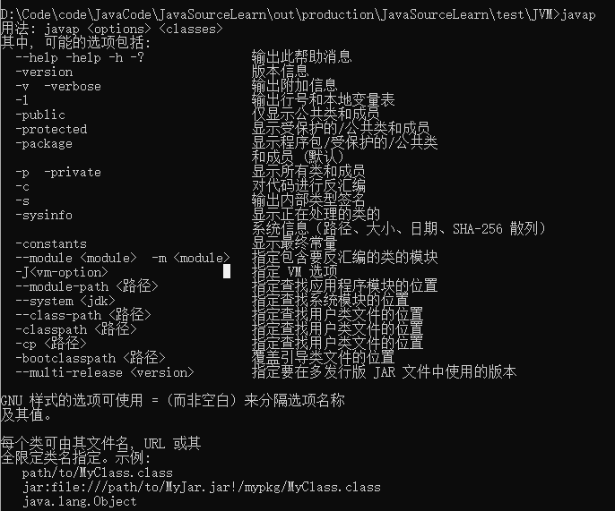

## javap

------



## 字节码的基本信息

------

```java
public class Test {
    private int age = 10;

    public int getAge() {
        return age;
    }
}
```

- 在 class 文件的同级目录下输入命令 `javap -v -p Test.class` 来查看一下输出的内容

```java
// 字节码文件的位置
Classfile /D:/Code/code/JavaCode/JavaSourceLearn/out/production/JavaSourceLearn/test/JVM/Test.class
  // 文件的修改日期和大小
  Last modified 2024年7月15日; size 369 bytes
  // 字节码文件的 SHA-256 值，用于校验文件的完整性
  SHA-256 checksum ece86f04e47d4ba3e27fc08cf3cb675a31670d9eab284fc0b2e8487ed8ed1c73
  // 该字节码文件编译自 Main.java 源文件
  Compiled from "Test.java"
// 类访问修饰符和类型，表明这是一个公开的类，名为test.JVM.Test
public class test.JVM.Test
  // 次版本号
  minor version: 0
  // 主版本号 由 Java 8 编译
  major version: 52
  // 类访问标记:表明当前类是 ACC_PUBLIC | ACC_SUPER（表明这个类是 public 的，并且使用了 super 关键字）。
  flags: (0x0021) ACC_PUBLIC, ACC_SUPER
  // 当前类的索引，指向常量池中下标为 3 的常量，当前类是 Test 类
  this_class: #3                          // test/JVM/Test
  // 父类的索引，指向常量池中下标为 4 的常量，当前类的父类是 Object 类
  super_class: #4                         // java/lang/Object
  // 当前类有 0 个接口，1 个字段（age），2 个方法（getAge()方法和缺省的默认构造方法），1 个属性（该类仅有的一个属性是 SourceFIle，包含了源码文件的信息）。
  interfaces: 0, fields: 1, methods: 2, attributes: 1   
// 常量池
Constant pool:
// 类型为 Methodref，表明是用来定义方法的，指向常量池中下标为 4 和 18 的常量
   #1 = Methodref          #4.#18         // java/lang/Object."<init>":()V
// 类型为 Fieldref，表明是用来定义字段的，指向常量池中下标为 3 和 19 的常量
   #2 = Fieldref           #3.#19         // test/JVM/Test.age:I
// 类型为 Class，表明是用来定义类（或者接口）的，指向常量池中下标为 20 的常量
   #3 = Class              #20            // test/JVM/Test
// 类型为 Class，表明是用来定义类（或者接口）的，指向常量池中下标为 21 的常量
   #4 = Class              #21            // java/lang/Object
// 类型为 Utf8，UTF-8 编码的字符串，值为 age，表明字段名为 age
   #5 = Utf8               age
// 类型为 Utf8，UTF-8 编码的字符串，值为 I，表明字段的类型为 int
   #6 = Utf8               I
// 类型为 Utf8，UTF-8 编码的字符串，值为 <init>，表明为构造方法
   #7 = Utf8               <init>
// 类型为 Utf8，UTF-8 编码的字符串，值为 ()V，表明方法的返回值为 void
   #8 = Utf8               ()V
   #9 = Utf8               Code
  #10 = Utf8               LineNumberTable
  #11 = Utf8               LocalVariableTable
  #12 = Utf8               this
  #13 = Utf8               Ltest/JVM/Test;
  #14 = Utf8               getAge
  #15 = Utf8               ()I
  #16 = Utf8               SourceFile
  #17 = Utf8               Test.java
// 类型为 NameAndType，表明是字段或者方法的部分符号引用，指向常量池中下标为 7 和 8 的常量
  #18 = NameAndType        #7:#8          // "<init>":()V
// 类型为 NameAndType，表明是字段或者方法的部分符号引用，指向常量池中下标为 5 和 6 的常量
  #19 = NameAndType        #5:#6          // age:I
  #20 = Utf8               test/JVM/Test
// 类型为 Utf8，UTF-8 编码的字符串，值为 java/lang/Object
  #21 = Utf8               java/lang/Object
{
  // 字段表
  private int age;
    descriptor: I
    flags: (0x0002) ACC_PRIVATE
  // 方法表
  // 构造方法，返回类型为 void，访问标志为 public
  public test.JVM.Test();
    descriptor: ()V
    flags: (0x0001) ACC_PUBLIC
    Code:
      // stack 为最大操作数栈，Java 虚拟机在运行的时候会根据这个值来分配栈帧的操作数栈深度
      // locals 为局部变量所需要的存储空间，单位为槽（slot），方法的参数变量和方法内的局部变量都会存储在局部变量表中；局部变量表的容量以变量槽为最小单位，一个变量槽可以存放一个 32 位以内的数据类型，比如 boolean、byte、char、short、int、float、reference 和 returnAddress 类型；局部变量表所需的容量大小是在编译期间完成计算的，大小由编译器决定；对于实例方法（如构造方法），局部变量表的第一个位置（索引 0）总是用于存储 this 引用
      // args_size 为方法的参数个数，有一个隐藏的 this 变量
      stack=2, locals=1, args_size=1
         0: aload_0
         1: invokespecial #1                  // Method java/lang/Object."<init>":()V
         4: aload_0
         5: bipush        10
         7: putfield      #2                  // Field age:I
        10: return
      // 描述源码行号与字节码行号(字节码偏移量)之间的对应关系
      LineNumberTable:
        line 4: 0
        line 5: 4
      // LocalVariableTable描述帧栈中的局部变量与源码中定义的变量之间的关系
      LocalVariableTable:
      // Start 和 Length：定义变量在方法中的作用域。Start 是变量生效的字节码偏移量，Length 是它保持活动的长度。
      // Slot：变量在局部变量数组中的索引
      // Name：变量的名称，如在源代码中定义的
      // Signature：变量的类型描述符
        Start  Length  Slot  Name   Signature
            0      11     0  this   Ltest/JVM/Test;
  // 成员方法
  public int getAge();
    descriptor: ()I
    flags: (0x0001) ACC_PUBLIC
    Code:
      // 最大操作数栈为 1，局部变量所需要的存储空间为 1，方法的参数个数为 1，是因为局部变量只有一个隐藏的 this，并且字节码指令中只执行了一次 aload_0
      stack=1, locals=1, args_size=1
          //  加载 this 引用到栈顶，以便接下来访问实例字段 age
         0: aload_0
          // 获取字段值。这条指令读取 this 对象的 age 字段的值，并将其推送到栈顶。#2 是对常量池中的字段引用。
         1: getfield      #2                  // Field age:I
          // 返回栈顶整型值。这里返回的是 age 字段的值
         4: ireturn
      LineNumberTable:
        line 8: 0
      LocalVariableTable:
        Start  Length  Slot  Name   Signature
            0       5     0  this   Ltest/JVM/Test;
}
SourceFile: "Test.java"
```

- Java 虚拟机是在加载字节码文件的时候才进行的动态链接，也就是说，字段和方法的符号引用只有经过运行期转换后才能获得真正的内存地址。当 Java 虚拟机运行时，需要从常量池获取对应的符号引用，然后在类创建或者运行时解析并翻译到具体的内存地址上。

- Test类使用的是默认的构造方法，来源于 Object 类。`#4` 指向 `Class #21`（即 `java/lang/Object`），`#18` 指向 `NameAndType #7:#8`（即 `<init>:()V`）。

- 声明了一个类型为 int 的字段 age。`#3` 指向 `Class #20`（即 `test/JVM/Test`），`#19` 指向 `NameAndType #5:#6`（即 `age:I`）

| 标识字符 |             含义             |
| :------: | :--------------------------: |
|    B     |      基本数据类型 byte       |
|    C     |      基本数据类型 char       |
|    D     |     基本数据类型 double      |
|    F     |      基本数据类型 float      |
|    I     |       基本数据类型 int       |
|    J     |      基本数据类型 long       |
|    S     |      基本数据类型 short      |
|    Z     |     基本数据类型 boolean     |
|    V     |        特殊类型 void         |
|    L     | 引用数据类型，以分号“；”结尾 |
|    [     |           一维数组           |

## 字段表集合

------

- 字段表用来描述接口或者类中声明的==变量==，包括类变量和成员变量，但不包含声明在方法中局部变量

字段的修饰符一般有：

- 访问权限修饰符，比如 public private protected
- 静态变量修饰符，比如 static
- final
- 并发可见性修饰符，比如 volatil序列化修饰符，比如 transient

然后是字段的类型（可以是基本数据类型、数组和对象）和名称。

## 方法表集合

- 方法表用来描述接口或者类中声明的==方法==，包括类方法和成员方法，以及构造方法


