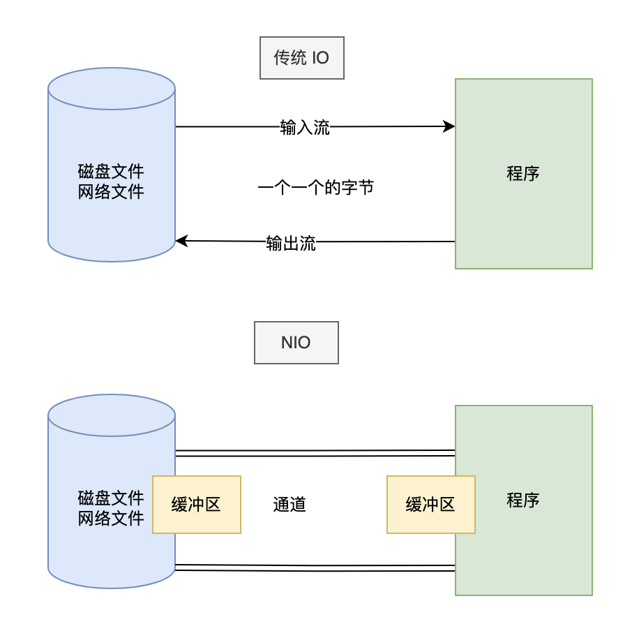

传统 IO 基于字节流或字符流（如 FileInputStream、BufferedReader 等）进行文件读写，以及使用 Socket 和 ServerSocket 进行网络传输。

NIO 使用通道（Channel）和缓冲区（Buffer）进行文件操作，以及使用 SocketChannel 和 ServerSocketChannel 进行网络传输。

传统 IO 采用阻塞式模型，对于每个连接，都需要创建一个独立的线程来处理读写操作。当一个线程在等待 I/O 操作时，无法执行其他任务。这会导致大量线程的创建和销毁，以及上下文切换，降低了系统性能。

NIO 使用非阻塞模型，允许线程在等待 I/O 时执行其他任务。这种模式通过使用选择器（Selector）来监控多个通道（Channel）上的 I/O 事件，实现了更高的性能和可伸缩性。

## NIO 和传统 IO 在操作文件时的差异

JDK 1.4 中，`java.nio.*包`引入新的 Java I/O 库，其目的是**提高速度**。实际上，“旧”的 I/O 包已经使用 NIO**重新实现过，即使我们不显式的使用 NIO 编程，也能从中受益**。

```java
class SimpleFileTransferTest {

    // 使用传统的 I/O 方法传输文件
    private long transferFile(File source, File des) throws IOException {
        long startTime = System.currentTimeMillis();

        if (!des.exists()) des.createNewFile();

        // 创建输入输出流
        BufferedInputStream bis = new BufferedInputStream(Files.newInputStream(source.toPath()));
        BufferedOutputStream bos = new BufferedOutputStream(Files.newOutputStream(des.toPath()));

        // 使用数组传输数据
        byte[] bytes = new byte[1024 * 1024];
        int len;
        while ((len = bis.read(bytes)) != -1) {
            bos.write(bytes, 0, len);
        }

        long endTime = System.currentTimeMillis();
        return endTime - startTime;
    }

    // 使用 NIO 方法传输文件
    private long transferFileWithNIO(File source, File des) throws IOException {
        long startTime = System.currentTimeMillis();

        if (!des.exists()) des.createNewFile();

        // 创建随机存取文件对象
        RandomAccessFile read = new RandomAccessFile(source, "rw");
        RandomAccessFile write = new RandomAccessFile(des, "rw");

        // 获取文件通道
        FileChannel readChannel = read.getChannel();
        FileChannel writeChannel = write.getChannel();

        // 创建并使用 ByteBuffer 传输数据
        ByteBuffer byteBuffer = ByteBuffer.allocate(1024 * 1024);
        while (readChannel.read(byteBuffer) > 0) {
            byteBuffer.flip();
            writeChannel.write(byteBuffer);
            byteBuffer.clear();
        }

        // 关闭文件通道
        writeChannel.close();
        readChannel.close();
        long endTime = System.currentTimeMillis();
        return endTime - startTime;
    }

    public static void main(String[] args) throws IOException {
        SimpleFileTransferTest simpleFileTransferTest = new SimpleFileTransferTest();
        File sourse = new File("hello.txt");
        File des = new File("io.txt");
        File nio = new File("nio.txt");

        // 比较传统的 I/O 和 NIO 传输文件的时间
        long time = simpleFileTransferTest.transferFile(sourse, des);
        System.out.println("普通字节流时间=" + time);

        long timeNio = simpleFileTransferTest.transferFileWithNIO(sourse, nio);
        System.out.println("NIO时间=" + timeNio);
    }
}
```

NIO（New I/O）的设计目标是解决传统 I/O（BIO，Blocking I/O）在处理大量并发连接时的性能瓶颈。传统 I/O 在网络通信中主要使用阻塞式 I/O，为每个连接分配一个线程。当连接数量增加时，系统性能将受到严重影响，线程资源成为关键瓶颈。而 NIO 提供了非阻塞 I/O 和 I/O 多路复用，可以在单个线程中处理多个并发连接，从而在网络传输中显著提高性能。

以下是 NIO 在网络传输中优于传统 I/O 的原因：

①、NIO 支持非阻塞 I/O，这意味着在执行 I/O 操作时，线程不会被阻塞。这使得在网络传输中可以有效地管理大量并发连接（数千甚至数百万）。而在操作文件时，这个优势没有那么明显，因为文件读写通常不涉及大量并发操作。

②、NIO 支持 I/O 多路复用，这意味着一个线程可以同时监视多个通道（如套接字），并在 I/O 事件（如可读、可写）准备好时处理它们。这大大提高了网络传输中的性能，因为单个线程可以高效地管理多个并发连接。操作文件时这个优势也无法提现出来。

③、NIO 提供了 ByteBuffer 类，可以高效地管理缓冲区。这在网络传输中很重要，因为数据通常是以字节流的形式传输。操作文件的时候，虽然也有缓冲区，但优势仍然不够明显。

## NIO 和传统 IO 在网络传输中的差异

### IOSever

```java
class IOServer {
    public static void main(String[] args) {
        try {
            ServerSocket serverSocket = new ServerSocket(9527);
            while (true) {
                Socket client = serverSocket.accept();
                InputStream in = client.getInputStream();
                OutputStream out = client.getOutputStream();

                byte[] buffer = new byte[1024];
                int bytesRead = in.read(buffer);
                out.write(buffer, 0, bytesRead);

                in.close();
                out.close();
                client.close();
            }
        } catch (IOException e) {
            e.printStackTrace();
        }
    }
}
```

Socket 和 ServerSocket 是传统的阻塞式 I/O 编程方式，用于建立和管理 TCP 连接。

- Socket：表示客户端套接字，负责与服务器端建立连接并进行数据的读写。
- ServerSocket：表示服务器端套接字，负责监听客户端连接请求。当有新的连接请求时，ServerSocket 会创建一个新的 Socket 实例，用于与客户端进行通信。

在传统阻塞式 I/O 编程中，每个连接都需要一个单独的线程进行处理，这导致了在高并发场景下的性能问题。

### NIOSever

```java
class NIOServer {
    public static void main(String[] args) {
        try {
            // 创建 ServerSocketChannel
            ServerSocketChannel serverSocketChannel = ServerSocketChannel.open();
            // 绑定端口
            serverSocketChannel.bind(new InetSocketAddress(4399));
            // 设置为非阻塞模式
            serverSocketChannel.configureBlocking(false);

            // 创建 Selector
            Selector selector = Selector.open();
            // 将 ServerSocketChannel 注册到 Selector，关注 OP_ACCEPT 事件
            serverSocketChannel.register(selector, SelectionKey.OP_ACCEPT);

            // 无限循环，处理事件
            while (true) {
                // 阻塞直到有事件发生
                selector.select();
                // 获取发生事件的 SelectionKey
                Iterator<SelectionKey> iterator = selector.selectedKeys().iterator();
                while (iterator.hasNext()) {
                    SelectionKey key = iterator.next();
                    // 处理完后，从 selectedKeys 集合中移除
                    iterator.remove();

                    // 判断事件类型
                    if (key.isAcceptable()) {
                        // 有新的连接请求
                        ServerSocketChannel server = (ServerSocketChannel) key.channel();
                        // 接受连接
                        SocketChannel client = server.accept();
                        // 设置为非阻塞模式
                        client.configureBlocking(false);
                        // 将新的 SocketChannel 注册到 Selector，关注 OP_READ 事件
                        client.register(selector, SelectionKey.OP_READ);
                    } else if (key.isReadable()) {
                        // 有数据可读
                        SocketChannel client = (SocketChannel) key.channel();
                        // 创建 ByteBuffer 缓冲区
                        ByteBuffer buffer = ByteBuffer.allocate(1024);
                        // 从 SocketChannel 中读取数据并写入 ByteBuffer
                        client.read(buffer);
                        // 准备读取
                        buffer.flip();
                        // 将数据从 ByteBuffer 写回到 SocketChannel
                        client.write(buffer);
                        // 关闭连接
                        client.close();
                    }
                }
            }
        } catch (IOException e) {
            e.printStackTrace();
        }
    }
}
```

非阻塞 I/O，可以在单个线程中处理多个连接。

- ServerSocketChannel：类似于 ServerSocket，表示服务器端套接字通道。它负责监听客户端连接请求，并可以设置为非阻塞模式，这意味着在等待客户端连接请求时不会阻塞线程。
- SocketChannel：类似于 Socket，表示客户端套接字通道。它负责与服务器端建立连接并进行数据的读写。SocketChannel 也可以设置为非阻塞模式，在读写数据时不会阻塞线程。

Selector 是 Java NIO 中的一个关键组件，用于实现 I/O 多路复用。它允许在单个线程中同时监控多个 ServerSocketChannel 和 SocketChannel，并通过 SelectionKey 标识关注的事件。当某个事件发生时，Selector 会将对应的 SelectionKey 添加到已选择的键集合中。通过使用 Selector，可以在单个线程中同时处理多个连接，从而有效地提高 I/O 操作的性能，特别是在高并发场景下。

### 客户端测试用例

```java
class TestClient {
    public static void main(String[] args) throws InterruptedException {
        int clientCount = 10000;
        ExecutorService executorServiceIO = Executors.newFixedThreadPool(10);
        ExecutorService executorServiceNIO = Executors.newFixedThreadPool(10);

        // 使用传统 IO 的客户端
        Runnable ioClient = () -> {
            try {
                Socket socket = new Socket("localhost", 9527);
                OutputStream out = socket.getOutputStream();
                InputStream in = socket.getInputStream();
                out.write("Hello, IO!".getBytes());
                byte[] buffer = new byte[1024];
                in.read(buffer);
                in.close();
                out.close();
                socket.close();
            } catch (IOException e) {
                e.printStackTrace();
            }
        };

        // 使用 NIO 的客户端
        Runnable nioClient = () -> {
            try {
                SocketChannel socketChannel = SocketChannel.open();
                socketChannel.connect(new InetSocketAddress("localhost", 4399));
                ByteBuffer buffer = ByteBuffer.wrap("Hello, NIO!".getBytes());
                socketChannel.write(buffer);
                buffer.clear();
                socketChannel.read(buffer);
                socketChannel.close();
            } catch (IOException e) {
                e.printStackTrace();
            }
        };

        // 分别测试 NIO 和传统 IO 的服务器性能
        long startTime, endTime;

        startTime = System.currentTimeMillis();
        for (int i = 0; i < clientCount; i++) {
            executorServiceIO.execute(ioClient);
        }
        executorServiceIO.shutdown();
        executorServiceIO.awaitTermination(1, TimeUnit.MINUTES);
        endTime = System.currentTimeMillis();
        System.out.println("传统 IO 服务器处理 " + clientCount + " 个客户端耗时: " + (endTime - startTime) + "ms");

        startTime = System.currentTimeMillis();
        for (int i = 0; i < clientCount; i++) {
            executorServiceNIO.execute(nioClient);
        }
        executorServiceNIO.shutdown();
        executorServiceNIO.awaitTermination(1, TimeUnit.MINUTES);
        endTime = System.currentTimeMillis();
        System.out.println("NIO 服务器处理 " + clientCount + " 个客户端耗时: " + (endTime - startTime) + "ms");
    }
}
```
