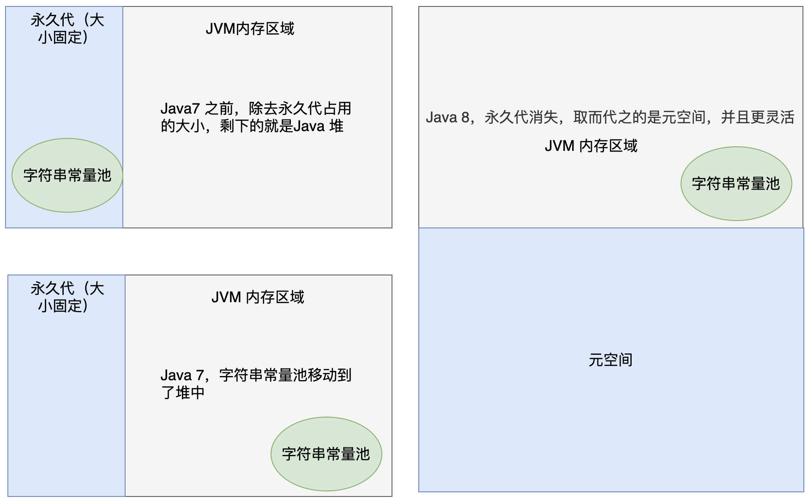

## new String()创建了几个对象

```java
// 使用new，每次都会创建一个新的对象
String s = new String("hh");
```

- 先在位于堆中的字符串常量池中查找是否已经存在hh字符串对象
  - 如果有，直接在堆中创建一个hh字符串对象，然后把这个堆中新创建的对象地址返回给栈中的变量s
  - 如果没有，现在字符串常量池中创建一个对象，然后再在堆中也创建个对象并返回堆中的给s

## 字符串常量池的作用

```java
// 采用双引号的方式来创建字符串对象，会重复利用字符串常量池中已经存在的对象
String s2 = "hh";
```

- JVM会在字符串常量池中查找有没有hh字符串对象
  - 如果有，不创建任何对象，直接返回字符串常量值中的对象地址
  - 如果没有，在字符串常量池中创建后再将其返回

## 字符串常量池位置变化


