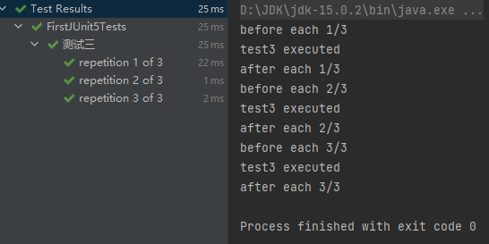

# JUnit5

## 安卓build.gradle

> https://github.com/mannodermaus/android-junit5

## Unit 3 或 JUnit4 的向后兼容性

- JUnit4 已经存在了很长时间，并且用 JUnit4 编写了许多测试。JUnitJupiter 也需要支持这些测试。 为此，开发了 *JUnit Vintage* 子项目。

- JUnit Vintage 提供了`TestEngine`实现，用于在 JUnit5 平台上运行基于 JUnit 3 和 JUnit4 的测试。

## 注解

- 所有核心注解位于`junit-jupiter-api`模块中的`org.junit.jupiter.api`包中。
- 测试类和测试方法都不必是`public`。

| 注解               | 描述                                                                                                                                                                                                                                      |
| ------------------ | ----------------------------------------------------------------------------------------------------------------------------------------------------------------------------------------------------------------------------------------- |
| @Test              | 表示方法是测试方法。与JUnit4的@Test注解不同的是，这个注解没有声明任何属性，因为JUnit Jupiter中的测试扩展是基于他们自己的专用注解来操作的。除非被覆盖，否则这些方法可以继承。                                                              |
| @ParameterizedTest | 表示方法是参数化测试。 除非被覆盖，否则这些方法可以继承。                                                                                                                                                                                 |
| @RepeatedTest      | 表示方法是用于重复测试的测试模板。除非被覆盖，否则这些方法可以继承。                                                                                                                                                                      |
| @TestFactory       | 表示方法是用于动态测试的测试工厂。除非被覆盖，否则这些方法可以继承。                                                                                                                                                                      |
| @TestInstance      | 用于为被注解的测试类配置测试实例生命周期。 这个注解可以继承。                                                                                                                                                                             |
| @TestTemplate      | 表示方法是测试用例的模板，设计为被调用多次，调用次数取决于自注册的提供者返回的调用上下文。除非被覆盖，否则这些方法可以继承。                                                                                                              |
| @DisplayName       | 声明测试类或测试方法的自定义显示名称。这个注解不被继承。                                                                                                                                                                                  |
| @BeforeEach        | 表示被注解的方法应在当前类的每个@Test，@RepeatedTest，@ParameterizedTest或@TestFactory方法**之前**执行; 类似于JUnit 4的@Before。 除非被覆盖，否则这些方法可以继承。                                                                       |
| @AfterEach         | 表示被注解的方法应在当前类的每个@Test，@RepeatedTest，@ParameterizedTest或@TestFactory方法**之后**执行; 类似于JUnit 4的@After。 除非被覆盖，否则这些方法可以继承。                                                                        |
| @BeforeAll         | 表示被注解的方法应该在当前类的所有@Test，@RepeatedTest，@ParameterizedTest和@TestFactory方法**之前**执行; 类似于JUnit 4的@BeforeClass。 这样的方法可以继承（除非被隐藏或覆盖），并且必须是静态的（除非使用“per-class”测试实例生命周期）。 |
| @AfterAll          | 表示被注解的方法应该在当前类的所有@Test，@RepeatedTest，@ParameterizedTest和@TestFactory方法**之后**执行; 类似于JUnit 4的@AfterClass。 这样的方法可以继承（除非被隐藏或覆盖），并且必须是静态的（除非使用“per-class”测试实例生命周期）。  |
| @Nested            | 表示被注解的类是一个嵌套的非静态测试类。除非使用“per-class”测试实例生命周期，否则@BeforeAll和@AfterAll方法不能直接在@Nested测试类中使用。 这个注解不能继承。                                                                              |
| @Tag               | 在类或方法级别声明标签，用于过滤测试; 类似于TestNG中的test group或JUnit 4中的Categories。这个注释可以在类级别上继承，但不能在方法级别上继承。                                                                                             |
| @Disabled          | 用于禁用测试类或测试方法; 类似于JUnit4的@Ignore。这个注解不能继承。                                                                                                                                                                       |
| @ExtendWith        | 用于注册自定义扩展。 这个注解可以继承。                                                                                                                                                                                                   |

- 简单的注解使用

```java
import static org.junit.jupiter.api.Assertions.*;

import org.junit.jupiter.api.*;

class FirstJUnit5Tests {

    /**
     * 只会执行一次
     * 必须为static
     */
    @BeforeAll
    static void beforeAll(){
        System.out.println("before all");
    }

    @AfterAll
    static void afterAll(){
        System.out.println("after all");
    }

    /**
     * 在每个测试单元执行前都会执行一次
     */
    @BeforeEach
    void beforeEach(){
        System.out.println("before each");
    }

    @AfterEach
    void afterEach(){
        System.out.println("after each");
    }

    @DisplayName("测试一")
    @Test
    void test1() {
        assertEquals(2, 2, "error");
    }

    /**
     * 禁用测试方法，也可以禁用测试类
     */
    @Disabled
    @Test
    void test2(){
        System.out.println(2);
    }
}
```

- @RepeatedTest

```java
import static org.junit.jupiter.api.Assertions.*;

import org.junit.jupiter.api.*;

class FirstJUnit5Tests {
    @BeforeEach
    void beforeEach(RepetitionInfo info){
        int currentRepetition = info.getCurrentRepetition();
        int totalRepetition = info.getTotalRepetitions();
        System.out.println("before each " + currentRepetition + "/" + totalRepetition);
    }

    @AfterEach
    void afterEach(RepetitionInfo info){
        int currentRepetition = info.getCurrentRepetition();
        int totalRepetition = info.getTotalRepetitions();
        System.out.println("after each " + currentRepetition + "/" + totalRepetition);
    }

 	@DisplayName("测试三")
	// @RepeatedTest(value = 3, name = "{displayName} - repetition {currentRepetition} 			of {totalRepetitions}")
	// @RepeatedTest(value = 3, name = RepeatedTest.LONG_DISPLAY_NAME)
    @RepeatedTest(value = 3) // 默认的SHORT_DISPLAY_NAME
    void test3(){
        System.out.println("test3 executed");
    }
}
```



- @Tag

```java
@Tag("tagA")
@Test
void test1(){
    System.out.println("test1");
}

@Tag("tagA")
@Tag("tagC")
@Test
void test2(){
    System.out.println("test2");
}

@Tag("tagB")
@Tag("tagC")
@DisplayName("测试三")
@RepeatedTest(value = 3)
void test3(){
    System.out.println("test3 executed");
}
```


## 断言

- 所有方法

```ceylon
Assertions.assertEquals() and Assertions.assertNotEquals()
Assertions.assertArrayEquals()
Assertions.assertIterableEquals()
Assertions.assertLinesMatch()
Assertions.assertNotNull() and Assertions.assertNull()
Assertions.assertNotSame() and Assertions.assertSame()
Assertions.assertTimeout() and Assertions.assertTimeoutPreemptively()
Assertions.assertTrue() and Assertions.assertFalse()
Assertions.assertThrows()
Assertions.fail()
```

### Assertions.assertEquals()

```java
/**
 * assertEquals()针对不同的数据类型
 * 还支持传递传递的错误消息
 */
@Test
void test1() {
    System.out.println("test1");
    // pass
    Assertions.assertEquals(4, 4);

    // fail
    Assertions.assertEquals(3, 4, "Calculator.add(2, 2) test failed");

    // fail
    Supplier<String> messageSupplier = () -> "Calculator.add(2, 2) test failed";
    Assertions.assertEquals(3, 4, messageSupplier);
}

/**
 * assertNotEquals()不会针对不同的数据类型重载方法，而仅接受Object
 * public static void assertNotEquals(Object expected, Object actual)
 * public static void assertNotEquals(Object expected, Object actual, String message)
 * public static void assertNotEquals(Object expected, Object actual, Supplier<String> messageSupplier)
 */
@Test
void test2() {
    Assertions.assertNotEquals(3, 4);
}
```

- 判断Object是否相等的源码

```java
static void assertEquals(Object expected, Object actual, String message) {
    if (!AssertionUtils.objectsAreEqual(expected, actual)) {
        AssertionUtils.failNotEqual(expected, actual, message);
    }
}

/**
 * 对于 ==
 * 基本类型：比较的是值是否相同；
 * 引用类型：比较的是引用是否相同；
 * 对于 equals
 * 本质上就是 ==
 * 只不过 String 和 Integer 等重写了 equals 方法，把它变成了值比较
 */
static boolean objectsAreEqual(Object obj1, Object obj2) {
    if (obj1 == null) {
        return obj2 == null;
    } else {
        return obj1.equals(obj2);
    }
}
```

### Assertions.assertArrayEquals()

```java
@Test
void test1() {
    //Test will pass
    Assertions.assertArrayEquals(new int[]{1,2,3}, new int[]{1,2,3}, "Array Equal Test");

    //Test will fail because element order is different
    Assertions.assertArrayEquals(new int[]{1,2,3}, new int[]{1,3,2}, "Array Equal Test");

    //Test will fail because number of elements are different
    Assertions.assertArrayEquals(new int[]{1,2,3}, new int[]{1,2,3,4}, "Array Equal Test");
}
```

### Assertions.assertIterableEquals()

```java
/**
 * 断言期望和实际的可迭代项高度相等。 
 * 高度相等意味着集合中元素的数量和顺序必须相同； 以及迭代元素必须相等。
 */
@Test
void test1() {
    Iterable<Integer> listOne = new ArrayList<>(Arrays.asList(1,2,3,4));
    Iterable<Integer> listTwo = new ArrayList<>(Arrays.asList(1,2,3,4));
    Iterable<Integer> listThree = new ArrayList<>(Arrays.asList(1,2,3));
    Iterable<Integer> listFour = new ArrayList<>(Arrays.asList(1,2,4,3));

    //Test will pass
    Assertions.assertIterableEquals(listOne, listTwo);

    //Test will fail
    Assertions.assertIterableEquals(listOne, listThree);

    //Test will fail
    Assertions.assertIterableEquals(listOne, listFour);
}
```

### Assertions.assertLinesMatch()

它断言**期望的字符串列表与实际列表**相匹配。 将一个字符串与另一个字符串匹配的逻辑是：

1. 检查`expected.equals(actual)` –如果是，则继续下一对
2. 否则将`expected`视为正则表达式，并通过
   `String.matches(String)`检查–如果是，则继续下一对
3. 否则检查`expected`行是否为快进标记，如果是，则相应地应用
   快速前行并转到 1。

有效的快进标记是以`>>`开头和结尾并且至少包含 4 个字符的字符串。 快进文字之间的任何字符都将被丢弃。

```java
>>>>
>> stacktrace >>
>> single line, non Integer.parse()-able comment >>
```

### Assertions.assertNotNull()

```java
@Test
void test1() {
    String nullString = null;
    String notNullString = "haha";

    //Test will pass
    Assertions.assertNotNull(notNullString);

    //Test will fail
    Assertions.assertNotNull(nullString);

    //Test will pass
    Assertions.assertNull(nullString);

    // Test will fail
    Assertions.assertNull(notNullString);
}
```

### Assertions.assertNotSame()

- `assertNotSame()`断言**预期和实际不引用同一对象**。 同样，`assertSame()`方法断言，**预期和实际引用完全相同的对象**

```java
@Test
void test1() {
    // 都是在常量池中取值，二者都指向常量池中同一对象，其地址值相同
    String originalObject = "haha";
    String cloneObject = originalObject;
    String otherObject = "haha";

    // 还是从常量池中取
    String otherObject2 = new String(new char[]{'h', 'a','h', 'a'});

    //Test will pass
    Assertions.assertNotSame(originalObject, "hehe");

    //Test will fail
    Assertions.assertNotSame(originalObject, cloneObject);

    //Test will pass
    Assertions.assertSame(originalObject, cloneObject);

    // Test will fail
    Assertions.assertSame(originalObject, "hehe");
}
```

> > String为什么不用new：https://www.debugease.com/j2se/3709966.html

### Assertions.assertTimeout()

```java
/**
 * 如果超过超时，Executable或ThrowingSupplier的执行将被抢先中止。
 * 在assertTimeout()的情况下，不会中断Executable或ThrowingSupplier。
 */
@Test
void test1() {
    //This will pass
    Assertions.assertTimeout(Duration.ofMinutes(1), () -> "result");

    //This will fail
    Assertions.assertTimeout(Duration.ofMillis(100), () -> {
        Thread.sleep(200);
        return "result";
    });

    //This will fail
    Assertions.assertTimeoutPreemptively(Duration.ofMillis(100), () -> {
        Thread.sleep(200);
        return "result";
    });
}
```

### Assertions.assertTrue()

```java
@Test
void testCase() {

    boolean trueBool = true;
    boolean falseBool = false;

    Assertions.assertTrue(trueBool);
    Assertions.assertTrue(falseBool, "test execution message");
    Assertions.assertTrue(falseBool, FirstJUnit5Tests::message);
    Assertions.assertTrue(FirstJUnit5Tests::getResult, FirstJUnit5Tests::message);
}

private static String message() {
    return "Test execution result";
}

private static boolean getResult() {
    return false;
}
```

### Assertions.assertThrows()

```java
/**
 * 预期异常
 */
@Test
void testExpectedException() {
    Assertions.assertThrows(NumberFormatException.class, () -> {
        Integer.parseInt("One");
    });
}

/**
 * 预期异常的超类
 */
@Test
void testExpectedExceptionWithSuperType() {
    Assertions.assertThrows(IllegalArgumentException.class, () -> {
        Integer.parseInt("One");
    });
}

/**
 * 抛出其他异常或者没有异常将会测试失败
 */
@Test
void testExpectedExceptionFail() {
    Assertions.assertThrows(IllegalArgumentException.class, () -> {
        Integer.parseInt("1");
    });
}
```

### Assertions.fail()

- 仅使测试失败

```java
public static void fail(String message)
public static void fail(Throwable cause)
public static void fail(String message, Throwable cause)
public static void fail(Supplier<String> messageSupplier)
```

## 假设

### Assumptions.assumeTrue()

```java
@Test
void testOnDev() {
    Assumptions.assumeTrue(true);
    // 剩余的测试将继续
    System.out.println("haha");
}

@Test
void testOnProd() {
    Assumptions.assumeTrue(false, FirstJUnit5Tests::message);
    // 剩余的测试将被中止
    System.out.println("xixi");
}

private static String message() {
    return "TEST Execution Failed :: ";
}
```

## 测试套件

- 测试类名称必须遵循正则表达式模式`^.*Tests?$`。 这意味着测试类名称必须以`Test`或`Tests`结尾

### @SelectPackages创建测试套件

