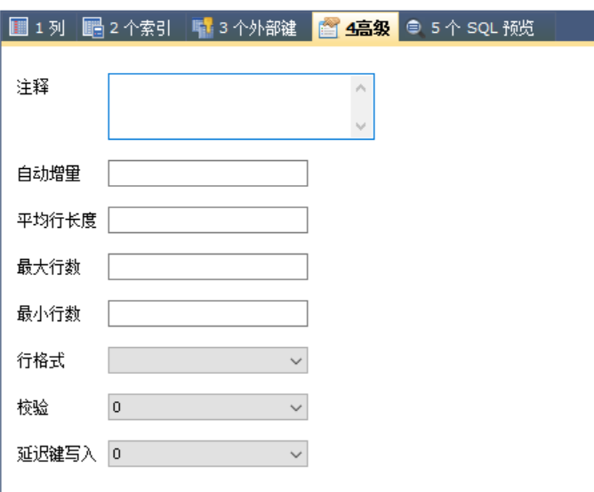
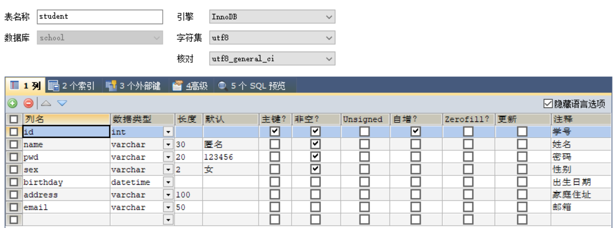

# MySql

- 管理员身份运行cmd
- 新建的数据库都在data目录下

```sql
net start mysql --启动mysql
mysql -u root -p --回车输入密码连接数据库
flush privileges; -- 新权限
show databases; -- 显示所有数据库

create database westos;
mysql> use westos -- 切换数据库
show tables; -- 查看数据库中所有的表
describe student； -- 显示数据库中所有表的信息


```

## 操作数据库

```sql
CREATE DATABASE [IF NOT EXISTS] westos; -- 创建数据库

DROP DATABASE [IF EXISTS] westos; -- 删除数据库

USE `school`; -- 使用数据库 字段为特殊字符时需要加上`

SHOW DATABASES; -- 查看所有数据库
```

## 列的数据类型

> 数值

- tinyint		    1byte
- smallint        2byte
- mediumint   3byte
- **==int==              4byte**
- bigint            8byte
- float              4byte
- double          8byte
- decimal        字符串形式的浮点数


> 字符串

- char      固定大小     0~255
- **varchar 可变字符串 0~65535**
- tinytext 微型文本     2^8 - 1
- text       文本串         2^16 - 1


> 时间日期

- date             YYYY-MM-DD
- time            HH:mm:ss
- **datetime    YYYY-MM-DD HH:mm:s**
- **timestamp 时间戳（到毫秒数）**
- year             年份表示


> null

**不要使用NULL运算**

## 数据库字段属性

- Unsigned
  - 无符号整数
  - 不能声明为负数

- zerofill
  - 0填充的
  - 不足的位数用0填充

- 自增
  - 自动在上条记录基础上加一
  - 通常用于设计唯一的主键，必须为整数类型
  - 可以自定义设置主键自增的初始值和步长
  - 

- 非空
  - not null不赋值就会报错
  - Null，如果不填写值，默认为null

- 默认
  - 设置默认的值

- ==每个表都必须要有的五个字段==
  1. id                  主键
  2. `version`    乐观锁
  3. is_delete      伪删除
  4. gmt_create  创建时间
  5. gmt_update 修改时间

## 创建数据库表

```sql
-- 使用英文括号
-- AUTO_INCREMENT自增
-- 字符串用``括起来
-- 所有语句后加英文逗号,最后一个不用加
-- 主键一般最后写
CREATE TABLE IF NOT EXISTS `student`(
	`id` INT(4) NOT NULL AUTO_INCREMENT COMMENT '学号',
	`name` VARCHAR(30) NOT NULL DEFAULT '匿名' COMMENT '姓名',
	`pwd` VARCHAR(20) NOT NULL DEFAULT '123456' COMMENT '密码',
	`sex` VARCHAR(2) NOT NULL DEFAULT '女' COMMENT '性别',
	`birthday` DATETIME DEFAULT NULL COMMENT '出生日期',
	`address` VARCHAR(100) DEFAULT NULL COMMENT '家庭住址',
	`email` VARCHAR(50) DEFAULT NULL COMMENT '邮箱',
	PRIMARY KEY (`id`)
)ENGINE=INNODB DEFAULT CHARSET=utf8
```



==格式==

```sql
CREATE TABLE [IF NOT EXISTS] `表明`(
	`字段名` 列类型 [属性] [索引] [注释], 
    `字段名` 列类型 [属性] [索引] [注释], 
    `字段名` 列类型 [属性] [索引] [注释]
)[表类型][字符集设置][注释]
```

==常用命令==

```sql
SHOW CREATE DATABASE school -- 查看创建数据库的语句
SHOW CREATE TABLE student -- 查看数据库表的定义语句
DESC student -- 查看表的结构
```

## MyISAM和InnoDB的区别

|            | MYISAM | INNODB       |
| ---------- | ------ | ------------ |
| 事务支持   | 0      | 1            |
| 数据行锁定 | 0      | 1            |
| 外键约束   | 0      | 1            |
| 表空间大小 | 较小   | 较大约为两倍 |
| 全文索引   | 1      | 0            |

- MyISAM：节约空间，速度快
- InnoDB：安全性高，事务的处理，多表多用户操作
- 物理文件上的区别
  - InnoDB在数据库表中只有一个*.frm文件，以及上级目录下的ibdata1文件
  - MyISAM对应文件
    - *.frm 表结构的定义文件
    - *.MYD数据文件
    - *.MYI索引文件

- 设置数据库表的字符集编码

```sql
CHARSET=utf8
-- 不设置的话不支持中文
-- 或者在my.ini中配置
```

## 修改删除数据库表字段

```sql
-- 修改表
ALTER TABLE student RENAME AS stu
-- 增加表的字段
ALTER TABLE student ADD age INT(11)
-- 修改表的字段
ALTER TABLE student CHANGE age age1 INT(1) -- 重命名
ALTER TABLE student MODIFY age VARCHAR(11) -- 修改约束
-- 删除表的字段
ALTER TABLE student DROP age1
-- 删除表
DROP TABLE IF EXISTS student
```

==所有创建和删除操作加上判断以免报错==

## 外键(不建议使用)

- 创建的时候添加外键

```sql
CREATE TABLE `grade`(
	`gradeid` INT(10) NOT NULL AUTO_INCREMENT COMMENT '年纪id',
	`gradename` VARCHAR(50) NOT NULL COMMENT '年级名称',
	PRIMARY KEY (`gradeid`)
)ENGINE=INNODB DEFAULT CHARSET=utf8

-- 学生表的gradeid字段引用年级表的gradeid
-- 定义外键key
-- 给这个外键添加约束
SHOW CREATE TABLE student
CREATE TABLE `student` (
  `id` INT NOT NULL AUTO_INCREMENT COMMENT '学号',
  `name` VARCHAR(30) NOT NULL DEFAULT '匿名' COMMENT '姓名',
  `pwd` VARCHAR(20) NOT NULL DEFAULT '123456' COMMENT '密码',
  `sex` VARCHAR(2) NOT NULL DEFAULT '女' COMMENT '性别',
  `gradeid` INT(10) NOT NULL COMMENT '学生的年纪',
  `birthday` DATETIME DEFAULT NULL COMMENT '出生日期',
  `address` VARCHAR(100) DEFAULT NULL COMMENT '家庭住址',
  `email` VARCHAR(50) DEFAULT NULL COMMENT '邮箱',
  PRIMARY KEY (`id`),
  KEY `FK_gradeid` (`gradeid`),
  CONSTRAINT `FK_gradeid` FOREIGN KEY (`gradeid`) REFERENCES `grade`(`gradeid`)
) ENGINE=INNODB DEFAULT CHARSET=utf8
```

==删除有外键的表时，先删除从表，再删除主表==

- 创建的时候没有外键

```sql
-- 创建的时候没有外键
ALTER TABLE `student`
ADD CONSTRAINT `FK_gradeid` FOREIGN KEY (`gradeid`) REFERENCES `grade`(`gradeid`);
```

