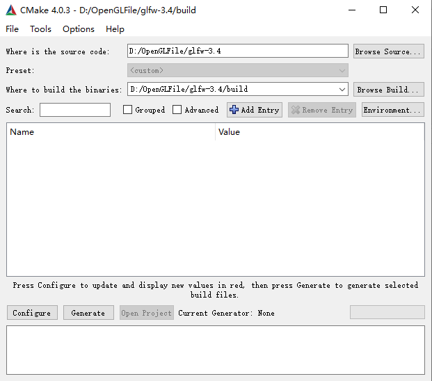
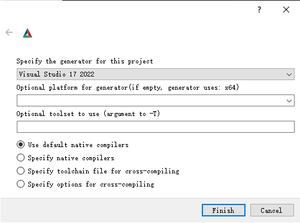
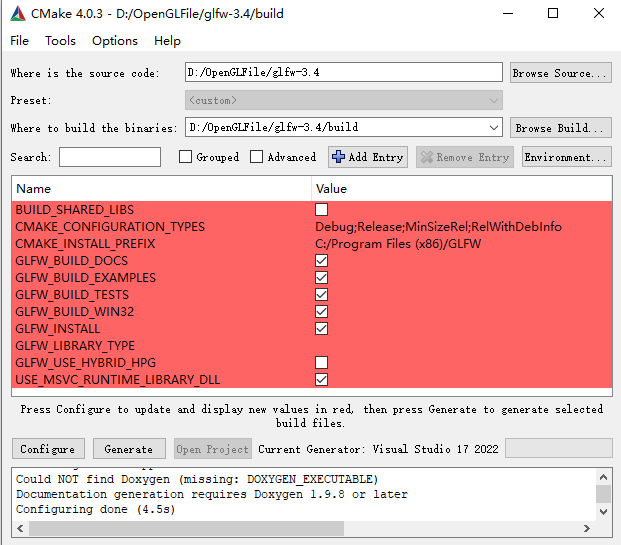
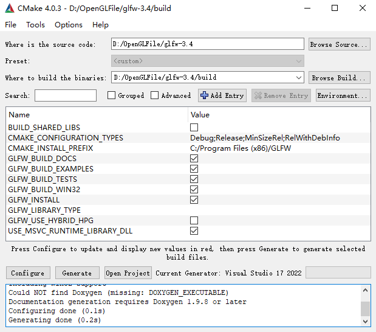
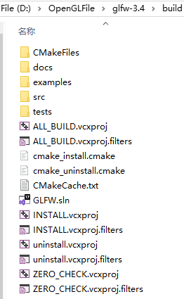
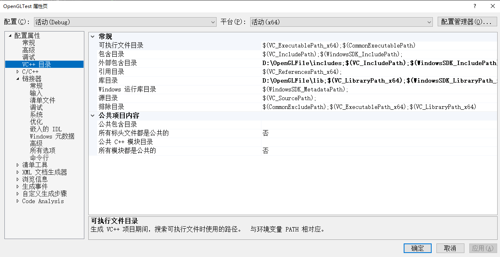
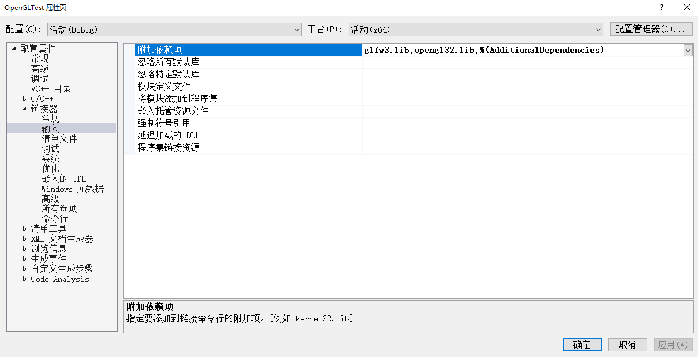
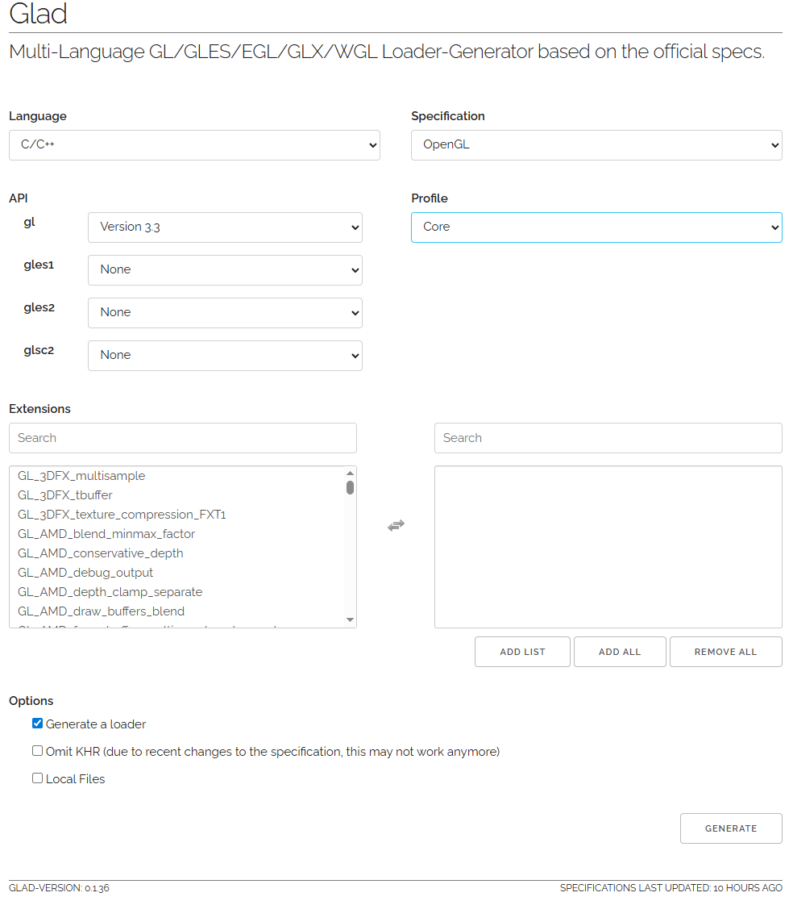
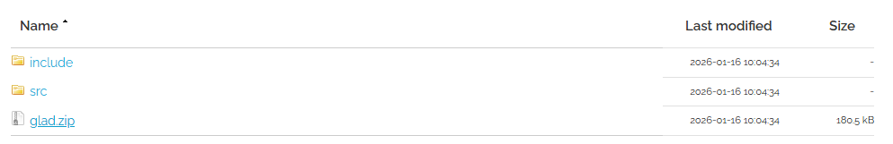
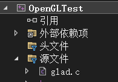

## 创建窗口

### 构建 GLFW

GLFW 可以从[官方网站](http://www.glfw.org/download.html)上获取。下载源代码包，解压并打开。使用 CMake 的 GUI 进行编译。

#### CMake

首先设置源代码的路径（解压后的路径），并且设置编译的输出目录。



点击 Configure 选择 Visual Studio 17 2022（要安装好 VS2022，否则后续步骤会报错）。





再次点击 Configure，然后点击 Generate，会生成一些 VS2022 的工程文件。





#### 编译

点击 GLFW.sln，用 VS2022 打开项目，然后执行生成解决方案，在 `build/src/Debug` 文件夹内就会出现编译出的库文件 glfw3.lib 和程序数据库 glfw3.pdb(存的是调试信息)。

把生成的两个文件 glfw3.lib 和 glfw3.pdb 复制到 `D:\OpenGLFile\lib`；

把 `D:\OpenGLFile\glfw-3.4\include\GLFW` 文件夹复制到 `D:\OpenGLFile\includes\`。

以后的项目只需使用到这两个文件夹里的东西。

### 新建 VS2022 项目

新建一个 VS2022 空项目，然后右击项目名称，点击属性。在 VC++ 目录里把两个文件夹路径分别加入到库目录和外部包含目录。



在附加依赖项里增加两条记录：glfw3.lib 和 opengl32.lib（Windows 系统提供的 OpenGL 导入库）。



### GLAD

**GLAD 是 OpenGL 的“函数加载器”**，它负责把 `glCreateShader`、`glBindBuffer` 这些函数在运行时从显卡驱动里“捞出来”。

进入 GLAD 的[在线服务](http://glad.dav1d.de/)进行如下设置：



点击 GENERATE，生成几个文件。



把解压后的 glad 和 KHR 文件夹复制到之前的 `D:\OpenGLFile\includes` 目录下。把 `src\glad.c` 复制到新建的 VS2022 项目中。



### 窗口

test.cpp

```cpp
#include <glad/glad.h>      // GLAD: 用于加载现代 OpenGL 函数指针（OpenGL 3.x/4.x）
#include <GLFW/glfw3.h>     // GLFW: 跨平台窗口管理、输入处理库，必须先导入 GLAD

#include <iostream>         // 用于打印调试信息

// 函数声明
void framebuffer_size_callback(GLFWwindow* window, int width, int height); // 窗口大小变化时的回调
void processInput(GLFWwindow* window);                                     // 处理键盘输入

// 设置窗口尺寸常量
const unsigned int SCR_WIDTH = 800;
const unsigned int SCR_HEIGHT = 600;

int main() {
    // ------------------------------
    // GLFW: 初始化和配置
    // ------------------------------
    glfwInit(); // 初始化 GLFW 库
    glfwWindowHint(GLFW_CONTEXT_VERSION_MAJOR, 3);  // 请求 OpenGL 主版本 3
    glfwWindowHint(GLFW_CONTEXT_VERSION_MINOR, 3);  // 请求 OpenGL 次版本 3 (即 OpenGL 3.3)
    glfwWindowHint(GLFW_OPENGL_PROFILE, GLFW_OPENGL_CORE_PROFILE); // 核心模式，不包含旧版 OpenGL 函数

    // ------------------------------
    // 创建 GLFW 窗口
    // ------------------------------
    GLFWwindow* window = glfwCreateWindow(SCR_WIDTH, SCR_HEIGHT, "LearnOpenGL", NULL, NULL);
    if (window == NULL) {
        std::cout << "Failed to create GLFW window" << std::endl;
        glfwTerminate(); // 创建失败，释放 GLFW 资源
        return -1;
    }
    glfwMakeContextCurrent(window); // 将创建的窗口设置为当前 OpenGL 上下文
    glfwSetFramebufferSizeCallback(window, framebuffer_size_callback); // 设置窗口大小回调

    // ------------------------------
    // GLAD: 加载所有 OpenGL 函数指针
    // ------------------------------
    if (!gladLoadGLLoader((GLADloadproc)glfwGetProcAddress)) {
        // GLAD 初始化失败
        std::cout << "Failed to initialize GLAD" << std::endl;
        return -1;
    }

    // ------------------------------
    // 渲染循环（主循环）
    // ------------------------------
    while (!glfwWindowShouldClose(window)) {
        // 处理输入
        processInput(window);

        // TODO: 在这里写 OpenGL 渲染代码
        // glClear, glDrawArrays, shader 使用等
        glClearColor(0.2f, 0.3f, 0.3f, 1.0f);
        glClear(GL_COLOR_BUFFER_BIT);

        // GLFW: 交换缓冲区并处理事件
        glfwSwapBuffers(window); // 将绘制结果显示到屏幕
        glfwPollEvents();        // 处理键盘/鼠标/窗口事件
    }

    // ------------------------------
    // 释放资源并退出
    // ------------------------------
    glfwTerminate(); // 终止 GLFW，释放所有资源
    return 0;
}

// ------------------------------
// 处理键盘输入
// ------------------------------
void processInput(GLFWwindow* window) {
    // 按 ESC 键时关闭窗口
    if (glfwGetKey(window, GLFW_KEY_ESCAPE) == GLFW_PRESS)
        glfwSetWindowShouldClose(window, true);
}

// ------------------------------
// 窗口大小变化回调
// ------------------------------
void framebuffer_size_callback(GLFWwindow* window, int width, int height) {
    // 更新 OpenGL 的视口，使渲染区域匹配窗口大小
    glViewport(0, 0, width, height);
}
```

